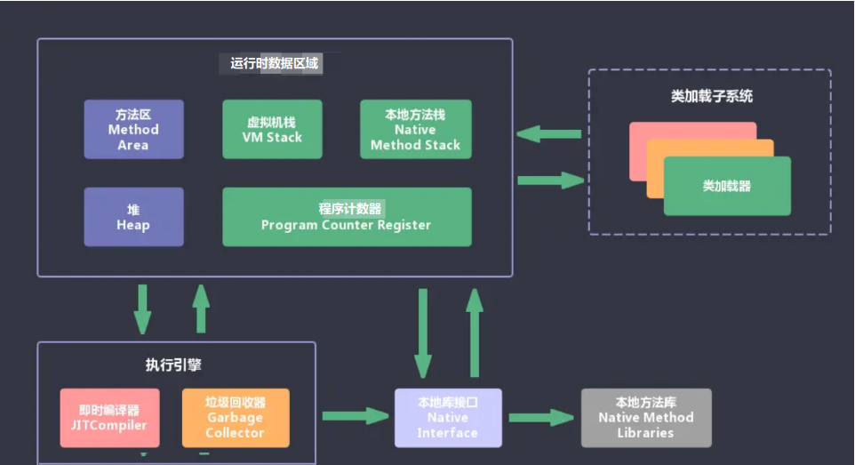
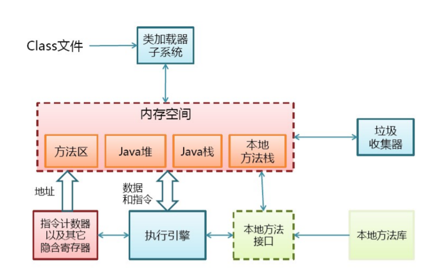

# 1. 你知道哪些垃圾回收算法？
GC最基础的算法有三种：标记-清除算法、复制算法、标记-压缩算法，我们常用的垃圾回收器一般都采用分代收集算法。

标记-清除算法，“标记-清除”（Mark-Sweep）算法，如它的名字一样，算法分为“标记”和“清除”两个阶段：首先标记出所有需要回收的对象，在标记完成后统一回收掉所有被标记的对象。

复制算法，“复制”（Copying）的收集算法，它将可用内存按容量划分为大小相等的两块，每次只使用其中的一块。当这一块的内存用完了，就将还存活着的对象复制到另外一块上面，然后再把已使用过的内存空间一次清理掉。

标记-压缩算法，标记过程仍然与“标记-清除”算法一样，但后续步骤不是直接对可回收对象进行清理，而是让所有存活的对象都向一端移动，然后直接清理掉端边界以外的内存

分代收集算法，“分代收集”（Generational Collection）算法，把Java堆分为新生代和老年代，这样就可以根据各个年代的特点采用最适当的收集算法。

# 2. CMS 收集器和 G1 收集器有什么区别？
CMS收集器是老年代的收集器，可以配合新生代的Serial和ParNew收集器一起使用；

G1收集器收集范围是老年代和新生代，不需要结合其他收集器使用；

CMS收集器以最小的停顿时间为目标的收集器；

G1收集器可预测垃圾回收的停顿时间；

CMS收集器是使用“标记-清除”算法进行的垃圾回收，容易产生内存碎片。

G1收集器使用的是“标记-整理”算法，进行了空间整合，降低了内存空间碎片。

# 3. 什么是内存屏障？包括哪些？
内存屏障，也叫内存栅栏，是一种CPU指令，用于控制特定条件下的重排序和内存可见性问题。

LoadLoad屏障：对于这样的语句Load1; LoadLoad; Load2，在Load2及后续读取操作要读取的数据被访问前，保证Load1要读取的数据被读取完毕。

StoreStore屏障：对于这样的语句Store1;StoreStore; Store2，在Store2及后续写入操作执行前，保证Store1的写入操作对其它处理器可见。

LoadStore屏障：对于这样的语句Load1;LoadStore; Store2，在Store2及后续写入操作被刷出前，保证Load1要读取的数据被读取完毕。

StoreLoad屏障：对于这样的语句Store1;StoreLoad; Load2，在Load2及后续所有读取操作执行前，保证Store1的写入对所有处理器可见。它的开销是四种屏障中最大的。 在大多数处理器的实现中，这个屏障是个万能屏障，兼具其它三种内存屏障的功能。

# 4. JVM 中如何判断两个类相同？
1、类的全限定名是否相等。

2、类加载器是否相等。

即便是同样的字节代码，被不同的类加载器加载之后所得到的类，也是不同的。

比如一个Java类com.example.Sample，编译之后生成了字节代码文件Sample.class。

两个不同的类加载器ClassLoaderA和ClassLoaderB分别读取了这个Sample.class文件，并定义出两个 java.lang.Class类的实例来表示这个类，那么这两个实例是不相同的。对于Java虚拟机来说，它们是不同的类。

# 5. JAVA GC 分为哪几种回收机制？
TODO

# 6. 什么是分布式垃圾回收（DGC）？它是如何工作的？
DGC叫做分布式垃圾回收。

RMI使用DGC来做自动垃圾回收。

因为RMI包含了跨虚拟机的远程对象的引用，垃圾回收是很困难的。

DGC使用引用计数算法来给远程对象提供自动内存管理。

# 7. RMI 中使用 RMI 安全管理器（RMISecurityManager）的目的是什么？
RMISecurityManager使用下载好的代码提供可被RMI应用程序使用的安全管理器。

如果没有设置安全管理器，RMI的类加载器就不会从远程下载任何的类。

# 8. 解释下什么是 Marshalling 和 demarshalling？
当应用程序希望把内存对象跨网络传递到另一台主机或者是持久化到存储的时候，就必须要把对象在内存里面的表示转化成合适的格式。这个过程就叫做Marshalling，反之就是demarshalling。

# 9. 解释下什么是 Serialization 和 Deserialization？
Java提供了一种叫做对象序列化的机制，它把对象表示成一连串的字节，里面包含了对象的数据，对象的类型信息，对象内部的数据的类型信息等等。

因此，序列化可以看成是为了把对象存储在磁盘上或者是从磁盘上读出来并重建对象而把对象扁平化的一种方式。

反序列化是把对象从扁平状态转化成活动对象的相反的步骤。

# 10. 说一下 JVM 的主要组成部分？及其作用？
JVM：类加载器（ClassLoader）、运行时数据区（Runtime Data Area）、执行引擎（Execution Engine）、本地库接口（Native Interface）。



组件的作用：首先通过类加载器（ClassLoader）会把 Java 代码转换成字节码，运行时数据区（Runtime Data Area）再把字节码加载到内存中，而字节码文件只是 JVM 的一套指令集规范，并不能直接交个底层操作系统去执行，因此需要特定的命令解析器执行引擎（Execution Engine），将字节码翻译成底层系统指令，再交由 CPU 去执行，而这个过程中需要调用其他语言的本地库接口（Native Interface）来实现整个程序的功能。

# 11. 解释内存中的栈（stack）、堆(heap)和静态存储区的用法。
通常我们定义一个基本数据类型的变量，一个对象的引用，还有就是函数调用的现场保存都使用内存中的栈空间；而通过new关键字和构造器创建的对象放在堆空间；程序中的字面量（literal）如直接书写的100、“hello”和常量都是放在静态存储区中。栈空间操作最快但是也很小，通常大量的对象都是放在堆空间，整个内存包括硬盘上的虚拟内存都可以被当成堆空间来使用。

```java
String str = newString("hello");
```

上面的语句中str放在栈上，用new创建出来的字符串对象放在堆上，而“hello”这个字面量放在静态存储区。

补充：较新版本的Java中使用了一项叫“逃逸分析“的技术，可以将一些局部对象放在栈上以提升对象的操作性能。

# 12. 如何开启和查看 GC 日志？
常见的 GC 日志开启参数包括：

1、 -Xloggc:filename，指定日志文件路径

2、 -XX:+PrintGC，打印 GC 基本信息

3、 -XX:+PrintGCDetails，打印 GC 详细信息

4、 -XX:+PrintGCTimeStamps，打印 GC 时间戳

5、 -XX:+PrintGCDateStamps，打印 GC 日期与时间

6、 -XX:+PrintHeapAtGC，打印 GC 前后的堆、方法区、元空间可用容量变化

7、 -XX:+PrintTenuringDistribution，打印熬过收集后剩余对象的年龄分布信息，有助于 MaxTenuringThreshold 参数调优设置

8、 -XX:+PrintAdaptiveSizePolicy，打印收集器自动设置堆空间各分代区域大小、收集目标等自动调节的相关信息

9、 -XX:+PrintGCApplicationConcurrentTime，打印 GC 过程中用户线程并发时间

10、 -XX:+PrintGCApplicationStoppedTime，打印 GC 过程中用户线程停顿时间

11、 -XX:+HeapDumpOnOutOfMemoryError，堆 oom 时自动 dump

12、 -XX:HeapDumpPath，堆 oom 时 dump 文件路径

Java 9 JVM 日志模块进行了重构，参数格式发生变化，这个需要知道。

GC 日志输出的格式，会随着上面的参数不同而发生变化。关注各个分代的内存使用情况、垃圾回收次数、垃圾回收的原因、垃圾回收占用的时间、吞吐量、用户线程停顿时间。

借助工具可视化工具可以更方便的分析，在线工具 GCeasy；离线版可以使用 GCViewer。

如果现场环境不允许，可以使用 JDK 自带的 jstat 工具监控观察 GC 情况。

# 13. 内存溢出和内存泄漏有什么区别？
内存溢出：OutOfMemory，指程序在申请内存时，没有足够的内存空间供其使用。

内存泄露：Memory Leak，指程序在申请内存后，无法释放已申请的内存空间，内存泄漏最终将导致内存溢出。

# 14. 垃圾回收的优点和原理。说说2种回收机制
Java语言中一个显著的特点就是引入了垃圾回收机制，使C++程序员最头疼的内存管理的问题迎刃而解，它使得Java程序员在编写程序的时候不再需要考虑内存管理。由于有个垃圾回收机制，Java中的对象不再有“作用域”的概念，只有对象的引用才有"作用域"。

垃圾回收可以有效的防止内存泄露，有效的使用可以使用的内存。垃圾回收器通常是作为一个单独的低级别的线程运行，不可预知的情况下对内存堆中已经死亡的或者长时间没有使用的对象进行清楚和回收，程序员不能实时的调用垃圾回收器对某个对象或所有对象进行垃圾回收。

回收机制有分代复制垃圾回收和标记垃圾回收，增量垃圾回收。

# 15. 说一下垃圾分代收集的过程。
分为新生代和老年代，新生代默认占总空间的1/3，老年代默认占2/3。

新生代使用复制算法，有3个分区：Eden、To Survivor、From Survivor，它们的默认占比是8:1:1。

当新生代中的Eden区内存不足时，就会触发Minor GC，过程如下：

1、在Eden区执行了第一次GC之后，存活的对象会被移动到其中一个Survivor分区；

2、Eden区再次GC，这时会采用复制算法，将Eden和from区一起清理，存活的对象会被复制到to区；

3、移动一次，对象年龄加1，对象年龄大于一定阀值会直接移动到老年代；

4、Survivor区相同年龄所有对象大小的总和（Survivor区内存大小*这个目标使用率）时，大于或等于该年龄的对象直接进入老年代。其中这个使用率通过-XX:TargetSurvivorRatio指定，默认为50%；

5、Survivor区内存不足会发生担保分配；

6、超过指定大小的对象可以直接进入老年代；

Major GC，指的是老年代的垃圾清理，但并未找到明确说明何时在进行MajorGC。

FullGC，整个堆的垃圾收集，触发条件：

1、每次晋升到老年代的对象平均大小>老年代剩余空间；

2、MinorGC后存活的对象超过了老年代剩余空间；

3、元空间不足；

4、System.gc()可能会引起；

5、CMS GC异常，promotion failed:MinorGC时，survivor空间放不下，对象只能放入老年代，而老年代也放不下造成；concurrent mode failure:GC时，同时有对象要放入老年代，而老年代空间不足造成；

6、堆内存分配很大的对象。

# 16. 列出并简要解释几种常见垃圾回收技术。
引用计数：每个对象都包含了一个引用计数器，每被引用一次，计数器都加1，引用者被置为null或者销毁，计数器就减1。垃圾收集器进行轮询，一旦发现计数器的值小于1，就回收该对象占用的内存。

停止复制：在垃圾回收机制运行时，程序需要停止运行，将每个活动的对象由一个堆转移到另一个堆，留下的垃圾会被回收。

标记清除：从堆栈和静态存储区域开始，寻找到活的对象就对其进行标记，所有的标记过程完成后，就对垃圾进行回收。

# 17. finalize() 有何用途？什么情况下需要调用这个函数？
在需要释放内存的地方调用finalize()，则在下一轮垃圾回收时会回收占用的内存，一般情况下不需要显式调用此函数。

垃圾回收器只能回收那些由new关键字创建的对象所占用的内存，那么有些不是通过这种方式（比如调用C++本地方法）所占用的内存如何回收呢？那么就需要使用finalize()了。

由于C++中需要使用free()函数来释放内存，所以Java程序在调用C++时需要调用finalize()方法来释放内存。

# 18. JVM物理结构和内存中的组织结构组成？
对于 JVM 自身的物理结构，可以从下图了解：



方法区和堆是所有线程共享的内存区域；而java栈、本地方法栈和程序员计数器是运行是线程私有的内存区域。

JVM内存组成结构

JVM内存结构由堆、方法区、栈、本地方法栈、方法区等部分组成，结构图如下所示：

**1）堆**

所有通过new创建的对象的内存都在堆中分配，其大小可以通过-Xmx和-Xms来控制。堆被划分为新生代和旧生代，新生代又被进一步划分为Eden和Survivor区，最后Survivor由From Space和To Space组成。用如下图表示：新生代(Young)+老年代(Old)

**2）栈**

每个线程执行每个方法的时候都会在栈中申请一个栈帧，每个栈帧包括局部变量区和操作数栈，用于存放此次方法调用过程中的临时变量、参数和中间结果。栈大小由Xss来调节，默认为128K，方法调用层次太多会撑爆这个区域。

**3）本地方法栈**

用于支持native方法的执行，存储了每个native方法调用的状态。

**4）方法区**

即非堆内存或者叫永久代，存放要加载的类信息、静态变量、final类型的常量、属性和方法信息。JVM用持久代（Permanet Generation）来存放方法区，可通过-XX:PermSize和-XX:MaxPermSize来指定最小值和最大值。

# 19. Java 代码编译和执行的整个过程包含哪三个重要机制？
**一、Java 源码编译机制**

Java 源码编译由以下三个过程组成：

• 分析和输入到符号表

• 注解处理

• 语义分析和生成class文件

最后生成的class文件由以下部分组成：

• 结构信息。包括class文件格式版本号及各部分的数量与大小的信息。

• 元数据。对应于Java源码中声明与常量的信息。包含类/继承的超类/实现的接口的声明信息、域与方法声明 信息和常量池。

• 方法信息。对应Java源码中语句和表达式对应的信息。包含字节码、异常处理器表、求值栈与局部变量区 大小、求值栈的类型记录、调试符号信息。

**二、类加载机制**

• Bootstrap ClassLoader

负责加载 $JAVA_HOME中jre/lib/rt.jar里所有的class，由C++实现，不是ClassLoader子类。

• Extension ClassLoader

负责加载Java平台中扩展功能的一些jar包，包括$JAVA_HOME中jre/lib/*.jar 或-Djava.ext.dirs 指定目录下的 jar 包。

• App ClassLoader

负责记载classpath中指定的jar包及目录中 class。

• Custom ClassLoader

属于应用程序根据自身需要自定义的ClassLoader，如 Tomcat、jboss都会根据 J2EE 规范自行实现 ClassLoader。加载过程中会先检查类是否被已加载，检查顺序是自底向上，从Custom ClassLoader到BootStrap ClassLoader逐层检查，只要某个Classloader已加载就视为已加载此类，保证此类只所有ClassLoader加载一次。而加载的顺序是自顶向下，也就是由上层来逐层尝试加载此类。

**三、类执行机制**

JVM 是基于栈的体系结构来执行class字节码的。线程创建后，都会产生程序计数器（PC）和栈（Stack），程序计数器存放下一条要执行的指令在方法内的偏移量，栈中存放一个个栈帧，每个栈帧对应着每个方法的每次调用，而栈帧又是有局部变量区和操作数栈两部分组成，局部变量区用于存放方法中的局部变量和参数，操作数栈中用于存放方法执行过程中产生的中间结果。

# 20. JVM 中的程序计数器什么？
一块较小的内存空间，它是当前线程所执行的字节码的行号指示器，字节码解释器工作时通过改变该计数器的值来选择下一条需要执行的字节码指令，分支、跳转、循环等基础功能都要依赖它来实现。每条线程都有一个独立的的程序计数器，各线程间的计数器互不影响，因此该区域是线程私有的。

当线程在执行一个Java方法时，该计数器记录的是正在执行的虚拟机字节码指令的地址，当线程在执行的是 Native 方法（调用本地操作系统方法）时，该计数器的值为空。另外，该内存区域是唯一一个在 Java 虚拟机规范中么有规定任何OOM（内存溢出：OutOfMemoryError）情况的区域。
