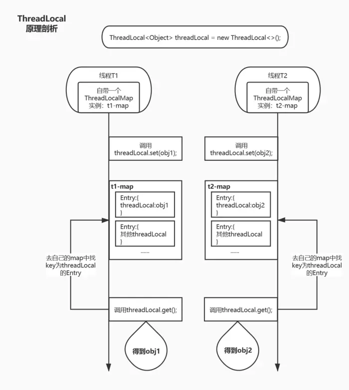

# 1. 什么是 ABA 问题？
ABA问题是指在CAS操作中带来的潜在问题，CAS的全称是compare and swap或compare and set。

对于一个要更新的变量A，提供一个它的旧值a和新值b，如果变量A的值等于旧值a那么更新成功，否则失败。

如果CAS操作是基于CPU内核的原子操作，那基本是不会出现ABA问题的，但是如果CAS本身操作不满足原子性，则会带来ABA问题。

>比如两个线程 线程1查询A的值为a，与旧值a比较 线程2查询A的值为a，与旧值a比较，相等，更新为b值 线程2查询A的值为b，与旧值b比较，相等，更新为a值 线程1相等，更新B的值为c

可以看到此情况下，线程1可以正常进行CAS操作，将值从a变为c但是在这之间，实际A值已经发了a->b b->a的转换。

ABA问题通俗的可以理解为别人挪用了你的钱，但是在你发现之前又还了回来。但是别人却已经触犯了法律。

# 2. 如何解决 ABA 问题？
ABA问题：如果线程1第一次读取的值为A，线程1准备对A执行写操作，但这段时间，线程2完成了A->B->A的更改，当线程1准备写时，A已经不是原来的A。

JDK的atomic包里提供了一个类AtomicStampedReference来解决ABA问题。如果当前引用 == 预期引用，并且当前标志等于预期标志，则以原子方式将该引用和该标志的值设置为给定的更新值。

**如何解决ABA问题？**

JDK1.5版本后，推出两种办法解决或改善ABA问题，分别是AtomicStampedRefence和AtomicMarkableReference。

1、AtomicStampedRefence

观察其源码发现：其内部的value被pair代替，即：
```java
private volatile Pair<V> pair;
```

pair源码：

```java
private static class Pair<T> {
    final T reference;
    final int stamp;
    private Pair(T reference, int stamp) {
        this.reference = reference;
        this.stamp = stamp;
    }
    static <T> Pair<T> of(T reference, int stamp) {
        return new Pair<T>(reference, stamp);
    }
}
```

可以看到其内部不仅有T引用模板，还有一个int类型的stamp作为版本号，等修改时比较当前版本号与当前线程持有的版本号是否一致，若一直则修改，并stamp+1。

2、AtomicMarkableReference

观察其源码发现：其内部的value被pair代替，即：

```java
private volatile AtomicMarkableReference.Pair<V> pair;
```
pair源码：

```java
static <T> AtomicMarkableReference.Pair<T> of(T var0, boolean var1) {
    return new AtomicMarkableReference.Pair(var0, var1);
}
```
可以看到其内部不仅有T引用模板，还有一个boolean类型的var1。

var1的值有两个true和false，修改时在这两个版本号之间来回切换，这样做并不能解决ABA问题，但可以降低其发生的几率。

**解决的办法**

加个版本号就可以解决ABA问题。真正要做到严谨的CAS机制，在Compare阶段不仅要比较期望值A和地址V中的实际值，还要比较变量的版本号是否一致。

用例子来说明一下，假设地址V中存储着变量值A，当前版本号是01。

线程1获得了当前值A和版本号01，想要更新为B，但是被阻塞了。

此时内存地址V中的变量发生了多次改变，版本号提升为03，但是变量值仍然是A。

随后线程1恢复运行，进行Compare操作。经过比较，线程1所获得的值和地址V的实际值都是A，但是版本号不相等，所以这一次更新失败。在Java当中AtomicStampedReference类就实现了用版本号做比较的CAS机制。

# 3. Java 中无锁队列的原理是什么？
SynchronousQueue队列是无锁队列，其内部是使用CAS自旋操作保证线程安全。

# 4. Java 中延迟阻塞队列的原理是什么？
DelayQueue底层使用了PriorityQueue优先级队列，而PriorityQueue实际上一个二叉堆结构，通过比较堆内元素过期时间，将堆内最快过期的元素放在堆头，以保证每次获取的元素是最二叉堆中最快过期的元素。

# 5. String变量可以存放在 DelayQueue 队列吗？
DelayQueue要求元素必须实现Delayed接口，也就是说DelayQueue的元素必须是Delayed的子类。而String类并没有实现Delayed 接口，所以String变量是不能放在DelayQueue队列里。

# 6. SynchronousQueue 队列的大小是多少？
实际上SynchronousQueue本身是没有容量的大小，所以也无法查看其容量的大小，其内部的size方法都是写死的返回0值。

# 7. 超出 LinkedBlockingQueue 容量值会出现什么情况？
如果限定LinkedBlockingQueue的容量，当达到容量值的时候put操作和offer操作加上超时时间会阻塞。

如果没有限定容量的话，就可认为容量是无限大，直到耗尽机器的资源，发生OOM。

所以建议在使用LinkedBlockingQueue的时候最好能够设置容量，防止耗尽内容。

# 8. 什么是协程？
协程（Coroutine）：是单线程下的并发，又称微线程，纤程。简单理解就是线程中的线程。

**优点**

轻量，创建成本小，降低了内存消耗

用户态调度，减少了 CPU 上下文切换的开销，提高了 CPU 缓存命中率

减少同步加锁，提高了性能

可以用同步思维写异步代码

**缺点**

在协程执行中不能有阻塞操作，否则整个线程被阻塞

不擅长处理 CPU 密集型

**适用场景**

高性能要求，考虑牺牲公平性换取吞吐量

IO 密集型任务

Generator 式的流式计算

# 9. Java 支持协程吗？
Java 官方目前是还没推出协程。

目前可用性比较高的有Quasar和ea-async两个第三方库，都是通过byte code Instrument，把编译后同步程序class文件修改为异步的操作。

# 10. 什么是 CAS？
CAS是compare and swap的缩写，即我们所说的比较交换。

cas是一种基于锁的操作，而且是乐观锁。在java中锁分为乐观锁和悲观锁。悲观锁是将资源锁住，等一个之前获得锁的线程释放锁之后，下一个线程才可以访问。而乐观锁采取了一种宽泛的态度，通过某种方式不加锁来处理资源，比如通过给记录加version来获取数据，性能较悲观锁有很大的提高。

CAS操作包含三个操作数分别是内存位置（V）、预期原值（A）和新值(B)。如果内存地址里面的值和A的值是一样的，那么就将内存里面的值更新成B。CAS是通过无限循环来获取数据的，若果在第一轮循环中，a线程获取地址里面的值被b线程修改了，那么a线程需要自旋，到下次循环才有可能机会执行。

# 11. CAS 有什么缺点？
1、CAS容易造成ABA问题。

一个线程a将数值改成了b，接着又改成了a，此时CAS认为是没有变化，其实是已经变化过了，而这个问题的解决方案可以使用版本号标识，每操作一次version加1。在JDK1.5版本中，已经提供了AtomicStampedReference来解决问题。

2、CAS造成CPU利用率增加。之前说过了CAS里面是一个循环判断的过程，如果线程一直没有获取到状态，cpu资源会一直被占用。

# 12. 如何保证线程按顺序执行？
保证线程按顺序执行的方法有以下几种：

1、使用线程的join()方法

2、使用主线程的join()方法

3、使用线程的wait()方法

4、使用线程的线程池方法

5、使用线程的Condition(条件变量)方法

6、使用线程的CountDownLatch(倒计数)方法

7、使用线程的CyclicBarrier(回环栅栏)方法

8、使用线程的Semaphore(信号量)方法

# 13. 什么是守护线程？
守护线程（即daemon thread），是个服务线程，准确地来说就是服务其他的线程，而其他的线程只有一种，那就是用户线程。

java中线程可以划分为2种

>1、守护线程，比如垃圾回收线程，就是最典型的守护线程。 2、用户线程，就是应用程序里的自定义线程。

**守护线程**

1、守护线程，专门用于服务其他的线程，如果其他的线程（即用户自定义线程）都执行完毕，连main线程也执行完毕，那么jvm就会退出（即停止运行）——此时，连jvm都停止运行了，守护线程当然也就停止执行了。

2、如果存在用户自定义线程的话，jvm就不会退出，此时守护线程也不能退出，也就是它还要运行，就是为了执行垃圾回收的任务。

3、守护线程又被称为“服务进程”“精灵线程”“后台线程”，是指在程序运行是在后台提供一种通用的线程，这种线程并不属于程序不可或缺的部分。

通俗点讲，任何一个守护线程都是整个JVM中所有非守护线程的“保姆”。

# 14. 公平锁和非公平锁有什么区别？
公平锁：多个线程按照申请锁的顺序去获得锁，线程会直接进入队列去排队，永远都是队列的第一位才能得到锁。

优点：所有的线程都能得到资源，不会饿死在队列中。

缺点：吞吐量会下降很多，队列里面除了第一个线程，其他的线程都会阻塞，cpu唤醒阻塞线程的开销会很大。

非公平锁：多个线程去获取锁的时候，会直接去尝试获取，获取不到，再去进入等待队列，如果能获取到，就直接获取到锁。

优点：可以减少CPU唤醒线程的开销，整体的吞吐效率会高点，CPU也不必取唤醒所有线程，会减少唤起线程的数量。

缺点：可能导致队列中间的线程一直获取不到锁或者长时间获取不到锁，导致饿死。

# 15. 锁优化的方法有哪些？
**减少锁持有时间**

减少其他线程等待的时间，只在有线程安全要求的程序代码上加锁。

**减小锁粒度**

将大对象（这个对象可能会被很多线程访问），拆成小对象，大大增加并行度，降低锁竞争。降低了锁的竞争，偏向锁，轻量级锁成功率才会提高。

**锁分离**

读写锁ReadWriteLock，根据功能进行分离成读锁和写锁，这样读读不互斥，读写互斥，写写互斥。即保证了线程安全，又提高了性能。

读写分离思想可以延伸，只要操作互不影响，锁就可以分离。

**锁粗化**

为了保证多线程间的有效并发，会要求每个线程持有锁的时间尽量短，即在使用完公共资源后，应该立即释放锁。只有这样，等待在这个锁上的其他线程才能尽早的获得资源执行任务。

**锁消除**

在即时编译器时，如果发现不可能被共享的对象，则可以消除这些对象的锁操作。

# 16. 线程池的原理是什么？
**线程池状态**

线程池和线程一样拥有自己的状态，在ThreadPoolExecutor类中定义了一个volatile变量runState来表示线程池的状态，线程池有四种状态，分别为RUNNING、SHURDOWN、STOP、TERMINATED。

1）线程池创建后处于RUNNING状态。

2）调用shutdown后处于SHUTDOWN状态，线程池不能接受新的任务，会等待缓冲队列的任务完成。

3）调用shutdownNow后处于STOP状态，线程池不能接受新的任务，并尝试终止正在执行的任务。

4）当线程池处于SHUTDOWN或STOP状态，并且所有工作线程已经销毁，任务缓存队列已经清空或执行结束后，线程池被设置为TERMINATED状态。

>线程池原理： 预先启动一些线程，线程无限循环从任务队列中获取一个任务进行执行，直到线程池被关闭。如果某个线程因为执行某个任务发生异常而终止，那么重新创建一个新的线程而已，如此反复。

# 17. 什么是 Java 优先级队列（Priority Queue）？
PriorityQueue是一个基于优先级堆的无界队列，它的元素是按照自然顺序（natural order）排序的。在创建的时候，可以给它提供一个负责给元素排序的比较器。

PriorityQueue不允许null值，因为它们没有自然顺序，或者说它们没有任何的相关联的比较器。

最后，PriorityQueue不是线程安全的，入队和出队的时间复杂度是O(log(n))。

# 18. Java 中的 ReadWriteLock 是什么？
ReadWriteLock读写锁是用来提升并发程序性能的锁分离技术的成果。

ReadWriteLock管理一组锁，一个是只读的锁，一个是写锁。

Java并发库中ReetrantReadWriteLock实现了ReadWriteLock接口并添加了可重入的特性。

#  19. 【阿里巴巴】ThreadLocal 如何保证到线程隔离的？


通过上图，可以看出ThreadLocal之所以能达到变量的线程隔离，其实就是每个线程都有一个自己的ThreadLocalMap对象来存储同一个threadLocal实例set的值，而取值的时候也是根据同一个threadLocal实例去自己的ThreadLocalMap里面查找，自然就互不影响，从而达到线程隔离的目的。
