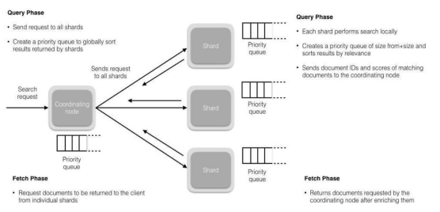

# 1. 什么是 Elasticsearch？
ES是一种开源、RESTful、可扩展的基于文档的搜索引擎，它构建在Lucene库上。

用户使用Kibana就可以可视化使用数据，同时Kibana也提供交互式的数据状态呈现和数据分析。

Apache Lucene搜索引擎基于JSON文档来进行搜索管理和快速搜索。

Elasticsearch，可简称为ES（官方未给出简称名字，很多人都这么叫而已）一种开源、RESTful、可扩展的基于文档的搜索引擎，构建是在Apache Lucene库的基础上的搜索引擎，无论在开源还是专有领域，Lucene可以被认为是迄今为止最先进、性能最好的、功能最全的搜索引擎库。 但是，Lucene只是一个库。想要发挥其强大的作用，需使用Java并要将其集成到应用中。

Elasticsearch是使用Java编写并使用Lucene来建立索引并实现搜索功能，但是它的目的是通过简单连贯的RESTful API让全文搜索变得简单并隐藏Lucene的复杂性。

用户通过JSON格式的请求，使用CRUD的REST API就可以完成存储和管理文本、数值、地理空间、结构化或者非结构化的数据。

Elasticsearch不仅是Lucene和全文搜索引擎，它还提供：

1、分布式的实时文件存储，每个字段都被索引并可被搜索 2、实时分析的分布式搜索引擎 3、可以扩展到上百台服务器，处理PB级结构化或非结构化数据，而且所有的这些功能被集成到一台服务器，应用可以通过简单的RESTful API、各种语言的客户端甚至命令行与之交互。

Elasticsearch非常简单，它提供了许多合理的缺省值，并对初学者隐藏了复杂的搜索引擎理论。开箱即用（安装即可使用），只需很少的学习既可在生产环境中使用。Elasticsearch在Apache 2 license下许可使用，可以免费下载、使用和修改。

# 2. Elasticsearch 安装前需要什么环境？
ElasticSearch是基于lucence开发的，也就是运行时需要java jdk支持。所以要先安装JAVA环境。

注意：由于ElasticSearch 5.x往后依赖于JDK 1.8及以上版本，安装高版本ES需要考虑与JDK版本的兼容性问题。ElasticSearch早期版本需要JDK，在7.X版本后已经集成JDK，已无需第三方依赖。

# 3. ElasticSearch 的节点类型有什么区别？
欢迎大家关注微信公众号： Java精选 ，专注分享前沿资讯，BATJ 大厂面试题解读，架构技术干货，微服务、高可用等架构设计，10年开发老兵帮你少走弯路，欢迎各领域程序员交流学习！

此类面试题只能在微信小程序： Java精选面试题 ，查阅全部内容，感谢支持！

# 4. 说说 ElasticSearch 生产集群节点分配方案？
1、针对节点按照分工职责进行划分；

2、生产集群建议部署3台以上单独作为master节点，只负责成为主节点，维护整个集群的状态。

3、设置一批data节点，负责存储数据、建立索引和查询索引服务。对磁盘，内存要求相对较高。

4、设置一批client节点，只负责处理用户请求，实现请求转发，负载均衡等功能。

# 5. ElasticSearch 分片是什么？
ElasticSearch分片是指随着索引文件的增加，磁盘容量、处理能力都会变得不足，在这种情况下，将索引数据切分成很多文件块，也可以称为数据的最小单元块。整个ES集群的核心就是对所有分片的分布、索引、负载、路由等提高处理效率。

举例说明：

假设IndexA有2个分片，向IndexA中插入100条数据 (100个文档)，那么这100条数据会尽可能平均的分为50条存储在第一个分片，剩下的50条会存储在另一个分片中。

有点类似主流关系型数据库的表分区的概念。

# 6. ElasticSearch 支持哪些类型的查询？
ElasticSearch支持的类型查询主要分为匹配（文本）查询和基于Term的查询。

文本查询包括基本匹配、match phrase、multi-match、match phrase prefix、common terms、query-string、simple query string等。

Term查询包括term exists、type、term set、range、prefix、ids、wildcard、regexp、and fuzzy等。

# 7. ElasticSearch 中 term 和 match 有什么区别？
term：代表完全匹配，也就是精确查询，搜索前不会再对搜索词进行分词解析，直接对搜索词进行查找。

match：代表模糊匹配，通常用于对text类型字段的查询，会对进行查询的文本先进行分词操作，然后按分词匹配查找。

term主要用于精确查询，通常用于对keyword和有精确值的字段进行查询，而match则主要用于模糊搜索。

term精确搜索相较match模糊查询而言，效率较高。

# 8. Elasticsearch 是如何实现 Master 选举的？
前置条件：

1）只有是候选主节点（master：true）的节点才能成为主节点。

2）最小主节点数（min_master_nodes）的目的是防止脑裂。

Elasticsearch 的选主是 ZenDiscovery 模块负责的，主要包含 Ping（节点之间通过这个RPC来发现彼此）和 Unicast（单播模块包含一个主机列表以控制哪些节点需要 ping 通）这两部分；

获取主节点的核心入口为findMaster，选择主节点成功返回对应Master，否则返回null。

选举流程大致描述如下：

第一步：确认候选主节点数达标，elasticsearch.yml设置的值discovery.zen.minimum_master_nodes。

第二步：对所有候选主节点根据nodeId字典排序，每次选举每个节点都把自己所知道节点排一次序，然后选出第一个（第0位）节点，暂且认为它是master节点。

第三步：如果对某个节点的投票数达到一定的值（候选主节点数n/2+1）并且该节点自己也选举自己，那这个节点就是master。否则重新选举一直到满足上述条件。

选举流程总结：

1、Elasticsearch的选主是ZenDiscovery模块负责的，主要包含Ping（节点之间通过这个RPC来发现彼此）和Unicast（单播模块包含一个主机列表以控制哪些节点需要ping通）这两部分；

2、对所有可以成为master的节点（node.master:true）根据nodeId字典排序，每次选举每个节点都把自己所知道节点排一次序，然后选出第一个（第0位）节点，暂且认为它是master节点。

3、如果对某个节点的投票数达到一定的值（可以成为master节点数n/2+1）并且该节点自己也选举自己，那这个节点就是master。否则重新选举一直到满足上述条件。

4、master节点的职责主要包括集群、节点和索引的管理，不负责文档级别的管理；data节点可以关闭http功能*。

# 9. Elasticsearch 索引数据过多，如何调优和部署？
TODO

# 10. 描述一下 Elasticsearch 更新和删除文档的过程？
1、删除和更新也都是写操作，但是Elasticsearch中的文档是不可变的，因此不能被删除或者改动以展示其变更；

2、磁盘上的每个段都有一个相应的.del文件。当删除请求发送后，文档并没有真的被删除，而是在.del文件中被标记为删除。该文档依然能匹配查询，但是会在结果中被过滤掉。当段合并时，在.del文件中被标记为删除的文档将不会被写入新段。

3、在新的文档被创建时，Elasticsearch会为该文档指定一个版本号，当执行更新时，旧版本的文档在.del文件中被标记为删除，新版本的文档被索引到一个新段。旧版本的文档依然能匹配查询，但是会在结果中被过滤掉。

# 11. 描述一下 Elasticsearch 搜索的过程？
1、搜索被执行成一个两阶段过程，称为Query Then Fetch；

2、在初始查询阶段时，查询会广播到索引中每一个分片拷贝（主分片或者副本分片）。 每个分片在本地执行搜索并构建一个匹配文档的大小为from+size的优先队列。

PS：在搜索的时候是会查询Filesystem Cache的，但是有部分数据还在Memory Buffer，所以搜索是近实时的。

3、每个分片返回各自优先队列中 所有文档的ID和排序值给协调节点，它合并这些值到自己的优先队列中来产生一个全局排序后的结果列表。

4、接下来就是取回阶段，协调节点辨别出哪些文档需要被取回并向相关的分片提交多个GET请求。每个分片加载并丰富文档，如果有需要的话，接着返回文档给协调节点。一旦所有的文档都被取回了，协调节点返回结果给客户端。

5、补充：Query Then Fetch的搜索类型在文档相关性打分的时候参考的是本分片的数据，这样在文档数量较少的时候可能不够准确，DFS Query Then Fetch 增 加了一个预查询的处理，询问Term和Document frequency，这个评分更准确，但是性能会变差。

# 12. Elasticsearch 中什么是倒排索引？
传统的检索方式是通过文章，逐个遍历找到对应关键词的位置。

倒排索引，是通过分词策略，形成了词和文章的映射关系表，也称倒排表，这种词典+映射表即为倒排索引。

其中词典中存储词元，倒排表中存储该词元在哪些文中出现的位置。有了倒排索引，就能实现O(1)时间复杂度的效率检索文章了，极大的提高了检索效率。

倒排索引的底层实现是基于：FST（Finite State Transducer）数据结构。

Lucene从4+版本后开始大量使用的数据结构是 FST。FST 有两个优点：

1）空间占用小。通过对词典中单词前缀和后缀的重复利用，压缩了存储空间；

2）查询速度快。O(len(str))的查询时间复杂度。

# 13. 如何解决 Elasticsearch 集群的脑裂问题？
ES集群脑裂是指Elasticsearch集群中的节点（比如共20个），其中的10个选了一个master，另外10个选了另一个master的情况。

当集群master候选数量不小于3个时，可以通过设置最少投票通过数量（discovery.zen.minimum_master_nodes）超过所有候选节点一半以上来解决脑裂问题；

当候选数量为两个时，只能修改为唯一的一个master候选，其他作为data节点，避免脑裂问题。

# 14. 在并发情况下，Elasticsearch 如何保证读写一致？
可以通过版本号使用乐观并发控制，以确保新版本不会被旧版本覆盖，由应用层来处理具体的冲突；

另外对于写操作，一致性级别支持quorum/one/all，默认为quorum，即只有当大多数分片可用时才允许写操作。但即使大多数可用，也可能存在因为网络等原因导致写入副本失败，这样该副本被认为故障，分片将会在一个不同的节点上重建。

对于读操作，可以设置replication为sync(默认)，这使得操作在主分片和副本分片都完成后才会返回；如果设置replication为async时，也可以通过设置搜索请求参数_preference为primary来查询主分片，确保文档是最新版本。

# 15. Elasticsearch 对于大数据量（上亿量级）的聚合如何实现？
TODO

# 16. 对于 GC 方面，使用 Elasticsearch 时要注意什么？
1）倒排词典的索引需要常驻内存，无法GC，需要监控data node上segment memory增长趋势。

2）各类缓存，field cache、filter cache、indexing cache、bulk queue等等，要设置合理的大小，并且要应该根据最坏的情况来看heap是否够用，也就是各类缓存全部占满的时候，还有heap空间可以分配给其他任务吗？避免采用clear cache等“自欺欺人”的方式来释放内存。

3）避免返回大量结果集的搜索与聚合。确实需要大量拉取数据的场景，可以采用scan & scroll api来实现。

4）cluster stats驻留内存并无法水平扩展，超大规模集群可以考虑分拆成多个集群通过tribe node连接。

5）想知道heap够不够，必须结合实际应用场景，并对集群的heap使用情况做持续的监控。

# 17. Elasticsearch 中的分析器是什么？
分析（analysis）机制用于进行全文文本（Full Text）的分词，以建立供搜索用的反向索引。

1、在ElasticSearch中索引数据时，数据由为索引定义的Analyzer在内部进行转换。分析器由一个Tokenizer和零个或多个TokenFilter组成。

编译器可以在一个或多个CharFilter之前。分析模块允许您在逻辑名称下注册分析器，然后可以在映射定义或某些API中引用它们。

2、Elasticsearch附带了许多可以随时使用的预建分析器。或者可以组合内置的字符过滤器，编译器和过滤器器来创建自定义分析器。

# 18. Elasticsearch中启用属性、索引和存储的用途是什么？
1、Enabled属性适用于各类ElasticSearch特定/创建领域，如index和size。用户提供的字段没有“已启用”属性。存储意味着数据由Lucene存储，如果询问，将返回这些数据。

2、存储字段不一定是可搜索的。默认情况下，字段不存储，但源文件是完整的。使用默认值(这是有意义的)，不要设置store属性该指数属性用于搜索。

3、索引属性只能用于搜索。只有索引域可以进行搜索。差异的原因是在分析期间对索引字段进行了转换，因此如果需要的话，不能检索原始数据。

# 19. 在使用 Elasticsearch 时要注意什么？
由于ES使用的Java写的，所有注意的是GC方面的问题

1、倒排词典的索引需要常驻内存，无法GC，需要监控data node上segmentmemory增长趋势。

2、各类缓存，field cache、filter cache、indexing cache、bulk queue等等，要设置合理的大小，并且要应该根据最坏的情况来看 heap 是否够用，也就是各类缓存全部占满的时候，还有heap 空间可以分配给其他任务吗？避免采用clear cache等“自欺欺人”的方式来释放内存。

3、避免返回大量结果集的搜索与聚合。确实需要大量拉取数据的场景，可以采用scan&scroll api来实现。

4、cluster stats驻留内存并无法水平扩展，超大规模集群可以考虑分拆成多个集群通过tribe node连接。

5、想知道heap够不够，必须结合实际应用场景，并对集群的heap使用情况做持续的监控。

# 20. 列出与 Elasticsearch 有关的主要可用字段数据类型？
1、字符串数据类型，包括支持全文检索的text类型 和 精准匹配的keyword类型。

2、数值数据类型，例如字节、短整数、长整数、浮点数、双精度数、half_float、scaled_float。

3、日期类型，日期纳秒Date nanoseconds，布尔值，二进制（Base64编码的字符串）等。

4、范围（整数范围integer_range，长范围long_range，双精度范围double_range，浮动范围float_range，日期范围 date_range）。

5、包含对象的复杂数据类型，nested、Object。

6、GEO地理位置相关类型。

7、特定类型如：数组（数组中的值应具有相同的数据类型）。
