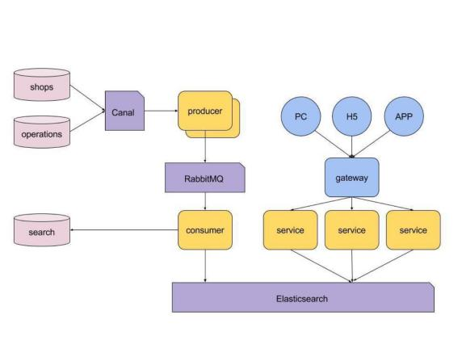
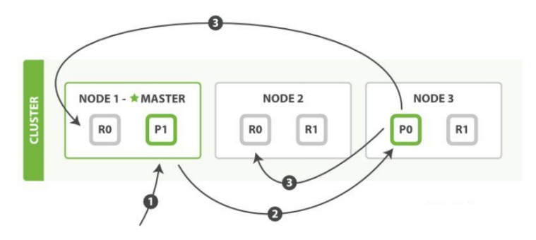

# 1. 如何监控 Elasticsearch 集群状态？
Marvel可以很简单的通过Kibana监控Elasticsearch。支持实时查看集群健康状态和性能，也可以分析过去的集群、索引和节点指标。

# 2. ElasticSearch 是否有架构？
1、ElasticSearch可以有一个架构。架构是描述文档类型以及如何处理文档的不同字段的一个或多个字段的描述。

Elasticsearch中的架构是一种映射，它描述了JSON文档中的字段及其数据类型，以及它们应该如何在Lucene索引中进行索引。因此，在Elasticsearch术语中，我们通常将此模式称为“映射”。

2、Elasticsearch具有架构灵活的能力，这意味着可以在不明确提供架构的情况下索引文档。如果未指定映射，则默认情况下，Elasticsearch会在索引期间检测文档中的新字段时动态生成一个映射。

# 3. Elasticsearch 中的集群、节点、索引、文档、类型是什么？
群集：一个或多个节点（服务器）的集合，它们共同保存您的整个数据，并提供跨所有节点的联合索引和搜索功能。群集由唯一名称标识，默认情况下为“elasticsearch”。此名称很重要，因为如果节点设置为按名称加入群集，则该节点只能是群集的一部分。

节点：属于集群一部分的单个服务器。它存储数据并参与群集索引和搜索功能。

索引：就像关系数据库中的“数据库”。它有一个定义多种类型的映射。索引是逻辑名称空间，映射到一个或多个主分片，并且可以有零个或多个副本分片。 eg: MySQL =>数据库 　　 ElasticSearch =>索引

文档：类似于关系数据库中的一行。不同之处在于索引中的每个文档可以具有不同的结构（字段），但是对于通用字段应该具有相同的数据类型。 MySQL=>Databases =>Tables =>Columns/Rows ElasticSearch=>Indices=>Types =>具有属性的文档

类型：是索引的逻辑类别/分区，其语义完全取决于用户。

# 4. 介绍一下常见电商搜索的整体技术架构？


# 5. Elasticsearch 中索引在设计阶段如何调优？
1）根据业务增量需求，采取基于日期模板创建索引，通过roll over API滚动索引；

2）使用别名进行索引管理；

3）每天凌晨定时对索引做force_merge操作，以释放空间；

4）采取冷热分离机制，热数据存储到SSD，提高检索效率；冷数据定期进行shrink操作，以缩减存储；

5）采取curator进行索引的生命周期管理；

5）仅针对需要分词的字段，合理的设置分词器；

6）Mapping阶段充分结合各个字段的属性，是否需要检索、是否需要存储等。

# 6. Elasticsearch 中索引在写入阶段如何调优？
1）写入前副本数设置为0；

2）写入前关闭refresh_interval设置为-1，禁用刷新机制；

3）写入过程中：采取bulk批量写入；

4）写入后恢复副本数和刷新间隔；

5）尽量使用自动生成的id。

# 7. Elasticsearch 中索引在查询阶段如何调优？
1）禁用wildcard；

2）禁用批量terms（成百上千的场景）；

3）充分利用倒排索引机制，能keyword类型尽量keyword；

4）数据量大时候，可以先基于时间敲定索引再检索；

5）设置合理的路由机制。

# 8. Elasticsearch 部署时，Linux 设置有哪些优化方法？
1）关闭缓存swap；

2）堆内存设置为：Min（节点内存/2, 32GB）；

3）设置最大文件句柄数；

4）线程池+队列大小根据业务需要做调整；

5）磁盘存储raid方式：存储有条件使用RAID10，增加单节点性能以及避免单节点存储故障。

# 9. ElasticSearch 中是否了解字典树？
| 数据结构	| 优缺点| 
| ----------------	| -------------- | 
| Array/List	| 使用二分法查找，不平衡| 
| HashMap/TreeMap	| 性能高，内存消耗大，几乎是原始数据的三倍| 
| Skip List	| 跳跃表，可快速查找词语，在lucene,redis,HBase中有实现| 
| Trie	| 适合英文词典，如果系统中存在大量字符串且这些字符串基本没有公共前缀| 
| Double Array Trie	| 适合做中文词典，内存占用小，很多分词工具军采用此种算法| 
| Ternary Search Tree	| 一种有状态的转移机，Lucene 4有开源实现，并大量使用| 
Trie的核心思想是空间换时间，利用字符串的公共前缀来降低查询时间的开销以

达到提高效率的目的。它有3个基本性质：

1、根节点不包含字符，除根节点外每一个节点都只包含一个字符。

2、从根节点到某一节点，路径上经过的字符连接起来，为该节点对应的字符串。

3、每个节点的所有子节点包含的字符都不相同。

# 10. Elasticsearch 中按 ID 检索文档的语法是什么？
```shell
GET test_001/_doc/1
```

# 11. Elasticsearch 客户端和集群连接时，如何选择特定的节点执行请求的？
1、TransportClient利用transport模块远程连接一个elasticsearch集群。

2、TransportClient并不加入到集群中，只是简单的获得一个或者多个初始化的transport地址，并以轮询的方式与这些地址进行通信。

# 12. Elasticsearch 中解释一下 NRT 是什么？
从文档索引（写入）到可搜索到之间的延迟默认一秒钟，因此Elasticsearch是近实时（NRT）搜索平台。

也就是说：文档写入，最快一秒钟被索引到，不能再快了。

写入调优的时候，我们通常会动态调整：refresh_interval = 30s 或者更达值，以使得写入数据更晚一点时间被搜索到。

# 13. Elasticsearch 中常用的 cat 命令有哪些？
面试时说几个核心的就可以，包含但不限于：

| 含义	 |  命令                      | 
| -----------	|--------------------------| 
| 别名	| GET _cat/aliases?v       | 
| 分配相关	| GET _cat/allocation      | 
| 计数	| GET _cat/count?v         | 
| 字段数据	| GET _cat/fielddata?v     | 
| 运行状况	| GET_cat/health?v         | 
| 索引相关	| GET _cat/indices?v       | 
| 主节点相关	| GET _cat/master?v        | 
| 节点属性	| GET _cat/nodeattrs?v     | 
| 节点	| GET _cat/nodes?v         | 
| 待处理任务	| GET _cat/pending_tasks?v | 
| 插件	| GET _cat/plugins?v       | 
| 恢复	| GET _cat / recovery?v    | 
| 存储库	| GET _cat /repositories?v | 
| 段	| GET _cat /segments?v     | 
| 分片	| GET _cat/shards?v        | 
| 快照	| GET _cat/snapshots?v     | 
| 任务	| GET _cat/tasks?v         | 
| 模板	| GET _cat/templates?v     | 
| 线程池	| GET _cat/thread_pool?v   | 
# 14. Elasticsearch 中什么是分词器？
把全文本转换成一系列单词（term/token）的过程，叫做分词。

举一个分词简单的例子：比如输入 Hello World，会自动分成两个单词，一个是hello，另一个是world，可以看出单词也被转化成了小写。

分词器（Tokenizers）接收一个字符流，将其分解为单个标记(通常是单个单词)，并输出一个标记流。例如，当看到任何空白时，whitespace分词器就会将文本分解为标记。它会将文本“Quick brown fox!”转换为“Quick, brown, fox!” 。

分词器（Tokenizers）还负责记录每个词的顺序或位置(用于短语和词接近查询)，以及该词表示的原始词的开头和结尾字符偏移量(用于突出显示搜索片段)。

分词器（Tokenizers）主要还是用来创建分析器（Analyzer）的。ES有很多内置的分词器，以供用户来自定义分析器。

分词器是专门处理分词的组件，分词器由以下三部分组成：

Character Filters： 针对原始文本处理，比如去除HTML标签。

Tokenizer： 按照规则切分为单词，比如按照空格切分。

Token Filters： 将切分的单词进行加工，比如大写转小写，删除stopwords，增加同义语。

# 15. Elasticsearch 中内置分词器有哪些？
面向字的分词器（Word Oriented Tokenizers）

Standard Tokenizer、Letter Tokenizer、Lowercase Tokenizer、Whitespace Tokenizer、UAX URL Email Tokenizer、Classic Tokenizer、Thai Tokenizer。

部分字分词器（Partial Word Tokenizers）

N-Gram Tokenizer、Edge N-Gram Tokenizer

结构化文本分词器（Structured Text Tokenizers）

Keyword Tokenizer、Pattern Tokenizer、Simple Pattern Tokenizer、Char Group Tokenizer、Simple Pattern Split Tokenizer、Path Tokenizer

# 16. Elasticsearch 中分析器的工作过程原理？
分析器的工作过程大概分成两步：

分词（Tokenization）： 根据停止词把文本分割成很多的小的token，比如the quick fox会被分成the、quick、fox，其中的停止词就是空格，还有很多其他的停止词比如&或者#，大多数的标点符号都是停止词

归一化（Normalization）： 把分隔的token变成统一的形式方便匹配，比如下面几种

把单词变成小写，Quick会变成quick。

提取词干，foxes变成fox。

合并同义词，jump和leap是同义词，会被统一索引成jump。

Elasticsearch自带了一个分析器，是系统默认的标准分析器，只对英文语句做分词，中文不支持，每个中文字都会被拆分为独立的个体。

# 17. Elasticsearch 中常见的分词过滤器有哪些？
常见的分词过滤器（token filter）包括：

标准分词过滤器（Standard Token Filter）在6.5.0版本弃用。此筛选器已被弃用，将在下一个主要版本中删除。在之前的版本中其实也没干啥，甚至在更老版本的Lucene中，它用于去除单词结尾的s字符，还有不必要的句点字符，但是现在， 连这些小功能都被其他的分词器和分词过滤器顺手干了。

ASCII折叠分词过滤器（ASCII Folding Token Filter）将前127个ASCII字符(基本拉丁语的Unicode块)中不包含的字母、数字和符号Unicode字符转换为对应的ASCII字符(如果存在的话）。

扁平图形分词过滤器（Flatten Graph Token Filter）接受任意图形标记流。例如由同义词图形标记过滤器生成的标记流，并将其展平为适合索引的单个线性标记链。这是一个有损的过程，因为单独的侧路径被压扁在彼此之上，但是如果在索引期间使用图形令牌流是必要的，因为Lucene索引当前不能表示图形。 出于这个原因，最好只在搜索时应用图形分析器，因为这样可以保留完整的图形结构，并为邻近查询提供正确的匹配。该功能在Lucene中为实验性功能。

长度标记过滤器（Length Token Filter）会移除分词流中太长或者太短的标记，它是可配置的，可以在settings中设置。

小写分词过滤器（Lowercase Token Filter）将分词规范化为小写，它通过language参数支持希腊语、爱尔兰语和土耳其语小写标记过滤器。

大写分词过滤器（Uppercase Token Filter）将分词规范为大写。

# 18. Elasticsearch 中分析器由哪几部分组成？
欢迎大家关注微信公众号： Java精选 ，专注分享前沿资讯，BATJ 大厂面试题解读，架构技术干货，微服务、高可用等架构设计，10年开发老兵帮你少走弯路，欢迎各领域程序员交流学习！

此类面试题只能在微信小程序： Java精选面试题 ，查阅全部内容，感谢支持！

#19. 详细描述一下 Elasticsearch 索引文档的过程？
面试官：想了解ES的底层原理，不只关注业务层面。

回答：这里的索引文档应该理解为文档写入ES，创建索引的过程。文档写入包含：单文档写入和批量bulk写入，这里只解释一下：单文档写入流程。

官方图解



第一步：客户写集群某节点写入数据，发送请求。（如果没有指定路由/协调节点，请求的节点扮演路由节点的角色。）

第二步：节点1接受到请求后，使用文档_id来确定文档属于分片0。请求会被转到另外的节点，假定节点3。因此分片0的主分片分配到节点3上。

第三步：节点3在主分片上执行写操作，如果成功，则将请求并行转发到节点1和节点2的副本分片上，等待结果返回。所有的副本分片都报告成功，节点3将向协调节点（节点1）报告成功，节点1向请求客户端报告写入成功。

面试官再问：第二步中的文档获取分片的过程？

回答：借助路由算法获取，路由算法就是根据路由和文档id计算目标的分片id的过程。

```shell

1shard = hash(_routing) % (num_of_primary_shards)
```
# 20. Java 中常用的搜索引擎框架有哪些？
1、Java 全文搜索引擎框架Lucene

官网：[http://lucene.apache.org/](http://lucene.apache.org/)

2、开源Java搜索引擎Nutch

官网：[http://nutch.apache.org/](http://lucene.apache.org/)

3、分布式搜索引擎 ElasticSearch

官网：[http://www.elasticsearch.org/](http://lucene.apache.org/)

4、实时分布式搜索引擎 Solandra

官网：[https://github.com/tjake/Solandra](http://lucene.apache.org/)

5、IndexTank

官网：[https://github.com/linkedin/indextank-engine](http://lucene.apache.org/)

6、搜索引擎 Compass

官网：[http://www.compass-project.org/](http://lucene.apache.org/)

7、Java全文搜索服务器 Solr

官网：[http://lucene.apache.org/solr/](http://lucene.apache.org/)

8、Lucene图片搜索 LIRE

官网：[http://www.semanticmetadata.net/lire/](http://lucene.apache.org/)

9、全文本搜索引擎 Egothor

官网：[http://www.egothor.org/cms/](http://lucene.apache.org/)
