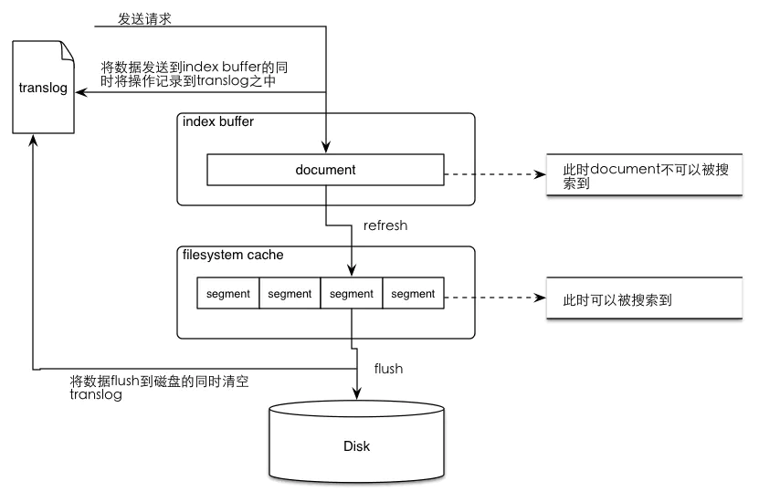

# 1. Elasticsearch 中 refresh 和 flush 有什么区别？


整体流程：

1、数据写入buffer缓冲和translog日志文件中。当写一条数据document的时候，一方面写入到mem buffer缓冲中，一方面同时写入到translog日志文件中。

2、buffer满了或者每隔1秒(可配)，refresh将mem buffer中的数据生成index segment文件并写入os cache，此时index segment可被打开以供search查询读取，这样文档就可以被搜索到了（注意，此时文档还没有写到磁盘上）；然后清空mem buffer供后续使用。可见，refresh实现的是文档从内存移到文件系统缓存的过程。

3、重复上两个步骤，新的segment不断添加到os cache，mem buffer不断被清空，而translog的数据不断增加，随着时间的推移，translog文件会越来越大。

4、当translog长度达到一定程度的时候，会触发flush操作，否则默认每隔30分钟也会定时flush，其主要过程：

1）执行refresh操作将mem buffer中的数据写入到新的segment并写入os cache，然后打开本segment以供search使用，最后再次清空mem buffer。

2）一个commit point被写入磁盘，这个commit point中标明所有的index segment。

3）filesystem cache（os cache）中缓存的所有的index segment文件被fsync强制刷到磁盘os disk，当index segment被fsync强制刷到磁盘上以后，就会被打开，供查询使用。

4）translog被清空和删除，创建一个新的translog。

refresh

最原始的ES版本里，必须等待fsync将segment刷入磁盘，才能将segment打开供search使用，这样的话，从一个document写入到它可以被搜索，可能会超过一分钟，主要瓶颈是在fsync实际发生磁盘IO写数据进磁盘，是很耗时的，这就不是近实时的搜索了。为此，引入refresh操作的目的是提高ES的实时性，使添加文档尽可能快的被搜索到，同时又避免频繁fsync带来性能开销，依靠的原理就是文件系统缓存OS cache里缓存的文件可以被打开(open/reopen)和读取，而这个os cache实际是一块内存区域，而非磁盘，所以操作是很快的。

写入流程改进：

1）数据写入到内存buffer队列中

2）每隔一定时间，buffer中的数据被写入segment文件，然后先写入os cache

3）只要segment数据写入os cache，那就直接打开segment供search使用，而不必调用fsync将segment刷新到磁盘

将缓存数据生成segment后刷入os cache，并被打开供搜索的过程就叫做refresh，默认每隔1秒。也就是说，每隔1秒就会将buffer中的数据写入一个新的index segment file，先写入os cache中。所以，es是近实时的，输入写入到os cache中可以被搜索，默认是1秒，所以从数据插入到被搜索到，最长是1秒（可配）。

flush操作与translog

但是，需要注意， index segment刷入到os cache后就可以打开供查询，这个操作是有潜在风险的，因为os cache中的数据有可能在意外的故障中丢失，而此时数据必备并未刷入到os disk，此时数据丢失将是不可逆的，这个时候就需要一种机制，可以将对es的操作记录下来，来确保当出现故障的时候，已经落地到磁盘的数据不会丢失，并在重启的时候可以从操作记录中将数据恢复过来。elasticsearch提供了translog来记录这些操作，结合os cached segments数据定时落盘来实现数据可靠性保证（flush）。

当向elasticsearch发送创建document文档添加请求的时候，document数据会先进入到buffer，与此同时会将操作记录在translog之中，当发生refresh时（数据从index buffer中进入filesystem cache的过程）translog中的操作记录并不会被清除，而当数据从os cache中被写入磁盘之后才会将translog中清空。这个将os cache的索引文件(segment file)持久化到磁盘的过程就是flush，flush之后，这段translog的使命就完成了，因为segment已经写入磁盘，就算故障也可以从磁盘的segment文件中恢复。flush的时机可能是1.定时flush；2.translog大小达到阈值；3.一些重要操作;4.指令触发。

translog记录的是已经在内存生成(segments)并存储到os cache但是还没写到磁盘的那些索引操作（注意，有一种解释说，添加到buffer中但是没有被存入segment中的数据没有被记录到translog中，这依赖于写translog的时机，不同版本可能有变化，不影响理解），此时这些新写入的数据可以被搜索到，但是当节点挂掉后这些未来得及落入磁盘的数据就会丢失，可以通过trangslog恢复。

当然translog本身也是磁盘文件，频繁的写入磁盘会带来巨大的IO开销，因此对translog的追加写入操作的同样操作的是os cache，因此也需要定时落盘（fsync）。translog落盘的时间间隔直接决定了ES的可靠性，因为宕机可能导致这个时间间隔内所有的ES操作既没有生成segment磁盘文件，又没有记录到Translog磁盘文件中，导致这期间的所有操作都丢失且无法恢复。

translog的fsync是ES在后台自动执行的，默认是每5秒钟主动进行一次translog fsync，或者当translog文件大小大于512MB主动进行一次fsync，对应的配置是index.translog.flush_threshold_period 和 index.translog.flush_threshold_size。还需指出的是， 从ES2.0开始，每次index、bulk、delete、update完成的时候也会触发translog flush，当flush到磁盘成功后才给请求端返回 200 OK。这个改变提高了数据安全性，但是会对写入的性能造成不小的影响，因此在可靠性要求不十分严格且写入效率优先的情况下，可以在 index template 里设置如下参数："index.translog.durability":"async"，这相当于关闭了index、bulk等操作的同步flush translog操作，仅使用默认的定时刷新、文件大小阈值刷新的机制，同时可以调高 "index.translog.sync_interval":30s (默认是5s)和index.translog.flush_threshold_size配置选项。

总结一下translog的功能：

保证在filesystem cache中的数据不会因为elasticsearch重启或是发生意外故障的时候丢失。

当系统重启时会从translog中恢复之前记录的操作。

当对elasticsearch进行CRUD操作的时候，会先到translog之中进行查找，因为tranlog之中保存的是最新的数据。

translog的清除时间时进行flush操作之后（将数据从filesystem cache刷入disk之中）。

总结一下flush操作的时间点：

es的各个shard会每个30分钟进行一次flush操作。

当translog的数据达到某个上限的时候会进行一次flush操作。

有关于translog和flush的一些配置项：

index.translog.flush_threshold_ops:当发生多少次操作时进行一次flush。默认是 unlimited。

index.translog.flush_threshold_size:当translog的大小达到此值时会进行一次flush操作。默认是512mb。

index.translog.flush_threshold_period:在指定的时间间隔内如果没有进行flush操作，会进行一次强制flush操作。默认是30m。

index.translog.interval:多少时间间隔内会检查一次translog，来进行一次flush操作。es会随机的在这个值到这个值的2倍大小之间进行一次操作，默认是5s。

# 2. 什么是副本（REPLICA），它有什么作用？
副本是分片的完整拷贝，副本的作用是增加了查询的吞吐率和在极端负载情况下获得高可用的能力。副本有效的帮助处理用户请求。

# 3. ElasticSearch 集群中增加和创建索引的步骤是什么？
可以在Kibana中配置新的索引，进行Fields Mapping，设置索引别名。

也可以通过HTTP请求来创建索引。

# 4. 解释一下 Elasticsearch Node？
节点是Elasticsearch的实例。实际业务中，会说：ES集群包含3个节点、7个节点。

这里节点实际就是：一个独立的Elasticsearch进程，一般将一个节点部署到一台独立的服务器或者虚拟机、容器中。

不同节点根据角色不同，可以划分为：

主节点

帮助配置和管理在整个集群中添加和删除节点。

数据节点

存储数据并执行诸如CRUD（创建/读取/更新/删除）操作，对数据进行搜索和聚合的操作。

1、 客户端节点（或者说：协调节点） 将集群请求转发到主节点，将与数据相关的请求转发到数据节点

2、 摄取节点

用于在索引之前对文档进行预处理。

# 5. 如何使用 Elastic Reporting？
收费功能，只是了解，点到为止。

Reporting API有助于将检索结果生成PDF格式，图像PNG格式以及电子表格CSV格式的数据，并可根据需要进行共享或保存。

# 6. 解释一下 X-Pack for Elasticsearch 的功能和重要性吗？
X-Pack是与Elasticsearch一起安装的扩展程序。

X-Pack的各种功能包括安全性（基于角色的访问，特权/权限，角色和用户安全性），监视，报告，警报等。

# 7. Elasticsearch 中的节点（比如共 20 个），其中的 10 个选了一个master，另外 10 个选了另一个 master，怎么办？
1、当集群master候选数量不小于3个时，可以通过设置最少投票通过数量（discovery.zen.minimum_master_nodes）超过所有候选节点一半以上来解决脑裂问题；

2、当候选数量为两个时，只能修改为唯一的一个master候选，其他作为data节点，避免脑裂问题。

# 8. 解释一下 Elasticsearch 集群中索引的概念 ？
一个Elasticsearch集群可以包含多个索引，与关系数据库相比，这些索引是数据库，这些索引包含多种类型（表）。类型（表）包含多个文档（记录/行），这些文档包含属性（列）。

# 9. 你可以列出 Elasticsearch 各种类型的分析器吗？
Elasticsearch Analyzer的类型为内置分析器和自定义分析器。

Standard Analyzer： 标准分析器是默认分词器，如果未指定，则使用该分词器。

它基于Unicode文本分割算法，适用于大多数语言。

Whitespace Analyzer： 基于空格字符切词。

Stop Analyzer： 在simple Analyzer的基础上，移除停用词。

Keyword Analyzer： 不切词，将输入的整个串一起返回。

自定义分词器的模板： 自定义分词器的在Mapping的Setting部分设置：

```sql
PUT my_custom_index
{
 "settings":{
  "analysis":{
  "char_filter":{},
  "tokenizer":{},
  "filter":{},
  "analyzer":{}
  }
 }
}
```
其中参数含义如下：

“char_filter”:{},——对应字符过滤部分；

“tokenizer”:{},——对应文本切分为分词部分；

“filter”:{},——对应分词后再过滤部分；

“analyzer”:{}——对应分词器组成部分，其中会包含：1. 2. 3。

# 10. Master 节点和 候选 Master 节点有什么区别？
主节点负责集群相关的操作，例如创建或删除索引，跟踪哪些节点是集群的一部分，以及决定将哪些分片分配给哪些节点。

拥有稳定的主节点是衡量集群健康的重要标志。

而候选主节点是被选具备候选资格，可以被选为主节点的那些节点。

# 11. 拼写纠错是如何实现的？
1、拼写纠错是基于编辑距离来实现： 编辑距离是一种标准的方法，它用来表示经过插入、删除和替换操作从一个字符串转换到另外一个字符串的最小操作步数；

2、编辑距离的计算过程： 比如要计算batyu和beauty的编辑距离，先创建一个7×8的表（batyu长度为5，coffee 长度为6，各加2），接着，在如下位置填入黑色数字。其他格的计算过程是取以下三个值的最小值：如果最上方的字符等于最左方的字符，则为左上方的数字。否则为左上方的数字+1。（对于3,3 来说为0）

左方数字+1（对于3,3 格来说为2）

上方数字+1（对于3,3 格来说为2）

最终取右下角的值即为编辑距离的值3。

对于拼写纠错，考虑构造一个度量空间（Metric Space），该空间内任何关系满足以下三条基本条件：

d(x,y) = 0 --假如x与y的距离为0，则x=y d(x,y) = d(y,x) --x到y的距离等同于y到x的距离 d(x,y) + d(y,z) >= d(x,z) --三角不等式

1、根据三角不等式，则满足与query距离在n范围内的另一个字符转B，其与A的距离最大为d+n，最小为d-n。

2、BK树的构造就过程如下：每个节点有任意个子节点，每条边有个值表示编辑距离。所有子节点到父节点的边上标注n表示编辑距离恰好为n。比如，我们有棵树父节点是”book”和两个子节点”cake”和”books”，”book”到”books”的边标号1，”book”到”cake”的边上标号4。

从字典里构造好树后，无论何时你想插入新单词时，计算该单词与根节点的编辑距离，并且查找数值为d(neweord, root)的边。递归得与各子节点进行比较，直到没有子节点，你就可以创建新的子节点并将新单词保存在那。比如，插入”boo”到刚才上述例子的树中，我们先检查根节点，查找d(“book”, “boo”) = 1的边，然后检查标号为1 的边的子节点，得到单词”books”。我们再计算距离d(“books”, “boo”)=2，则将新单词插在”books”之后，边标号为2。

3、查询相似词如下：计算单词与根节点的编辑距离d，然后递归查找每个子节点标号为d-n到d+n（包含）的边。假如被检查的节点与搜索单词的距离d小于n，则返回该节点并继续查询。比如输入cape且最大容忍距离为1，则先计算和根的编辑距离 d(“book”, “cape”)=4，然后接着找和根节点之间编辑距离为3到5的，这个就找到了cake 这个节点，计算d(“cake”, “cape”)=1，满足条件所以返回 cake，然后再找和cake节点编辑距离是0到2的，分别找到cape和cart节点，这样就得到cape这个满足条件的结果。

# 12. Elasticsearch中 cat API 的功能是什么？
cat API命令提供Elasticsearch集群的分析、概述和运行状况，其中包括与别名，分配，索引，节点属性等有关的信息。

这些cat命令使用查询字符串作为其参数，并以JSON文档格式返回结果信息。

# 13. Elasticsearch 中删除索引的语法是什么？
可以使用以下语法删除现有索引：

```sql
DELETE <index_name>
```

支持通配符删除：

```sql
DELETE my_*
```
# 14. 能否列出 与 ELK 日志分析相关的应用场景？
电子商务搜索解决方案

欺诈识别

市场情报

风险管理

安全分析等。

# 15. Beats 如何与 Elasticsearch 结合使用？
Beats是一种开源工具，可以将数据直接传输到Elasticsearch或通过logstash，在使用Kibana进行查看之前，可以对数据进行处理或过滤。

传输的数据类型包含：审核数据，日志文件，云数据，网络流量和窗口事件日志等。

# 16. logstash 如何与 Elasticsearch 结合使用？
logstash是ELK Stack附带的开源ETL服务器端引擎，该引擎可以收集和处理来自各种来源的数据。

最典型应用包含：同步日志、邮件数据，同步关系型数据库（Mysql、Oracle）数据，同步非关系型数据库（MongoDB）数据，同步实时数据流Kafka数据、同步高性能缓存Redis数据等。

# 17. Kibana 在 Elasticsearch 的哪些地方以及如何使用？
Kibana是ELK Stack–日志分析解决方案的一部分。

它是一种开放源代码的可视化工具，可以以拖拽、自定义图表的方式直观分析数据，极大降低的数据分析的门槛。

未来会向类似：商业智能和分析软件-Tableau发展。

# 18. 详细解释 ELK Stack 及其内容？
ELK Stack是一系列搜索和分析工具（Elasticsearch），收集和转换工具（Logstash）以及数据管理及可视化工具（Kibana）、解析和收集日志工具（Beats未来是Agent）以及监视和报告工具（例如X Pack）的集合。

相当于用户基本不再需要第三方技术栈，就能全流程、全环节搞定数据接入、存储、检索、可视化分析等全部功能。

# 19. 你能否列出与 Elasticsearch 有关的主要可用字段数据类型？
字符串数据类型，包括文本和关键字，例如电子邮件地址、邮政编码、主机名。

数值数据类型，例如byte、short、integer、long、float、double、half_float、scaled_float。

日期类型，日期纳秒Date nanoseconds，布尔值，二进制二进制（Base64编码字符串，例如000000用于char 'A'或011010用于char 'a'）。

范围（整数范围 integer_range，长范围 long_range，双精度范围 double_range，浮动范围 float_range，日期范围 date_range）。

包含对象（例如：单个JSON对象）和嵌套（JSON对象数组）的复杂数据类型。

地理数据类型包括纬度/经度（地理点）和地理形状（包括多边形等形状）。

专用数据类型，数组（数组中的值应具有相同的数据类型）。

# 20. 如何在 Elasticsearch 中搜索数据？
Search API有助于从索引、路由参数引导的特定分片中查找检索数据。
