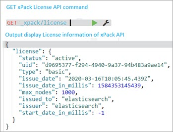

# 1. 迁移 Migration API 如何用作 Elasticsearch？
迁移API简化了X-Pack索引从一个版本到另一个版本的升级。

点到即可，类似问题实际开发中如有发现，需现场排查，类似问题没有什么意义。

参考文献：[https://www.elastic.co/guide/en/elasticsearch/reference/current/migration-api.html](https://www.elastic.co/guide/en/elasticsearch/reference/current/migration-api.html)

# 2. 能列举过你使用的 X-Pack 命令吗？
Elasticsearch7.1安全功能免费后，使用了：setup-passwords为账号设置密码，确保集群安全。

# 3. 你能列出 X-Pack API 类型吗？
X-Pack API 类型如下：

1）Info API：它提供有关已安装X-Pack功能的一般信息，例如构建信息、许可证信息、功能信息。

信息API – xPack API：


2）Graph Explore API：Explore API有助于检索和汇总文档信息与 Elasticsearch 索引的术语。


3）许可API：此API有助于管理许可，例如获取试用状态、开始试用、获取基本状态、开始基本、开始试用、更新许可和删除许可。

获取许可证



4）机器学习API：这些API执行与日历相关的任务，例如创建日历、添加和删除作业、向日历添加和删除计划事件、获取日历、获取计划事件、删除日历、过滤任务等创建、更新、获取和删除过滤器，数据馈送任务，如创建、更新、启动、停止、预览和删除数据馈送，获取数据馈送信息/统计信息。

作业任务，如创建、更新、打开、关闭、删除作业、向日历添加或删除作业、获取作业信息/统计信息、与模型快照、结果、文件结构以及过期数据相关的各种其他任务也包含在机器中学习API。

5）安全API：这些API用于执行X-Pack安全活动，例如身份验证、清除缓存、权限和SSL证书相关的安全活动。

6）观察者API：这些API有助于观察或观察添加到Elasticsearch中的新文档。

7）Rollup API：这些API已被引入用于验证实验阶段的功能，将来可能会从Elasticsearch中删除。

8）迁移API：这些API将X-Pack索引从以前的版本升级到最新版本。

# 4. Elasticsearch 支持哪些配置管理工具？
Ansible、Chef、Puppet和Salt Stack是DevOps团队使用的Elasticsearch支持的配置工具。

# 5. 安装 Elasticsearch 时，请解释不同的包及其重要性？
Linux和macOS平台需要安装tar.gz档案。

Windows操作系统需要安装.zip档案。

需要安装Debian，基于Ubuntu的系统deb包。

Red Hat、Centos、OpenSuSE、SLES需要安装rpm包。

Windows64位系统需要安装MSI包。

可以从Elastic Docker Registry下载用于将Elasticsearch作为Docker容器运行的Docker映像。

X-Pack API包与Elasticsearch一起安装，有助于获取有关Elasticsearch中涉及的许可证、安全性、迁移和机器学习活动的信息。

# 6. REST API 相对于 Elasticsearch 有哪些优势？
REST API是使用超文本传输​​协议的系统之间的通信，它以XML和JSON格式传输数据请求。

REST协议是无状态的，并且与服务器和存储数据的用户界面分离，从而增强了用户界面与任何类型平台的可移植性。它还提高了可扩展性，允许独立实现组件，因此应用程序变得更加灵活。

REST API独立于平台和语言，只是用于数据交换的语言是XML或JSON。

# 7. 如何使用 Elasticsearch Analyzer 中的字符过滤器？
Elasticsearch分析器中的字符过滤器不是强制性的。这些过滤器通过将文本标记替换为映射到键的相应值来操作字符串的输入流。

可以使用参数作为映射和映射路径的映射字符过滤器。映射是包含列出的键和相应值的数组的文件，而mappings_path是在配置目录中注册的路径，显示存在的映射文件。

字符过滤分类如下：

```shell
HTML Strip Character Filter.
```

作用：删除HTML元素，如，并解码HTML实体，如＆amp。

```shell
Mapping Character Filter
```
作用：替换指定的字符。

```shell
Pattern Replace Character Filter
```
作用：基于正则表达式替换指定的字符。

# 8. Elasticsearch 中的属性 enabled、index 和 store 的功能是什么？
enabled

enabled:false，启用的设置仅可应用于顶级映射定义和Object对象字段，导致Elasticsearch完全跳过对字段内容的解析。Elasticsearch中enabled属性适用于需要保留和存储索引中的特定字段的情况。这是通过在顶级映射以及对象字段中使用“enabled”：错误语法来完成的。

虽然可以从_source字段中检索JSON，但是无法搜索或以其他任何方式存储JSON。如果对非全局或者Object类型，设置enable:false会报错如下：

```shell
"type": "mapper_parsing_exception",
"reason": "Mapping definition for [user_id] has unsupported parameters:  [enabled : false]"
```
**index**

index:false，索引选项控制是否对字段值建立索引。它接受true或false，默认为true。未索引的字段不可查询。如果非要检索，报错如下：

```shell
"type": "search_phase_execution_exception",
"reason": "Cannot search on field [user_id] since it is not indexed."
```
Elasticsearch中index属性将决定对字符串流进行索引的三种方式：

>analyzed 在将字符串作为全文字段进行索引之前对其进行分析。 not_analyzed 索引字符串流以使其可搜索，而不对其进行分析。 no 字符串根本不会被索引，也无法搜索。

**store**

某些特殊场景下，如果只想检索单个字段或几个字段的值，而不是整个_source的值，则可以使用源过滤来实现。即使将store设置为false，Elasticsearch也会将原始文档存储在磁盘上，从而尽可能快地进行搜索。


# 9. 您能否说明目前可供下载的稳定 Elasticsearch 版本？
Elasticsearch的最新稳定版本是7.5.0（2022年1月26日）。

# 10. 列出 10 家使用 Elasticsearch 作为其应用程序的搜索引擎和数据库的公司？
参与过Elastic中文社区活动或者经常关注社区动态的人都知道，使用的公司太多了，列举如下（排名不分先后）：

阿里、腾讯、字节跳动、百度、京东、美团、小米、滴滴、携程、贝壳找房、360、IBM、顺丰快递等等，几乎能想到的互联网公司都在使用Elasticsearch。

# 11. Elasticsearch 中列出集群的所有索引的语法是什么？
```shell
GET /_<索引名称>
```


```shell
GET index_name，在上述情况下index_name是.kibana。
```
# 12. 在索引中更新 Mapping 的语法？
```shell
PUT test_001/_mapping
{
  "properties": {
    "title":{
      "type":"keyword"
    }
  }
}
```
# 13. Elasticsearch中按 ID 检索文档的语法是什么？
GET API从索引中检索指定的JSON文档。

句法：

```shell
GET <index_name>/_doc/<_id>
```
实例：

```shell
GET test_001/_doc/1
```
# 14. 我们可以在 Elasticsearch 中执行搜索的各种可能方式有哪些？
下面提到的是我们可以在Elasticsearch中执行搜索的各种可能方式：

1）跨多个类型和多个索引应用搜索API：搜索API，可以跨多个类型和索引搜索实体。

2）使用统一资源标识符搜索请求：可以使用参数和URI即统一资源标识符来搜索请求。

```shell
GET /my_index/_search?q=user:seina
```
3）在正文中使用查询DSL即（动态脚本语言）进行搜索：DSL即动态脚本语言用于JSON请求正文。

```shell
GET /javals/_search
{
  "query": {
    "bool": {
      "filter": [
        { "jingxuan": { "color": "red"}},
        { "jingxuan": { "brand": "gucci"}}
      ]
    }
  }
}
```
# 15. 精准匹配检索和全文检索匹配检索有什么不同？
动态脚本语言 (DSL) Elasticsearch查询被称为全文查询，它利用HTTP请求正文，提供意图清晰和详细的优势，随着时间的推移，调整这些查询变得更加简单。

举例：驾驶证号、身份证号等的匹配往往是精准匹配。

精准匹配检索查询利用倒排索引，一种类似哈希图的数据结构，有助于从用于分析目的的电子邮件正文、关键字或数字或日期等中定位文本或字符串。

举例：类似B站搜索特定关键词如“公众号：Java精选”往往是模糊匹配，相关的都返回。

# 16. 如何使用 Elasticsearch Tokenizer？
Tokenizer接收字符流（如果包含了字符过滤，则接收过滤后的字符流；否则，接收原始字符流），将其分词。

同时记录分词后的顺序或位置(position)，以及开始值（start_offset）和偏移值(end_offset-start_offset)。

# 17. token filter 过滤器在 Elasticsearch 中如何工作？
针对tokenizers处理后的字符流进行再加工，比如：转小写、删除（删除停用词）、新增（添加同义词）等。

# 18. Elasticsearch中的 Ingest 节点如何工作？
ingest节点可以看作是数据前置处理转换的节点，支持pipeline管道设置，可以使用ingest对数据进行过滤、转换等操作，类似于logstash中filter的作用，功能相当强大。

# 19. 请解释一下 Elasticsearch 中聚合的工作原理？
Elasticsearch中聚合有助于从搜索中使用的查询中收集数据。

不同类型的聚合是Metrics、Average、Minimum、Maximum、Sum和stats，基于不同的目的。

Elasticsearch7.10的官方文档分类如下：

1）分桶Bucket聚合

根据字段值，范围或其他条件将文档分组为桶（也称为箱）。

2）指标Metric聚合

从字段值计算指标（例如总和或平均值）的指标聚合。

3）管道Pipeline聚合

子聚合，从其他聚合（而不是文档或字段）获取输入。
