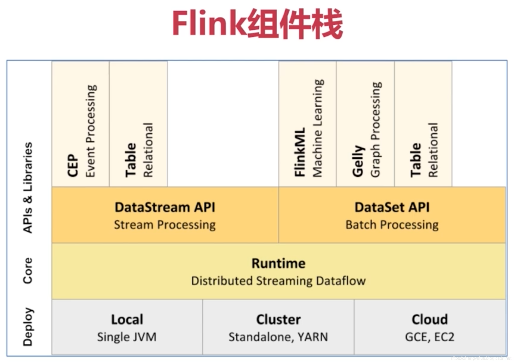
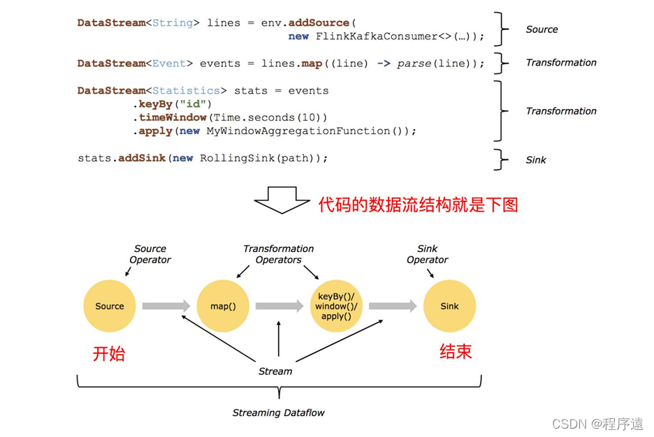
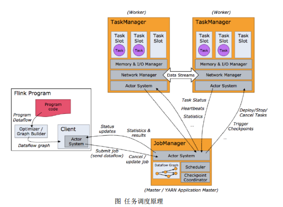
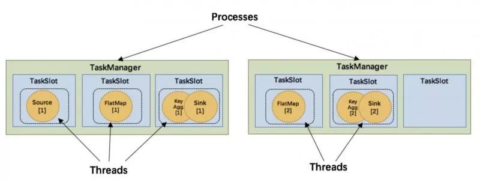

# 1. 简单描述一下什么是 Flink？
Flink是一个框架和分布式处理引擎，用于对无界和有界数据流进行有状态计算。并且Flink提供了数据分布、容错机制以及资源管理等核心功能。

Flink提供了诸多高抽象层的API以便用户编写分布式任务：

DataSet API，对静态数据进行批处理操作，将静态数据抽象成分布式的数据集，用户可以方便地使用Flink提供的各种操作符对分布式数据集进行处理，支持Java、Scala和Python。

DataStream API，对数据流进行流处理操作，将流式的数据抽象成分布式的数据流，用户可以方便地对分布式数据流进行各种操作，支持Java和Scala。

Table API，对结构化数据进行查询操作，将结构化数据抽象成关系表，并通过类SQL的DSL对关系表进行各种查询操作，支持Java和Scala。

此外，Flink还针对特定的应用领域提供了领域库，例如：FlinkML，Flink的机器学习库，提供了机器学习Pipelines API并实现了多种机器学习算法。Gelly，Flink的图计算库，提供了图计算的相关API及多种图计算算法实现。

# 2. Flink 都有哪些特性？
支持高吞吐、低延迟、高性能的流处理

支持带有事件时间的窗口（Window）操作

支持有状态计算的Exactly-once语义

支持高度灵活的窗口（Window）操作，支持基于time、count、session以及data-driven的窗口操作

支持具有Backpressure功能的持续流模型

支持基于轻量级分布式快照（Snapshot）实现的容错

一个运行时同时支持Batch on Streaming处理和Streaming处理

Flink在JVM内部实现了自己的内存管理

支持迭代计算

支持程序自动优化：避免特定情况下Shuffle、排序等昂贵操作，中间结果有必要进行缓存

# 3. Flink 相比传统的 Spark Streaming 有什么区别？
TODO

# 4. Flink中都有哪些组件栈？
根据Flink官网描述，Flink是一个分层架构的系统，每一层所包含的组件都提供了特定的抽象，用来服务于上层组件。



自下而上，每一层分别代表：

Deploy层：该层主要涉及了Flink的部署模式，在上图中我们可以看出，Flink支持包括local、Standalone、Cluster、Cloud等多种部署模式。

Runtime层：Runtime层提供了支持Flink计算的核心实现，比如：支持分布式Stream处理、JobGraph到ExecutionGraph的映射、调度等等，为上层API层提供基础服务。

API层：API层主要实现了面向流（Stream）处理和批（Batch）处理API，其中面向流处理对应DataStream API，面向批处理对应DataSet API，后续版本，Flink有计划将DataStream和DataSetAPI进行统一。

Libraries层：该层称为Flink应用框架层，根据API层的划分，在API层之上构建的满足特定应用的实现计算框架，也分别对应于面向流处理和面向批处理两类。面向流处理支持：CEP（复杂事件处理）、基于SQL-like的操作（基于Table的关系操作）；面向批处理支持：FlinkML（机器学习库）、Gelly（图处理）。

# 5. Flink 运行时必须依赖 Hadoop 组件吗？
Flink可以完全独立于Hadoop，在不依赖Hadoop组件下运行。但是做为大数据的基础设施，Hadoop体系是任何大数据框架都绕不过去的。

Flink可以集成众多Hadooop组件，例如Yarn、Hbase、HDFS等等。

例如Flink可以和Yarn集成做资源调度，也可以读写HDFS，或者利用HDFS做检查点。

# 6. 了解 Flink 基础编程模型吗？


上图是来自Flink官网的运行流程图。通过上图我们可以得知，Flink 程序的基本构建是数据输入来自一个 Source，Source 代表数据的输入端，经过 Transformation 进行转换，然后在一个或者多个Sink接收器中结束。数据流（stream）就是一组永远不会停止的数据记录流，而转换（transformation）是将一个或多个流作为输入，并生成一个或多个输出流的操作。执行时，Flink程序映射到 streaming dataflows，由流（streams）和转换操作（transformation operators）组成。

# 7. Flink 集群有哪些角色？各自有什么作用？


客户端不是运行时和程序执行的一部分，但它用于准备并发送dataflow（JobGraph）给Master（JobManager），然后，客户端断开连接或者维持连接以等待接收计算结果。

当Flink集群启动后，首先会启动一个JobManger和一个或多个的TaskManager。由Client提交任务给JobManager，JobManager再调度任务到各个TaskManager去执行，然后TaskManager将心跳和统计信息汇报给JobManager。TaskManager之间以流的形式进行数据的传输。上述三者均为独立的JVM进程。

Client为提交Job的客户端，可以是运行在任何机器上（与JobManager环境连通即可）。提交Job后，Client可以结束进程（Streaming的任务），也可以不结束并等待结果返回。

JobManager主要负责调度Job并协调Task做checkpoint，职责上很像Storm的Nimbus。从Client处接收到Job和JAR包等资源后，会生成优化后的执行计划，并以Task的单元调度到各个TaskManager去执行。

TaskManager在启动的时候就设置好了槽位数（Slot），每个slot能启动一个Task，Task为线程。从JobManager处接收需要部署的Task，部署启动后，与自己的上游建立Netty连接，接收数据并处理。

# 8. 说说 Flink 资源管理中 Task Slot 的概念？


在Flink架构角色中提到，TaskManager是实际负责执行计算的Worker，TaskManager是一个JVM进程，并会以独立的线程来执行一个task或多个subtask。为了控制一个TaskManager能接受多少个task，Flink提出了TaskSlot的概念。

简单的说，TaskManager会将自己节点上管理的资源分为不同的Slot：固定大小的资源子集。这样就避免了不同Job的Task互相竞争内存资源，但是需要主要的是，Slot只会做内存的隔离。没有做CPU的隔离。

# 9. Flink 中都有哪些常用算子？
flink中提供的大量的算子，常用的算子操作方式：

map

DataStream --> DataStream：输入一个参数产生一个参数，map的功能是对输入的参数进行转换操作。

flatMap

DataStream --> DataStream：输入一个参数，产生0、1或者多个输出，这个多用于拆分操作

filter

DataStream --> DataStream：结算每个元素的布尔值，并返回为true的元素

keyBy

DataSteam --> DataStream：逻辑地将一个流拆分成不相交的分区，每个分区包含具有相同key的元素，在内部以hash的形式实现的。以key来分组。

# 10. 描述一下 Flink 八种分区策略？
分区策略是用来决定数据如何发送至下游。目前Flink支持8中分区策略的实现。

1）GlobalPartitioner：数据会被分发到下游算子的第一个实例中进行处理。

2）ShufflePartitioner：数据会被随机分发到下游算子的每一个实例中进行处理。

3）RebalancePartitioner：数据会被循环发送到下游的每一个实例中进行处理。

4）RescalePartitioner：这种分区器会根据上下游算子的并行度，循环的方式输出到下游算子的每个实例。这里有点难以理解，假设上游并行度为2，编号为A和B。下游并行度为4，编号为1，2，3，4。那么A则把数据循环发送给1和2，B则把数据循环发送给3和4。假设上游并行度为4，编号为A，B，C，D。下游并行度为2，编号为1，2。那么A和B则把数据发送给1，C和D则把数据发送给2。

5）BroadcastPartitioner：广播分区会将上游数据输出到下游算子的每个实例中。适合于大数据集和小数据集做Jion的场景。

6）ForwardPartitioner ForwardPartitioner：用于将记录输出到下游本地的算子实例。它要求上下游算子并行度一样。简单的说，ForwardPartitioner用来做数据的控制台打印。

7）KeyGroupStreamPartitioner：Hash分区器。会将数据按Key的Hash值输出到下游算子实例中。

8）CustomPartitionerWrapper：用户自定义分区器。需要用户自己实现Partitioner接口，来定义自己的分区逻辑。

举例：
```java
static classCustomPartitioner implements Partitioner<String> {
    @Override
    public int partition(String key, int numPartitions) {
        switch (key){
        case "1":
            return 1;
        case "2":
            return 2;
        case "3":
            return 3;
        default:
            return 4;
        }
    }
}
```
# 11. Flink 三种时间语义是什么，分别说出应用场景？
Event Time：这是实际应用最常见的时间语义，指的是事件创建的时间，往往跟watermark结合使用。

Processing Time：指每一个执行基于时间操作的算子的本地系统时间，与机器相关。适用场景：没有事件时间的情况下，或者对实时性要求超高的情况。

Ingestion Time：指数据进入Flink的时间。适用场景：存在多个Source Operator 的情况下，每个Source Operator可以使用自己本地系统时钟指派Ingestion Time。后续基于时间相关的各种操作，都会使用数据记录中的Ingestion Time。

# 12. Flink 程序在面对数据高峰期时如何处理？
可以考虑使用大容量的Kafka把数据先放到消息队列里面作为数据源，再使用Flink进行消费，不过这样会影响到一点实时性。

# 13. Flink CEP 编程中当状态没有到达时会将数据保存在哪里？
在流式处理中，CEP当然是要支持EventTime的，那么相对应的也要支持数据的迟到现象，也就是watermark的处理逻辑。CEP对未匹配成功的事件序列的处理，和迟到数据是类似的。在Flink CEP的处理逻辑中，状态没有满足的和迟到的数据，都会存储在一个Map数据结构中，也就是说，如果限定判断事件序列的时长为5分钟，那么内存中就会存储5分钟的数据，这在我看来，也是对内存的极大损伤之一。

# 14. 简述一下 Flink 的 Watermark 机制？
Watermark本质是Flink中衡量EventTime进展的一个机制，主要用来处理乱序数据。

# 15. Flink 中 checkpoint 机制对比 Spark 有什么不同和优势？
spark streaming的checkpoint仅仅是针对driver的故障恢复做了数据和元数据的checkpoint。而flink的checkpoint机制要复杂了很多，它采用的是轻量级的分布式快照，实现了每个算子的快照，及流动中的数据的快照。

# 16. 描述一下 Flink 状态机制？
Flink内置的很多算子，包括源source，数据存储sink都是有状态的。在Flink中，状态始终与特定算子相关联。Flink会以checkpoint的形式对各个任务的状态进行快照，用于保证故障恢复时的状态一致性。Flink通过状态后端来管理状态和checkpoint的存储，状态后端可以有不同的配置选择。

# 17. Flink 中 exactly-once 语义是如何实现的，状态是如何存储的？
Flink依靠checkpoint机制来实现exactly-once语义，如果要实现端到端的exactly-once，还需要外部source和sink满足一定的条件。状态的存储通过状态后端来管理，Flink中可以配置不同的状态后端。

# 18. Flink 中 checkpoint 可以存储在哪里？
Flink中checkpoint可以存储在内存，文件系统，或者RocksDB。

# 19. 如果下级存储不支持事务，Flink 如何保证 exactly-once？
端到端的exactly-once对sink要求比较高，具体实现主要有幂等写入和事务性写入。

幂等写入的场景依赖于业务逻辑，更常见的是用事务性写入。

而事务性写入又有预写日志（WAL）和两阶段提交（2PC）两种方式。

如果外部系统不支持事务，那么可以用预写日志的方式，把结果数据先当成状态保存，然后在收到checkpoint完成的通知时，一次性写入sink系统。

# 20. 为什么使用 Flink 替代 Spark？
主要考虑的是Flink的低延迟、高吞吐量和对流式数据应用场景更好的支持；另外，Flink可以很好地处理乱序数据，而且可以保证exactly-once的状态一致性。