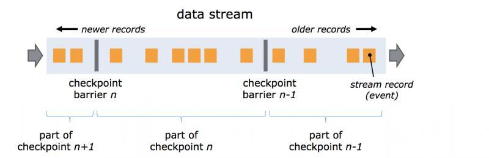

# 1. 如何做 Flink 压力测试和监控？
1、产生数据流的速度如果过快，而下游的算子消费不过来的话，会产生背压。背压的监控可以使用Flink Web UI（localhost:8081）来可视化监控，一旦报警就能知道。一般情况下背压问题的产生可能是由于sink这个操作符没有优化好，做一下优化就可以了。比如，如果是写入ElasticSearch，那么可以改成批量写入，可以调大ElasticSearch队列的大小等等

2、设置watermark的最大延迟时间这个参数，如果设置的过大，可能会造成内存的压力。可以设置最大延迟时间小一些，然后把迟到元素发送到侧输出流中去。晚一点更新结果。或者使用类似于RocksDB这样的状态后端，RocksDB会开辟堆外存储空间，但IO速度会变慢，需要权衡。

3、还有就是滑动窗口的长度如果过长，而滑动距离很短的话，Flink的性能会下降的很厉害。我们主要通过时间分片的方法，将每个元素只存入一个“重叠窗口”，这样就可以减少窗口处理中状态的写入。

4、状态后端使用RocksDB，还没有碰到被撑爆的问题。

# 2. 公司如何提交的实时任务，有多少 Job Manager？
1、使用yarn session模式提交任务。每次提交都会创建一个新的Flink集群，为每一个job提供一个yarn-session，任务之间互相独立，互不影响，方便管理。任务执行完成之后创建的集群也会消失。

线上命令脚本如下：
```shell
bin/yarn-session.sh -n 7 -s 8 -jm 3072 -tm 32768 -qu root.. -nm - -d
```
其中申请7个taskManager，每个8核，每个taskmanager有32768M内存。

2、集群默认只有一个Job Manager。但为了防止单点故障，我们配置了高可用。我们公司一般配置一个主Job Manager，两个备用Job Manager， 然后结合ZooKeeper的使用，来达到高可用。

# 3. Flink 应用场景都有哪些？
应用场景包括但不限于以下几方面：

1、优化电商网站的实时搜索结果；

2、针对数据分析团队提供实时流处理服务；

3、网络/传感器检测和错误检测；

4、商业智能分析ETL。

举例： 阿里使用Flink技术的应用主要包含四个模块：实时监控、实时报表、流数据分析和实时仓库。

实时监控

用户行为预警、app crash 预警、服务器攻击预警

对用户行为或者相关事件进行实时监测和分析，基于风控规则进行预警

实时报表

双11、双12等活动直播大屏

对外数据产品：生意参谋等

数据化运营

流数据分析

实时计算相关指标反馈及时调整决策

内容投放、无线智能推送、实时个性化推荐等

实时仓库

数据实时清洗、归并、结构化

数仓的补充和优化

# 4. Flink 并行度了解吗？并行度如何设置？
Flink中的任务被分为多个并行任务来执行，其中每个并行的实例处理一部分数据。这些并行实例的数量被称为并行度。

在实际生产环境中可以从四个不同层面设置并行度：

操作算子层面（Operator Level）

执行环境层面（Execution Environment Level）

客户端层面（Client Level）

系统层面（System Level）

需要注意的优先级：算子层面>环境层面>客户端层面>系统层面。

# 5. Flink 中有哪几种重启策略？
Flink 实现了多种重启策略，分别如下：

固定延迟重启策略（Fixed Delay Restart Strategy）

故障率重启策略（Failure Rate Restart Strategy）

没有重启策略（No Restart Strategy）

Fallback重启策略（Fallback Restart Strategy）

# 6. Flink 中如何使用分布式缓存吗？
Flink实现的分布式缓存和Hadoop有异曲同工之妙。目的是在本地读取文件，并把它放在 taskmanager节点中，防止task重复拉取。具体实现源码如下：
```js
val env = ExecutionEnvironment.getExecutionEnvironment

// register a file from HDFS
env.registerCachedFile("hdfs:///path/to/your/file", "hdfsFile")

// register a local executable file (script, executable, ...)
env.registerCachedFile("file:///path/to/exec/file", "localExecFile", true)

// define your program and execute
...
val input: DataSet[String] = ...
val result: DataSet[Integer] = input.map(new MyMapper())
...
env.execute()
```

# 7. Flink 中广播变量，使用时需要注意什么？
由于Flink是并行的，计算过程可能不在一个 Slot中进行，那么有一种情况：当需要访问同一份数据时，可以使用Flink中的广播变量，来解决这种情况。

通俗的讲可以把广播变量理解为是一个公共的共享变量，把一个dataset数据集广播出去，然后不同的task在节点上都能够获取到，这个数据在每个节点上只会存在一份。

# 8. 描述一下 Flink 中的状态存储？
Flink在做计算的过程中经常需要存储中间状态，来避免数据丢失和状态恢复。选择的状态存储策略不同，会影响状态持久化如何和checkpoint交互。

Flink提供了三种状态存储方式：MemoryStateBackend、FsStateBackend、RocksDBStateBackend。

# 9. Flink 中水印是什么概念，起到什么作用？
Watermark是Apache Flink为了处理EventTime窗口计算提出的一种机制，本质上是一种时间戳。一般来讲Watermark经常和Window一起被用来处理乱序事件。

# 10. Flink Table & SQL 熟悉吗？TableEnvironment 类有什么作用？
TableEnvironment是Table API和SQL集成的核心概念。

这个类主要用来实现：

在内部catalog中注册表；

注册外部catalog；

执行SQL查询；

注册用户定义（标量，表或聚合）函数；

将DataStream或DataSet转换为表；

持有对ExecutionEnvironment或StreamExecutionEnvironment的引用。

# 11. Flink SQL 实现原理是什么？如何实现 SQL 解析？
TODO

# 12. Flink 中是如何实现容错的？
Flink实现容错主要靠强大的CheckPoint机制和State机制。

Checkpoint负责定时制作分布式快照、对程序中的状态进行备份；State用来存储计算过程中的中间状态。

# 13. Flink 分布式快照的原理是什么？
Flink的分布式快照是根据Chandy-Lamport算法量身定做的。简单来说就是持续创建分布式数据流及其状态的一致快照。



核心思想是在input source端插入barrier，控制barrier的同步来实现snapshot的备份和exactly-once语义。

# 14. Flink 是如何实现高效的数据交换？
在一个Flink Job中，数据需要在不同的task中进行交换，整个数据交换是有TaskManager负责的，TaskManager的网络组件首先从缓冲buffer中收集records，然后再发送。

Records并不是一个一个被发送的，二是积累一个批次再发送，batch技术可以更加高效的利用网络资源。

# 15. Flink 中 kafka 连接器有什么特别之处？
Flink源码中有一个独立的connector模块，所有的其他connector都依赖于此模块，Flink 在1.9版本发布的全新kafka连接器，摒弃了之前连接不同版本的kafka集群需要依赖不同版本的connector这种做法，只需要依赖一个connector即可。

# 16. 说一说 Flink 中内存管理是如何实现的？
Flink并不是将大量对象存在堆上，而是将对象都序列化到一个预分配的内存块上。此外，Flink大量的使用了堆外内存。如果需要处理的数据超出了内存限制，则会将部分数据存储到硬盘上。Flink为了直接操作二进制数据实现了自己的序列化框架。

理论上Flink的内存管理分为三部分：

Network Buffers： 这个是在TaskManager启动的时候分配的，这是一组用于缓存网络数据的内存，每个块是32K，默认分配2048个，可以通过“taskmanager.network.numberOfBuffers”修改。

Memory Manage pool： 大量的Memory Segment块，用于运行时的算法（Sort/Join/Shuffle等），这部分启动的时候就会分配。下面这段代码，根据配置文件中的各种参数来计算内存的分配方法。（heap or off-heap，这个放到下节谈），内存的分配支持预分配和lazy load，默认懒加载的方式。

User Code： 这部分是除了Memory Manager之外的内存用于User code和TaskManager本身的数据结构。

# 17. Flink 中使用聚合函数 GroupBy、Distinct、KeyBy 等时出现数据热点如何解决？
数据倾斜和数据热点是所有大数据框架绕不过去的问题。处理这类问题主要从3个方面入手：

1、在业务上规避这类问题

例如一个假设订单场景，北京和上海两个城市订单量增长几十倍，其余城市的数据量不变。这时候我们在进行聚合的时候，北京和上海就会出现数据堆积，我们可以单独数据北京和上海的数据。

2、Key值设计方面

把热key进行拆分，比如上个例子中的北京和上海，可以把北京和上海按照地区进行拆分聚合。

3、参数设置

Flink 1.9.0 SQL(Blink Planner) 性能优化中一项重要的改进就是升级了微批模型，即 MiniBatch。原理是缓存一定的数据后再触发处理，以减少对State的访问，从而提升吞吐和减少数据的输出量。

# 18. Flink 中是如何实现序列化的？
Java本身自带的序列化和反序列化的功能，但是辅助信息占用空间比较大，在序列化对象时记录了过多的类信息。

Apache Flink摒弃了Java原生的序列化方法，以独特的方式处理数据类型和序列化，包含自己的类型描述符，泛型类型提取和类型序列化框架。

TypeInformation是所有类型描述符的基类。它揭示了该类型的一些基本属性，并且可以生成序列化器。

TypeInformation支持以下几种类型：

BasicTypeInfo: 任意Java 基本类型或 String 类型
BasicArrayTypeInfo: 任意Java基本类型数组或 String 数组

WritableTypeInfo: 任意 Hadoop Writable 接口的实现类

TupleTypeInfo: 任意的 Flink Tuple 类型(支持Tuple1 to Tuple25)。Flink tuples 是固定长度固定类型的Java Tuple实现

CaseClassTypeInfo: 任意的 Scala CaseClass(包括 Scala tuples)

PojoTypeInfo: 任意的POJO (Java or Scala)，例如，Java对象的所有成员变量，要么是public修饰符定义，要么有getter/setter方法

GenericTypeInfo: 任意无法匹配之前几种类型的类。

针对前六种类型数据集，Flink皆可以自动生成对应的TypeSerializer，能非常高效地对数据集进行序列化和反序列化。

# 19. Window 环境下 Flink 出现数据倾斜，有什么解决办法？
window产生数据倾斜指的是数据在不同的窗口内堆积的数据量相差过多。本质上产生这种情况的原因是数据源头发送的数据量速度不同导致的。出现这种情况一般通过两种方式来解决：

在数据进入窗口前做预聚合；

重新设计窗口聚合的key。

# 20. Flink 是如何处理反压的？
Flink内部是基于producer-consumer模型来进行消息传递的，Flink的反压设计也是基于这个模型。

Flink使用了高效有界的分布式阻塞队列，就像Java通用的阻塞队列（BlockingQueue）一样。下游消费者消费变慢，上游就会受到阻塞。