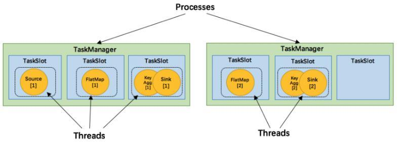
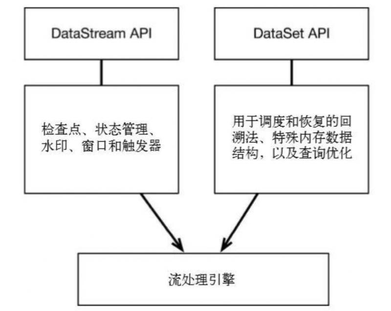
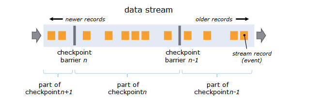

# 1. Flink 任务延迟高，如何解决这个问题？
在Flink的后台任务管理中，可以看到Flink的哪个算子和task出现了反压。最主要的手段是资源调优和算子调优。

资源调优即是对作业中的Operator的并发数（parallelism）、CPU（core）、堆内存（heap_memory）等参数进行调优。

作业参数调优包括：并行度的设置，State的设置，checkpoint的设置。

# 2. Flink 反压和 Strom 有哪些不同？
Storm是通过监控Bolt中的接收队列负载情况，如果超过高水位值就会将反压信息写到Zookeeper，Zookeeper上的watch会通知该拓扑的所有Worker都进入反压状态，最后Spout停止发送tuple。

Flink中的反压使用了高效有界的分布式阻塞队列，下游消费变慢会导致发送端阻塞。

二者最大的区别是Flink是逐级反压，而Storm是直接从源头降速。

# 3. Flink 如何实现的计算资源调度？
TaskManager中最细粒度的资源是Task slot，代表了一个固定大小的资源子集，每个TaskManager会将其所占有的资源平分给它的slot。

通过调整 task slot 的数量，用户可以定义task之间是如何相互隔离的。每个TaskManager有一个slot，也就意味着每个task运行在独立的JVM中。每个TaskManager有多个slot的话，也就是说多个task运行在同一个JVM中。

而在同一个JVM进程中的task，可以共享TCP连接（基于多路复用）和心跳消息，可以减少数据的网络传输，也能共享一些数据结构，一定程度上减少了每个task的消耗。每个slot可以接受单个task，也可以接受多个连续task组成的pipeline，如下图所示，FlatMap函数占用一个taskslot，而key Agg函数和sink函数共用一个taskslot：

# 4. Operator Chains（算子链）概念你了解吗？
为了更高效地分布式执行，Flink会尽可能地将operator的subtask链接（chain）在一起形成task。每个task在一个线程中执行。将operators链接成task是非常有效的优化：它能减少线程之间的切换，减少消息的序列化/反序列化，减少数据在缓冲区的交换，减少了延迟的同时提高整体的吞吐量。这就是常说的算子链。

# 5. Flink 中如何支持批流一体？

Flink的开发者认为批处理是流处理的一种特殊情况。批处理是有限的流处理。Flink使用一个引擎支持了DataSet API和DataStream API。

# 6. Flink 所谓“三层图”结构是哪几个“图”？
一个Flink任务的DAG生成计算图大致经历以下三个过程：

StreamGraph

最接近代码所表达的逻辑层面的计算拓扑结构，按照用户代码的执行顺序向StreamExecutionEnvironment添加StreamTransformation构成流式图。

JobGraph

从StreamGraph生成，将可以串联合并的节点进行合并，设置节点之间的边，安排资源共享slot槽位和放置相关联的节点，上传任务所需的文件，设置检查点配置等。相当于经过部分初始化和优化处理的任务图。

ExecutionGraph

由JobGraph转换而来，包含了任务具体执行所需的内容，是最贴近底层实现的执行图。

# 7. 简述 Flink 的数据抽象及数据交换过程？
Flink 为了避免JVM的固有缺陷例如java对象存储密度低，FGC影响吞吐和响应等，实现了自主管理内存。MemorySegment就是Flink的内存抽象。默认情况下，一个MemorySegment可以被看做是一个32kb大的内存块的抽象。这块内存既可以是JVM里的一个byte[]，也可以是堆外内存（DirectByteBuffer）。

在MemorySegment这个抽象之上，Flink在数据从operator内的数据对象在向TaskManager上转移，预备被发给下个节点的过程中，使用的抽象或者说内存对象是Buffer。

对接从Java对象转为Buffer的中间对象是另一个抽象StreamRecord。

# 8. Flink 中 JobManger 在集群中扮演什么角色？
JobManager负责整个Flink集群任务的调度以及资源的管理，从客户端中获取提交的应用，然后根据集群中TaskManager上TaskSlot的使用情况，为提交的应用分配相应的TaskSlot资源并命令TaskManager启动从客户端中获取的应用。

JobManager相当于整个集群的Master节点，且整个集群有且只有一个活跃的JobManager，负责整个集群的任务管理和资源管理。

JobManager和TaskManager之间通过Actor System进行通信，获取任务执行的情况并通过Actor System将应用的任务执行情况发送给客户端。

同时在任务执行的过程中，Flink JobManager会触发Checkpoint操作，每个TaskManager 节点 收到Checkpoint触发指令后，完成Checkpoint操作，所有的Checkpoint协调过程都是在Fink JobManager中完成。

当任务完成后，Flink会将任务执行的信息反馈给客户端，并且释放掉TaskManager中的资源以供下一次提交任务使用。

# 9. Flink 中 JobManger 在集群启动过程中起到什么作用？
JobManager的职责主要是接收Flink作业，调度Task，收集作业状态和管理TaskManager。它包含一个Actor，并且做如下操作：

RegisterTaskManager：它由想要注册到JobManager的TaskManager发送。注册成功会通过AcknowledgeRegistration消息进行Ack。

SubmitJob：由提交作业到系统的Client发送。提交的信息是JobGraph形式的作业描述信息。

CancelJob：请求取消指定id的作业。成功会返回CancellationSuccess，否则返回CancellationFailure。

UpdateTaskExecutionState：由TaskManager发送，用来更新执行节点(ExecutionVertex)的状态。成功则返回true，否则返回false。

RequestNextInputSplit：TaskManager上的Task请求下一个输入split，成功则返回NextInputSplit，否则返回null。

JobStatusChanged：它意味着作业的状态(RUNNING, CANCELING, FINISHED,等)发生变化。这个消息由ExecutionGraph发送。

# 10. Flink 中 TaskManager 在集群中扮演什么角色？
TaskManager相当于整个集群的Slave节点，负责具体的任务执行和对应任务在每个节点上的资源申请和管理。

客户端通过将编写好的Flink应用编译打包，提交到JobManager，然后JobManager会根据已注册在JobManager中TaskManager的资源情况，将任务分配给有资源的TaskManager节点，然后启动并运行任务。

TaskManager从JobManager接收需要部署的任务，然后使用Slot资源启动Task，建立数据接入的网络连接，接收数据并开始数据处理。同时TaskManager之间的数据交互都是通过数据流的方式进行的。

可以看出，Flink的任务运行其实是采用多线程的方式，这和MapReduce多JVM进行的方式有很大的区别，Flink能够极大提高CPU使用效率，在多个任务和Task之间通过TaskSlot 方式共享系统资源，每个TaskManager中通过管理多个TaskSlot资源池进行对资源进行有效管理。

# 11. Flink 中 TaskManager 在集群启动过程中起到什么作用？
TaskManager的启动流程较为简单：

启动类：org.apache.flink.runtime.taskmanager.TaskManager

核心启动方法：selectNetworkInterfaceAndRunTaskManager

启动后直接向JobManager注册自己，注册完成后，进行部分模块的初始化。

# 12. Flink 中分布式快照机制是如何实现的？
Flink的容错机制的核心部分是制作分布式数据流和操作算子状态的一致性快照。这些快照充当一致性checkpoint，系统可以在发生故障时回滚。Flink用于制作这些快照的机制在“分布式数据流的轻量级异步快照”中进行了描述。它受到分布式快照的标准Chandy-Lamport算法的启发，专门针对Flink的执行模型而定制。

barriers在数据流源处被注入并行数据流中。快照n的barriers被插入的位置（我们称之为Sn）是快照所包含的数据在数据源中最大位置。例如，在Apache Kafka中，此位置将是分区中最后一条记录的偏移量。将该位置Sn报告给checkpoint协调器（Flink的JobManager）。

然后barriers向下游流动。当一个中间操作算子从其所有输入流中收到快照n的barriers时，它会为快照n发出barriers进入其所有输出流中。一旦sink操作算子（流式DAG的末端）从其所有输入流接收到barriers n，它就向checkpoint协调器确认快照n完成。在所有sink确认快照后，意味快照着已完成。

一旦完成快照n，job将永远不再向数据源请求Sn之前的记录，因为此时这些记录（及其后续记录）将已经通过整个数据流拓扑，也即是已经被处理结束。

# 13. Flink 在什么情况下才会把两个 Operator chain 形成算子链？
两个operator chain在一起的的条件：

上下游的并行度一致；

下游节点的入度为1 （也就是说下游节点没有来自其他节点的输入）；

上下游节点都在同一个 slot group 中（下面会解释 slot group）；

下游节点的 chain 策略为 ALWAYS（可以与上下游链接，map、flatmap、filter等默认是ALWAYS）；

上游节点的 chain 策略为 ALWAYS 或 HEAD（只能与下游链接，不能与上游链接，Source默认是HEAD）；

两个节点间数据分区方式是 forward（参考理解数据流的分区）；

用户没有禁用 chain。