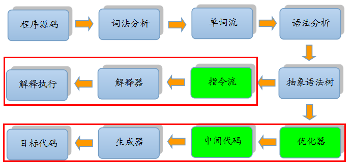

# 1. Java 中 @XmlTransient 和 @Transient 有什么区别？
1、@XmlTransient

1）@XmlTransient注解解决JavaBean属性名称与字段名称之间的名称冲突，或者用于防止字段/属性的映射。

2）阻止将JavaBean属性映射到XML表示形式。

2、@Transient

1）表示属性不需要映射到数据库表，即使数据库存在该字段也不会映射。

2）通常用来修饰属性，使用时修饰get方法即可。

# 2. Java 中 BigDecimal 类型如何加减乘除运算？
Java BigDecimal类型的加减乘除运算调用方法：

>加法：add() 减法：subtract() 乘法：multiply() 除法：divide()
实例代码如下：

```java
BigDecimal b1 = new BigDecimal("10");
BigDecimal b2 = new BigDecimal("5");
BigDecimal b3 = null;
```
加法
```java
b3 =  b1.add(b2);      
System.out.println("求和：" + b3);
```
减法
```java
b3 = b1.subtract(b2);
System.out.println("求差：" + b3);
```
乘法
```java
b3 = b1.multiply(b2);
System.out.println("乘法积：" + b3);
```
除法
```java
b3 = b1.divide(b2);
System.out.println("除法结果：" + b3);
```
# 3. 什么是对称加密？
   所谓对称加密算法即解密方式是加密方式的逆运算，即加密和解密使用的是同一个密钥（初等加密算法）。

常见的有DES、3DES、AES、PBE等加密算法，这几种算法安全性依次是逐渐增强的。

# 4. 什么是非对称加密？
所谓非对称加密算法即加密和解密需要两个密钥进行，这两个密钥是公钥和私钥（高等加密算法）。

非对称加密算法两个密钥：公开密钥（publickey）和私有密钥（privatekey）。

公开密钥与私有密钥是一对，如果用公开密钥对数据进行加密，只有用对应的私有密钥才能解密；如果用私有密钥对数据进行加密，那么只有用对应的公开密钥才能解密。一般公钥是公开的，私钥是自己保存。因为加密和解密使用的是两个不同的密钥，所以这种算法叫作非对称加密算法。

安全性相对对称加密来说更高，是一种高级加密方式。

# 5. 对称加密主要有哪些实现方式？
DES（Data Encryption Standard）加密

DES是一种对称加密算法，是一种非常简便的加密算法，但是密钥长度比较短。

DES加密算法出自IBM的研究，后来被美国政府正式采用，之后开始广泛流传，但是近些年使用越来越少，因为DES使用56位密钥，以现代计算能力，24小时内即可被破解。

3DES加密

3DES是一种对称加密算法，在DES的基础上，使用三重数据加密算法，对数据进行加密，它相当于是对每个数据块应用三次DES加密算法。由于计算机运算能力的增强，原版DES密码的密钥长度变得容易被暴力破解；3DES即是设计用来提供一种相对简单的方法，即通过增加DES的密钥长度来避免类似的攻击，而不是设计一种全新的块密码算法这样来说，破解的概率就小了很多。

缺点由于使用了三重数据加密算法，可能会比较耗性能。

AES加密

AES是一种对称加密算法，相比于3DES拥有更好的安全性。

PBE（Password Based Encryption）加密

PBE是基于口令的加密，结合了DES和AES的优点。

# 6. 非对称加密主要有哪些实现方式？
1）DH（Diffie-Hellman）：密钥交换算法。

2）RSA：基于因子分解。

RSA是一种非对称加密算法。RSA有两个密钥，一个是公开的，称为公开密钥；一个是私密的，称为私密密钥。

公开密钥是对大众公开的，私密密钥是服务器私有的，两者不能互推得出。

用公开密钥对数据进行加密，私密密钥可解密；私密密钥对数据加密，公开密钥可解密。速度较对称加密慢。

3）ElGamal：基于离散对数。

4）ECC（Elliptical Curve Cryptography）：椭圆曲线加密。

# 7. 对称加密和非对称加密有什么区别？
1、加密和解密过程不同

对称加密过程和解密过程使用的同一个密钥，加密过程相当于用原文+密钥可以传输出密文，同时解密过程用密文-密钥可以推导出原文。但非对称加密采用了两个密钥，一般使用公钥进行加密，使用私钥进行解密。

2、加密解密速度不同

对称加密解密的速度比较快，适合数据比较长时的使用。非对称加密和解密花费的时间长、速度相对较慢，只适合对少量数据的使用。

3、传输的安全性不同

对称加密的过程中无法确保密钥被安全传递，密文在传输过程中是可能被第三方截获的，如果密码本也被第三方截获，则传输的密码信息将被第三方破获，安全性相对较低。

非对称加密算法中私钥是基于不同的算法生成不同的随机数，私钥通过一定的加密算法推导出公钥，但私钥到公钥的推导过程是单向的，也就是说公钥无法反推导出私钥。所以安全性较高。

# 8. Java 中 float f = 3.5; 是否正确？
不正确，会提示错误如下：

```java
Type mismatch: cannot convert from double to float
```
float f=3.5;的值是双精度数，将双精度型（double）赋值给浮点型（float）属于下转型（down-casting，也称为窄化）会造成精度损失，因此需要强制类型转换float f =(float)3.5; 或者写成 float f =3.5f;（float f =3.5F;）。

# 9. OpenJDK 和 SunJDK 有什么区别？
历史上的原因是OpenJDK是JDK的开放原始码版本，以GPL(General Public License)协议的形式放出(题主提到的open就是指的开源)。在JDK7的时候，OpenJDK已经作为JDK7的主干开发，SUN JDK7是在OpenJDK7的基础上发布的，其大部分原始码都相同，只有少部分原始码被替换掉。使用JRL(JavaResearch License，Java研究授权协议)发布。

至于OpenJDK6则更是有其复杂的一面，首先是OpenJDK6是JDK7的一个分支，并且尽量去除Java SE7的新特性，使其尽量的符合Java6的标准。

关于JDK和OpenJDK的区别，可以归纳为以下几点：

授权协议的不同： OpenJDK采用GPL V2协议放出，而SUN JDK则采用JRL放出。两者协议虽然都是开放源代码的，但是在使用上的不同在于GPL V2允许在商业上使用，而JRL只允许个人研究使用。

OpenJDK不包含Deployment（部署）功能：部署的功能包括：Browser Plugin、Java Web Start、以及Java控制面板，这些功能在OpenJDK中是找不到的。

OpenJDK源代码不完整： 这个很容易想到，在采用GPL协议的OpenJDK中，SUN JDK的一部分源代码因为产权的问题无法开放给OpenJDK使用，其中最主要的部份就是JMX中的可选元件SNMP部份的代码。因此这些不能开放的源代码 将它作成plug，以供OpenJDK编译时使用，你也可以选择不要使用plug。而Icedtea则为这些不完整的部分开发了相同功能的源代码 (OpenJDK6)，促使OpenJDK更加完整。

部分源代码用开源代码替换： 由于产权的问题，很多产权不是SUN的源代码被替换成一些功能相同的开源代码，比如说字体栅格化引擎，使用Free Type代替。

OpenIDK只包含最精简的JDK： OpenJDK不包含其他的软件包，比如Rhino Java DB JAXP……，并且可以分离的软件包也都是尽量的分离，但是这大多数都是自由软件，你可以自己下载加入。

不能使用Java商标：这个很容易理解，在安装OpenJDK的机器上，输入“java -version”显示的是OpenJDK，但是如果是使用Icedtea补丁的OpenJDK，显示的是java。

# 10. Java 中 finally 和 return 执行顺序？
无论try还是catch中有return语句以及代码有没有捕捉到异常，finally代码块最终都被会执行的。

finally块中的语句，在try或catch中的return语句执行之后、返回之前执行。而且finally语句中的“干扰”可能或不可能影响try、catch中return已经确定的返回值。若finally中也有return则覆盖try、catch中的return语句直接返回。

注意两种情况下finally语句是不会被执行的：

1）try语句没有被执行到，如在try语句之前就返回了，这样finally语句就不会执行，这也说明了finally语句被执行的必要而非充分条件是：相应的try语句一定被执行到。

2）在try块中有System.exit(0);这样的语句，System.exit(0);是终止Java虚拟机JVM的，连JVM都停止了，所有都结束了，当然finally语句也不会被执行到。

# 11. 什么是 Java 事务？
通俗的理解，事务是一组原子操作单元，从数据库角度说，就是一组SQL指令，要么全部执行成功，若因为某个原因其中一条指令执行有错误，则撤销先前执行过的所有指令。更简答的说就是：要么全部执行成功，要么撤销不执行。

事务必须服从ISO/IEC所制定的ACID原则。

>原子性（atomicity） 一致性（consistency） 隔离性（isolation） 持久性（durability）

原子性表示事务执行过程中的任何失败都将导致事务所做的任何修改失效。

一致性表示当事务执行失败时，所有被该事务影响的数据都应该恢复到事务执行前的状态。

隔离性表示在事务执行过程中对数据的修改，在事务提交之前对其他事务不可见。

持久性表示已提交的数据在事务执行失败时，数据的状态都应该正确。

# 12. Java 事务都有哪些类型？有什么区别？
Java事务的类型有三种：JDBC事务、JTA（Java Transaction API）事务、容器事务。

JDBC事务

JDBC事务是用Connection对象控制的。JDBC Connection接口（ java.sql.Connection ）提供了两种事务模式：自动提交和手工提交。

JTA（java Transaction API）事务

JTA是一种高层的，与实现无关的，与协议无关的API，应用程序和应用服务器可以使用JTA来访问事务。

JTA允许应用程序执行分布式事务处理——在两个或多个网络计算机资源上访问并且更新数据，这些数据可以分布在多个数据库上。JDBC驱动程序的JTA支持极大地增强了数据访问能力。

容器事务

容器事务主要是J2EE应用服务器提供的，容器事务大多是基于JTA完成，这是一个基于JNDI的，相当复杂的API实现。

三种类型Java事务差异

1、JDBC事务控制的局限性在一个数据库连接内，但是其使用简单。

2、JTA事务的功能强大，事务可以跨越多个数据库或多个DAO，使用也比较复杂。

3、容器事务，主要指的是J2EE应用服务器提供的事务管理，局限于EJB应用使用。

# 13. Java 如何实现字符串中查找某字符出现的次数？
此方法只能用于统计单个字符出现的次数，不能统计一个字符串出现的次数。

实例代码
```java
import java.util.Arrays;
import java.util.stream.Collectors;

public class Tests {
    public static void main(String[] args) {
        String a = "欢迎关注“Java记录”公众号，回复“面试资料”，领取免费资料!";
        String b = "“";
        System.out.println("“出现的次数为：" + strCount(a, b));
    }
    public static int strCount(String str, String findByStr) {
        String[] split = str.split("");
        return Arrays.asList(split).stream().filter(s -> s.equals(findByStr)).collect(Collectors.toList()).size();
    }
}
```
运行结果
```sh
“出现的次数为：2
```
# 14. 【阿里巴巴】了解过字节码的编译过程吗？
大部分的程序代码从开始编译到最终转化成物理机的目标代码或虚拟机能执行的指令集之前，都会按照如下图所示的各个步骤进行：



其中绿色的模块可以选择性实现。

上图中间的那条分支是解释执行的过程（即一条字节码一条字节码地解释执行，如JavaScript）， 而下面的那条分支就是传统编译原理中从源代码到目标机器代码的生成过程。

# 15. 什么是RMI？
Java远程方法调用（Java RMI）是Java API对远程过程调用（RPC）提供的面向对象的等价形式，支持直接传输序列化的Java对象和分布式垃圾回收。

远程方法调用可以看做是激活远程正在运行的对象上的方法的步骤。

RMI对调用者是位置透明的，因为调用者感觉方法是执行在本地运行的对象上的。看下RMI的一些注意事项。

# 16. RMI体系结构的基本原则是什么？
RMI体系结构是基于一个非常重要的行为定义和行为实现相分离的原则。

RMI允许定义行为的代码和实现行为的代码相分离，并且运行在不同的JVM上。

# 17. RMI体系结构分哪几层？
RMI体系结构分以下几层：

存根和骨架层（Stub and Skeleton layer）： 这一层对程序员是透明的，它主要负责拦截客户端发出的方法调用请求，然后把请求重定向给远程的RMI服务。

远程引用层（Remote Reference Layer）： RMI体系结构的第二层用来解析客户端对服务端远程对象的引用。这一层解析并管理客户端对服务端远程对象的引用。连接是点到点的。

传输层（Transport layer）： 这一层负责连接参与服务的两个JVM。这一层是建立在网络上机器间的TCP/IP连接之上的。它提供了基本的连接服务，还有一些防火墙穿透策略。

# 18. RMI中的远程接口（Remote Interface）扮演了什么样的角色？
远程接口用来标识哪些方法是可以被非本地虚拟机调用的接口。

远程对象必须要直接或者是间接实现远程接口。

实现了远程接口的类应该声明被实现的远程接口，给每一个远程对象定义构造函数，给所有远程接口的方法提供实现。

# 19. java.rmi.Naming 类扮演了什么样的角色？
java.rmi.Naming类用来存储和获取在远程对象注册表里面的远程对象的引用。

Naming类的每一个方法接收一个URL格式的String对象作为它的参数。

# 20. RMI 的绑定（Binding）是什么含义？
绑定是为了查询找远程对象而给远程对象关联或者是注册以后会用到的名称的过程。

远程对象可以使用Naming类的bind()或者rebind()方法跟名称相关联。
