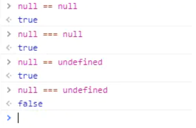

# 1. JavaScript 中如何使用事件处理程序？
事件是由用户生成活动（例如单击链接或填写表单）导致的操作。

需要一个事件处理程序来管理所有这些事件的正确执行。

事件处理程序是对象的额外属性。此属性包括事件的名称以及事件发生时采取的操作。

# 2. 解释延迟脚本在 JavaScript 中的作用？
默认情况下，在页面加载期间，HTML代码的解析将暂停，直到脚本停止执行。这意味着，如果服务器速度较慢或者脚本特别沉重，则会导致网页延迟。在使用Deferred时，脚本会延迟执行直到HTML解析器运行。这减少了网页加载时间，并且它们的显示速度更快。

# 3. JavaScript 中的各种功能组件是什么？
JavaScript中的不同功能组件是：

First-class函数：JavaScript中的函数被用作第一类对象。这通常意味着这些函数可以作为参数传递给其他函数，作为其他函数的值返回，分配给变量，也可以存储在数据结构中。

嵌套函数：在其他函数中定义的函数称为嵌套函数。

# 4. decodeURI() 和 encodeURI() 是什么？
EncodeURl()用于将URL转换为十六进制编码。而DecodeURI()用于将编码的URL转换回正常。

# 5. 如何在不支持 JavaScript 的旧浏览器中隐藏 JavaScript 代码？
在script标签之后的代码中添加“<!-– ”，不带引号。

在script标签之前添加“// –->”,代码中没有引号。

旧浏览器现在将JavaScript代码视为一个长的HTML注释。而支持JavaScript的浏览器则将“<！ - ”和“// - >”作为一行注释。

例如：
```html
<script><!--
alert();
// --></script>
```

# 6. JavaScript 中的强制转型是指什么？
在JavaScript中，两种不同的内置类型间的转换被称为强制转型。

强制转型在JavaScript中有两种形式：显式和隐式。

这是一个显式强制转型的例子：
```js
var a = "1024";
var b = Number(a);
a; // "1024"
b; // 1024 -- 是个数字!
```
这是一个隐式强制转型的例子：
```js
var a = "1024";
var b = a * 1; // "1024" 隐式转型成1024
a; // "1024"
b; // 1024 -- 是个数字!
```
# 7. JavaScript 中的作用域（scope）是指什么？
在JavaScript中，每个函数都有自己的作用域。作用域基本上是变量以及如何通过名称访问这些变量的规则的集合。只有函数中的代码才能访问函数作用域内的变量。

同一个作用域中的变量名必须是唯一的。一个作用域可以嵌套在另一个作用域内。如果一个作用域嵌套在另一个作用域内，最内部作用域内的代码可以访问另一个作用域的变量。

# 8. 解释 JavaScript 中的相等性？
JavaScript 中有严格比较和类型转换比较：

严格比较（例如===）在不允许强制转型的情况下检查两个值是否相等；

抽象比较（例如==）在允许强制转型的情况下检查两个值是否相等。
```js
var a = "42";
var b = 42;
a == b; // true
a === b; // false
```
一些简单的规则：

如果被比较的任何一个值可能是 true 或 false，要用===，而不是==； 如果被比较的任何一个值是这些特定值（0、“”或 []），要用===，而不是==； 在其他情况下，可以安全地使用==。它不仅安全，而且在很多情况下，它可以简化代码，并且提升代码可读性。

# 9. 解释什么是回调函数，并提供一个简单的例子。
回调函数是可以作为参数传递给另一个函数的函数，并在某些操作完成后执行。

下面是一个简单的回调函数示例，这个函数在某些操作完成后打印消息到控制台。
```js
function modifyArray(arr, callback) {
    // 对 arr 做一些操作
    arr.push(100);
    // 执行传进来的 callback 函数
    callback();
    }
    var arr = [1, 2, 3, 4, 5];
    modifyArray(arr, function() {
    console.log("array has been modified", arr);
});
```
# 10. “use strict”的作用是什么？
use strict出现在JavaScript代码的顶部或函数的顶部，可以帮助你写出更安全的JavaScript代码。如果你错误地创建了全局变量，它会通过抛出错误的方式来警告你。例如，以下程序将抛出错误：
```js
function doSomething(val) {
    "use strict";
    x = val + 10;
}
```
它会抛出一个错误，因为x没有被定义，并使用了全局作用域中的某个值对其进行赋值，而use strict不允许这样做。下面的小改动修复了这个错误：
```js
function doSomething(val) {
    "use strict";
    var x = val + 10;
}
```
# 11. JavaScript 中的 null 和 undefined有什么区别？
JavaScript中有两种底层类型：null和undefined。

它们代表了不同的含义：

尚未初始化：undefined；

空值：null。

null和undefined是两个不同的对象，实例图：



# 12. 编写一个可以执行如下操作的函数？
```js
var addSix = createBase(6);
addSix(10); // 返回 16
addSix(21); // 返回 27
```
可以创建一个闭包来存放传递给函数createBase的值。被返回的内部函数是在外部函数中创建的，内部函数就成了一个闭包，它可以访问外部函数中的变量，在本例中是变量baseNumber。
```js
function createBase(baseNumber) {
    return function(N) {
    // 这里访问baseNumber，即使它是在这个函数之外声明的。
    // JavaScript中的闭包允许这么做。
    return baseNumber + N;
    }
}
var addSix = createBase(6);
addSix(10);
addSix(21);
```
# 13. 解释 JavaScript 中的值和类型？
JavaScript提供两种数据类型: 基本数据类型和引用数据类型。

**基本数据类型包括：**

String Number Boolean Null Undefined Symbol

**引用数据类型包括：**

Object Array Function

# 14. 解释事件冒泡以及如何阻止它？
事件冒泡是指嵌套最深的元素触发一个事件，然后这个事件顺着嵌套顺序在父元素上触发。

防止事件冒泡的一种方法是使用event.cancelBubble或event.stopPropagation()（低于 IE 9）。

# 15. JavaScript 中的 let 关键字有什么用？
除了可以在函数级别声明变量之外，ES6还允许你使用let关键字在代码块（{..}）中声明变量。

# 16. 如何检查一个数字是否为整数？
检查一个数字是小数还是整数，可以使用一种非常简单的方法，就是将它对 1 进行取模，看看是否有余数。
```js
function isInt(num) {
    return num % 1 === 0;
}
console.log(isInt(4)); // true
console.log(isInt(12.2)); // false
console.log(isInt(0.3)); // false
```
# 17. 什么是 IIFE（立即调用函数表达式）？
它是立即调用函数表达式（Immediately-Invoked Function Expression），简称IIFE。函数被创建后立即被执行：
```js
(function IIFE(){
    console.log( "Hello!" );
})();
// "Hello!"
```
在避免污染全局命名空间时经常使用这种模式，因为IIFE（与任何其他正常函数一样）内部的所有变量在其作用域之外都是不可见的。

# 18. 如何在 JavaScript 中比较两个对象？
对于两个非原始值，比如两个对象（包括函数和数组），==和===比较都只是检查它们的引用是否匹配，并不会检查实际引用的内容。

例如，默认情况下，数组将被强制转型成字符串，并使用逗号将数组的所有元素连接起来。所以，两个具有相同内容的数组进行 == 比较时不会相等：
```js
var a = [1,2,3];
var b = [1,2,3];
var c = "1,2,3";
a == c; // true
b == c; // true
a == b; // false
```
对于对象的深度比较，可以使用deep-equal 这个库，或者自己实现递归比较算法。

# 19. 解释一下 ES5 和 ES6 之间有什么区别？
ECMAScript 5（ES5）：ECMAScript的第5版，于2009年标准化。这个标准已在所有现代浏览器中完全实现。

ECMAScript 6（ES6）或ECMAScript 2015（ES2015）：第6版ECMAScript，于2015年标准化。这个标准已在大多数现代浏览器中部分实现。

以下是ES5和ES6之间的一些主要区别：

箭头函数和字符串插值：
```js
const greetings = (name) => {
    return `hello ${name}`;
}
const greetings = name => `hello ${name}`;
```
常量

常量在很多方面与其他语言中的常量一样，但有一些需要注意的地方。常量表示对值的“固定引用”。因此，在使用常量时，你实际上可以改变变量所引用的对象的属性，但无法改变引用本身。
```js
const NAMES = [];
NAMES.push("Jim");
console.log(NAMES.length === 1); // true
NAMES = ["Steve", "John"]; // error
```
块作用域变量。

新的 ES6 关键字 let 允许开发人员声明块级别作用域的变量。let 不像 var 那样可以进行提升。

默认参数值

默认参数允许我们使用默认值初始化函数。如果省略或未定义参数，则使用默认值，也就是说 null 是有效值。
```js
// 基本语法
function multiply (a, b = 2) {
return a * b;
}
multiply(5); // 10
```
类定义和继承

ES6 引入了对类（关键字 class）、构造函数（关键字 constructor）和用于继承的 extend 关键字的支持。

for…of 操作符

for…of 语句将创建一个遍历可迭代对象的循环。

用于对象合并的Spread操作
```js
const obj1 = { a: 1, b: 2 }
const obj2 = { a: 2, c: 3, d: 4}
const obj3 = {...obj1, ...obj2}
promise
```
promise 提供了一种机制来处理异步操作结果。你可以使用回调来达到同样的目的，但是 promise 通过方法链接和简洁的错误处理带来了更高的可读性。
```js
const isGreater = (a, b) => {
    return new Promise ((resolve, reject) => {
        if(a > b) {
            resolve(true)
        } else {
            reject(false)
        }
    })
}
isGreater(1, 2)
    .then(result => {
    console.log('greater')
})
.catch(result => {
    console.log('smaller')
})
```
模块导出和导入
```js
const myModule = { x: 1, y: () => { console.log('This is ES5') }}
export default myModule;
import myModule from './myModule';
```
# 20. JavaScript 中 undefined 和 not defined 之间有什么区别？
在JavaScript中，如果试图使用一个不存在且尚未声明的变量，JavaScript将抛出错误“var name is not defined”，让后脚本将停止运行。但如果使用typeof undeclared_variable，它将返回undefined。

首先说一说JavaScript中声明和定义之间的区别。

“var x”表示一个声明，因为没有定义它的值是什么，表示只是声明它的存在。
```js
var x; // 声明 x
console.log(x); // 输出: undefined
```
“var x = 1”既是声明又是定义（我们也可以说它是初始化），x变量的声明和赋值相继发生。在JavaScript中，每个变量声明和函数声明都被带到了当前作用域的顶部，然后进行赋值，这个过程被称为提升（hoisting）。

当试图访问一个被声明但未被定义的变量时，会出现undefined错误。
```js
var x; // 声明
if(typeof x === 'undefined') // 将返回 true
```
当试图引用一个既未声明也未定义的变量时，会出现not defined错误。
```js
console.log(y); // 输出: ReferenceError: y is not defined
```