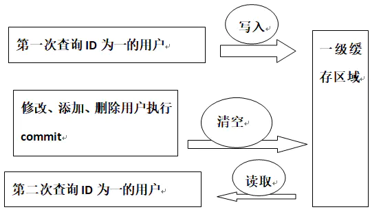
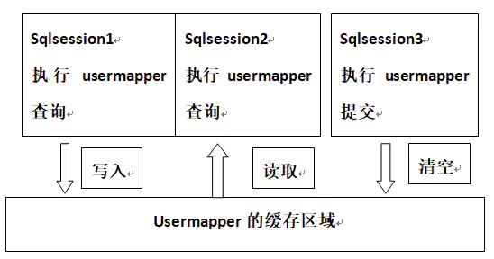

# 1. MyBatis 是什么框架？
MyBatis框架是一个优秀的数据持久层框架，在实体类和SQL语句之间建立映射关系，是一种半自动化的ORM实现。其封装性要低于Hibernate，性能优秀，并且小巧。

ORM即对象/关系数据映射，也可以理解为一种数据持久化技术。

MyBatis的基本要素包括核心对象、核心配置文件、SQL映射文件。

数据持久化是将内存中的数据模型转换为存储模型，以及将存储模型转换为内存中的数据模型的统称。

# 2. MyBatis 中 ${} 和 #{} 传参有什么区别？
1）“#”符号将传入的数据当成一个字符串并将传入的数据加上双引号。

如：order by #{userId}，如果传入的值是1，那么解析成sql时的值为order by "1"，如果传入的值是userId，则解析成的sql为order by "userId"。

2）“$”符号将传入的数据直接显示生成在sql语句中。

如：order by ${userId}，如果传入的值是1，那么解析成sql时的值为order by 1, 如果传入的值是userId，则解析成的sql为order by userId。

3）“#”符号能够很大程度防止sql注入，而“$”符号无法防止sql注入。

4）“$”符号方式一般用于传入数据库对象，例如传入表名。

5）一般能用“#”符号的就别用“$”符号

6）MyBatis排序时使用order by动态参数时需要注意使用“$”符号而不是“#”符号。

# 3. MyBatis 如何实现分页？
Mybatis使用rowbounds对象进行分页，它是针对resultset结果集执行的内存分页，而非物理分页。可以在sql内直接带有物理分页的参数来完成物理分页功能，也可以使用分页插件来完成物理分页。

对数据库表数据进行分页，依靠offset和limit两个参数，表示从第几条开始，取多少条。也就是常说的start和limit。

1）相对原始方法，使用limit分页，需要处理分页逻辑：

MySQL数据库使用limit，如：

```sql
select * from table limit 0,10; --返回0-10行
```

Oracle数据库使用rownum，如：

从表Sys_option（主键为sys_id)中从第10条记录开始检索20条记录，语句如下：

```sql
SELECT * FROM (SELECT ROWNUM R,t1.* From Sys_option where rownum < 30 ) t2 Where t2.R >= 10
```
2）拦截StatementHandler，其实质还是在最后生成limit语句。

3）使用PageHelper插件，目前比较常见的方法。

# 4. MyBatis 如何获取自动生成的主键 ID 值？
数据插入时获得主键值分为两种情况：支持主键自增数据库和不支持主键自增。

1）对于支持自动生成主键的数据库，如Mysql、sqlServer，可以通过Mybatis元素useGeneratedKeys返回当前插入数据主键值到输入类中。

```xml
<insert id="insertTest" useGeneratedKeys="true" keyProperty="id" parameterType="com.kq.domain.IdentityTest">
    insert into identity_test(name)
    values(#{name,jdbcType=VARCHAR})
</insert>
```
当执行此条插入语句以后，实体类IdentityTest中的Id会被当前插入数据的主键自动填充。

2）对于不支持自动生成主键的数据库。Oracle、DB2等，可以用元素selectKey 回当前插入数据主键值到输入类中。（同时生成一个自定义的随机主键）

```xml
<insert id="insertTest" useGeneratedKeys="true" keyProperty="id" parameterType="com.kq.domain.IdentityTest">
    <selectKey keyProperty="id" resultType="String" order="BEFORE">
        SELECT  REPLACE(UUID(),'-','')  
    </selectKey>
    insert into identity_test(name)
    values(#{name,jdbcType=VARCHAR})
</insert>
```
当执行此条插入语句以后，实体类IdentityTest中的Id也会被当前插入数据的主键自动填充。

# 5. MyBatis 中 Integer 类型值是 0 ，为什么 != '' 无法执行？
开发微信小程序“Java精选面试题”后台管理系统时，遇到根据状态判断是或否发布。

MySQL数据库中设计数据库表，其中某字段status使用tinyint数据类型，当修改状态的时候，赋值status属性的值为0，用于改变状态记录试题库中发布情况。

但是通过Debug模式查看Controller控制层明显已经获取到status等于0，但是在执行到MyBatis中xml文件SQL语句时，总是无法赋值成功，xml配置如下：

```xml
<update id="updateWarehouse" parameterType="Warehouse">
	update t_warehouse 
	<set>
		<if test="title != null and title != ''">title = #{title},</if>
		<if test="code != null and code != ''">code = #{code},</if>
		<if test="content != null and content != ''">content = #{content},</if>
		<if test="status != null and status != ''">status = #{status},</if>
		<if test="parentId != null and parentId != ''">parentId = #{parentId}</if>
	</set>
	where id = #{id}
</update>
```
分析：

通过分析表面上没有任何传参问题，通过上网查询MyBatis相关资料，终于弄明白什么原因。 此行代码中

```xml
<if test="status != null and status != ''">status = #{status},</if>
```
and status != ''，MyBatis中传参status的值为0时，因为数据类型为Integer类型，判断为false值。

MyBatis认定 0 = ''的，因此判断status != ''为false，这导致修改试题信息时状态值无法改变为0。

正确写法：

```xml
<update id="updateWarehouse" parameterType="Warehouse">
	update t_warehouse 
	<set>
		<if test="title != null and title != ''">title = #{title},</if>
		<if test="code != null and code != ''">code = #{code},</if>
		<if test="content != null and content != ''">content = #{content},</if>
		<if test="status != null">status = #{status},</if>
		<if test="parentId != null and parentId != ''">parentId = #{parentId}</if>
	</set>
	where id = #{id}
</update>
```
# 6. MyBatis 实现批量插入数据的方式有几种？
MyBatis 实现批量插入数据的方式有几种？

1、MyBatis foreach标签

foreach主要用在构建in条件，在SQL语句中进行迭代一个集合。

foreach元素的属性主要有item，index，collection，open，separator，close。

item表示集合中每一个元素进行迭代时的别名 index指定一个名字，用于表示在迭代过程中，每次迭代到的位置 open表示该语句以什么开始 separator表示在每次进行迭代之间以什么符号作为分隔符 close表示以什么结束

collection必须指定该属性，在不同情况下，值是不同的，主要体现3种情况：

若传入单参数且参数类型是List时，collection属性值为list

若传入单参数且参数类型是array数组时，collection的属性值为array

若传入参数是多个时，需要封装成Map

具体用法如下:

```xml
<insert id="insertForeach" parameterType="java.util.List" useGeneratedKeys="false">
	insert into t_userinfo
	(name, age, sex) values
	<foreach collection="list" item="item" index="index" separator=",">
		(#{item.name},#{item.age},#{item.sex})
	</foreach>		
</insert>
```
2、MyBatis ExecutorType.BATCH

Mybatis内置ExecutorType，默认是simple，该模式下它为每个语句的执行创建一个新的预处理语句，单条提交sql。

batch模式会重复使用已经预处理的语句，并批量执行所有更新语句。但batch模式Insert操作时，在事务没有提交前，是无法获取到自增的id。

# 7. Mybatis 中一级缓存和二级缓存有什么区别？
**一级缓存**

Mybatis一级缓存是指SQLSession

一级缓存的作用域是SQlSession

Mabits默认开启一级缓存

同一个SqlSession中，执行相同的SQL查询时第一次会去查询数据库，并写在缓存中，第二次会直接从缓存中取。

当执行SQL时两次查询中间发生了增删改的操作，则SQLSession的缓存会被清空。

每次查询会先去缓存中找，如果找不到，再去数据库查询，然后把结果写到缓存中。

Mybatis的内部缓存使用一个HashMap，其中key为hashcode+statementId+sql语句，Value为查询出来的结果集映射成的java对象。

SqlSession执行insert、update、delete等操作commit后会清空该SQLSession缓存。



**二级缓存**

二级缓存是mapper级别的，Mybatis默认是没有开启二级缓存的。

第一次调用mapper下的SQL去查询用户的信息，查询到的信息会存放到mapper对应的二级缓存区域。

第二次调用namespace下的mapper映射文件中，相同的sql去查询用户信息，会去对应的二级缓存内取结果。



# 8. MyBatis 是否支持延迟加载？其原理是什么？
Mybatis支持association关联对象和collection关联集合对象的延迟加载。

association指的就是一对一 collection指的就是一对多查询

在Mybatis配置文件中，启用延迟加载配置参数

```properties
lazyLoadingEnabled=true。
```

原理：使用CGLIB创建目标对象的代理对象，当调用目标方法时，进入拦截器方法。

比如调用a.getB().getName()，拦截器invoke()方法发现a.getB()是null值，就会单独发送事先保存好的查询关联B对象的SQL语句，先查询出B，然后再调用a.setB(b)赋值，最后再调用a.getB().getName()方法就有值了。几乎所有的包括Hibernate、Mybatis，支持延迟加载的原理都是一样的。

# 9. 如何解决 MyBatis 转义字符的问题？
xml配置文件使用转义字符

```sql
SELECT * FROM test WHERE crate_time &lt;= #{crate_time} AND end_date &gt;= #{crate_time}
```
xml转义字符关系表

| 字符  | 	转义      | 	备注  |
|-----|----------|------|
| <	  | &lt;	    | 小于号  |
| >	  | &gt;	    | 大于号  |
| &	  | &amp;	   | 和    |
| '	  | &apos;	  | 单引号  |
| "	  | &quot;	  | 双引号  |
注意：XML中只有”<”和”&”是非法的，其它三个都是合法存在的，使用时都可以把它们转义了，养成一个良好的习惯。

转义前后的字符都会被xml解析器解析，为了方便起见，使用

```sql
<![CDATA[...]]>
```

来包含不被xml解析器解析的内容。标记所包含的内容将表示为纯文本，其中...表示文本内容。

但要注意的是：

1）此部分不能再包含”]]>”；

2）不允许嵌套使用；

3)”]]>”这部分不能包含空格或者换行。

# 10. 为什么说 MyBatis 是半自动 ORM 映射？
ORM是Object和Relation之间的映射，包括Object->Relation和Relation->Object两方面。Hibernate是个完整的ORM框架，而MyBatis完成的是Relation->Object，也就是其所说的Data Mapper Framework。

JPA是ORM映射标准，主流的ORM映射都实现了这个标准。MyBatis没有实现JPA，它和ORM框架的设计思路不完全一样。MyBatis是拥抱SQL，而ORM则更靠近面向对象，不建议写SQL，实在要写需用框架自带的类SQL代替。MyBatis是SQL映射而不是ORMORM映射，当然ORM和MyBatis都是持久层框架。

最典型的ORM映射是Hibernate，它是全自动ORM映射，而MyBatis是半自动的ORM映射。Hibernate完全可以通过对象关系模型实现对数据库的操作，拥有完整的JavaBean对象与数据库的映射结构来自动生成SQL。而MyBatis仅有基本的字段映射，对象数据以及对象实际关系仍然需要通过手写SQL来实现和管理。

Hibernate数据库移植性远大于MyBatis。Hibernate通过它强大的映射结构和HQL语言，大大降低了对象与数据库（oracle、mySQL等）的耦合性，而MyBatis由于需要手写SQL，因此与数据库的耦合性直接取决于程序员写SQL的方法，如果SQL不具通用性而用了很多某数据库特性的SQL语句的话，移植性也会随之降低很多，成本很高。

# 11. MyBatis 中 模糊查询 like 语句如何使用？
方式一：Java代码中添加sql通配符

```java
String mname = "%Java精选，微信公众号%";
List<UserInfo> list = mapper.selectUserInfo(mnane);
```

```sql
<select id="selectUserInfo">
    select * from t_userinfo where name like #{mname}
</select>
```

方式二：sql语句中拼接通配符

```java
String name = "Java精选，微信公众号";
List<UserInfo> list = mapper.selectUserInfo(nane);
```
```sql
<select id="selectUserInfo">
    select * from t_userinfo where name like '%${name}%'
</select>
```
sql语句中拼接通配符需要注意sql注入的问题，在参数放入sql语句前校验是否合法。

# 12. MyBatis 框架适用哪些场景？
1）MyBatis框架专注于SQL语句本身，是一个足够灵活的DAO层解决方案。

2）应用性能要求很高或需求变化较多的项目，例如电商项目、一元购项目等，MyBatis框架将是不错的选择。

# 13. MyBatis 和 Hibernate 都有哪些区别？
1）Mybatis不完全是一个ORM框架，这是应为MyBatis需要开发人员自己来编写SQL语句。

2）Mybatis直接编写原生态SQL语句，可以严格控制SQL语句执行，其性能、灵活度高，非常适合对关系数据模型要求不高的软件开发，因为这类软件需求变化频繁，一但需求变化要求迅速输出成果。但是灵活的前提是mybatis无法做到数据库无关性，如果需要实现支持多种数据库的软件，则需要自定义多套SQL映射文件，工作量大。

3）Hibernate对象/关系映射能力强，数据库无关性好，对于关系模型要求高的软件，如果用hibernate开发可以节省很多代码，提高效率。

# 14. MyBatis 中实现一对多关系有几种方式？
MyBatis实现一对多关系有联合查询和嵌套查询两种方式。

联合查询是几个表联合查询，只查询一次，通过在resultMap里面的collection节点配置一对多的类就可以完成；

嵌套查询是先查一个表。根据这个表里面的 结果的外键id，去再另外一个表里面查询数据,也是通过配置collection，但另外一个表的查询通过select节点配置。

# 15. MyBatis 中实现一对一关系有几种方式？
MyBatis实现一对一关系有联合查询和嵌套查询两种方式。

联合查询是几个表联合查询，只查询一次，通过在resultMap里面配置association节点配置一对一的类就可以完成；

嵌套查询是先查一个表，根据这个表里面的结果的外键id，去再另外一个表里面查询数据,也是通过association配置，但另外一个表的查询通过select属性配置。

# 16. Mybatis 中不同的 Xml 映射文件 ID 是否可以重复？
Mybatis中不同的Xml映射文件，如果配置了namespace，那么id可以重复；反之ID不能重复。

这是因为namespace+id是作为Map<String, MapperStatement>的key来使用，如果没有namespace空间，那么ID重复会导致数据互相覆盖。

通过设置namespace空间，ID相同但是namespace不同，namespace+id自然也就不同。目前新版本的namespace是必须的。

# 17. Xml 映射文件中除了常见的标签外，还有哪些？
Mybatis常见的select、insert、updae、delete标签。

除了常见标签外，还有<resultMap>、<parameterMap>、<sql>、<include>、<selectKey>，加上动态sql的9个标签，其中<sql>为sql片段标签，通过<include>标签引入sql片段，<selectKey>为不支持自增的主键生成策略标签。

# 18. Mybatis 中有哪些动态 sql 标签，有什么作用？
Mybatis动态sql可以在Xml映射文件内，以标签的形式编写动态sql，执行原理是根据表达式的值完成逻辑判断并动态拼接sql的功能。

Mybatis提供了9种动态sql标签：trim、where、set、foreach、if、choose、when、otherwise、bind。

# 19. MyBatis 中 Mapper 接口调用时有哪些要求？
1）Mapper接口方法名和mapper.xml中定义的每个sql的id相同。

2）Mapper接口方法的输入参数类型和mapper.xml中定义的每个sql的parameterType的类型相同。

3）Mapper接口方法的输出参数类型和mapper.xml中定义的每个sql的resultType的类型相同。

4）Mapper.xml文件中的namespace即是mapper接口的类路径。

# 20. Mybatis 中如何防止 SQL 注入的？
首先看一下下面两个sql语句的区别：

```sql
<select id="selectByNameAndPassword" parameterType="java.util.Map" resultMap="BaseResultMap">
    select id, username, password
    from user
    where username = #{username,jdbcType=VARCHAR} and
    password = #{password,jdbcType=VARCHAR}
</select>
```
```sql
<select id="selectByNameAndPassword" parameterType="java.util.Map" resultMap="BaseResultMap">
    select id, username, password,
    from user
    where username = ${username,jdbcType=VARCHAR} and
    password = ${password,jdbcType=VARCHAR}
</select>
```
mybatis中#和$的区别：

#将传入的数据都当成一个字符串，会对自动传入的数据加一个双引号。 如：where username=#{username}，如果传入的值是111,那么解析成sql时的值为where username="111", 如果传入的值是id，则解析成的sql为where username="id"。

将传入的数据直接显示生成在sql中。如：whereusername=将传入的数据直接显示生成在sql中。如：where username=将传入的数据直接显示生成在sql中。如：whereusername={username}，如果传入的值是111,那么解析成sql时的值为where username=111；如果传入的值是：drop table user;，则解析成的sql为：select id, username, password, role from user where username=;drop table user;

#方式能够很大程度防止sql注入，$方式无法防止Sql注入。

$方式一般用于传入数据库对象，例如传入表名。

一般能用#的就别用，若不得不使用“，若不得不使用“，若不得不使用“{xxx}”这样的参数，要手工地做好过滤工作，来防止sql注入攻击。 在MyBatis中，“xxx”这样格式的参数会直接参与SQL编译，从而不能避免注入攻击。但涉及到动态表名和列名时，只能使用“{xxx}”这样格式的参数会直接参与SQL编译，从而不能避免注入攻击。但涉及到动态表名和列名时，只能使用“xxx”这样格式的参数会直接参与SQL编译，从而不能避免注入攻击。但涉及到动态表名和列名时，只能使用“{xxx}”这样的参数格式。所以，这样的参数需要我们在代码中手工进行处理来防止注入。 sql注入：

SQL注入，大家都不陌生，是一种常见的攻击方式。攻击者在界面的表单信息或URL上输入一些奇怪的SQL片段（例如“or '1'='1'”这样的语句），有可能入侵参数检验不足的应用程序。所以，在应用中需要做一些工作，来防备这样的攻击方式。在一些安全性要求很高的应用中（比如银行软件），经常使用将SQL语句全部替换为存储过程这样的方式，来防止SQL注入。这当然是一种很安全的方式，但平时开发中，可能不需要这种死板的方式。

mybatis是如何做到防止sql注入的？

MyBatis框架作为一款半自动化的持久层框架，其SQL语句都要自己手动编写，这个时候当然需要防止SQL注入。其实，MyBatis的SQL是一个具有“输入+输出”的功能，类似于函数的结构，参考上面的两个例子。其中，parameterType表示了输入的参数类型，resultType表示了输出的参数类型。回应上文，如果我们想防止SQL注入，理所当然地要在输入参数上下功夫。上面代码中使用#的即输入参数在SQL中拼接的部分，传入参数后，打印出执行的SQL语句，会看到SQL是这样的：

```sql
select id, username, password from user where username=? and password=?
```
不管输入什么参数，打印出的SQL都是这样的。这是因为MyBatis启用了预编译功能，在SQL执行前，会先将上面的SQL发送给数据库进行编译；执行时，直接使用编译好的SQL，替换占位符“?”就可以了。因为SQL注入只能对编译过程起作用，所以这样的方式就很好地避免了SQL注入的问题。

底层实现原理

MyBatis是如何做到SQL预编译的呢？其实在框架底层，是JDBC中的PreparedStatement类在起作用，PreparedStatement是我们很熟悉的Statement的子类，它的对象包含了编译好的SQL语句。这种“准备好”的方式不仅能提高安全性，而且在多次执行同一个SQL时，能够提高效率。原因是SQL已编译好，再次执行时无需再编译。 结论：

>#{}：相当于JDBC中的PreparedStatement ${}：是输出变量的值

简单说，#{}是经过预编译的，是安全的；${}是未经过预编译的，仅仅是取变量的值，是非安全的，存在SQL注入。
