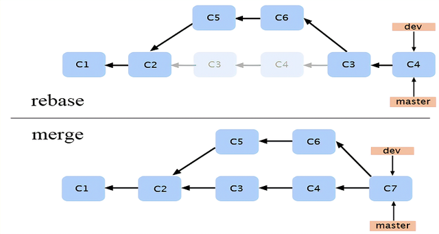

# 1. 列举工作中常用的几个 Git 命令？
新增文件的命令：git add file或者git add

提交文件的命令：git commit –m或者git commit –a

查看工作区状况：git status –s

拉取合并远程分支的操作：git fetch/git merge或者git pull

查看提交记录命令：git reflog

# 2. 什么是 Git？
Git是目前主流的一种代码托管技术。基本上大多数的公司都在使用Git进行协同开发。很多代码托管平台也是通过Git来实现的。

Git可以对代码进行版本控制以及分支管理等。它里面主要包含远程仓库，克隆，本地仓库，分支，提交，拉取等概念。其中远程仓库是指我们代码存储在服务器的地方，并且整个团队中所有人都可以正常访问。

克隆则是指从远程仓库克隆到本地的过程。本地仓库指的是开发人员从远程仓库克隆一份代码之后，保存在本地的代码，但是这个代码只有克隆的代码的开发人员可以看到。

# 3. Git 和 SVN 有什么区别？
Git是一个分布式的版本控制工具；而SVN是集中版本控制工具；

Git属于第3代版本控制工具；而SVN属于第2代版本控制工具；

Git客户端可以在其本地系统上克隆整个存储库；而SVN版本历史记录存储在服务器端存储库中；

Git支持离线提交；而SVN必须在线提交；

Git中Push/pull命令操作更快；而SVN中Push/pull命令操作较慢；

Git工程可以用commit命令实现自动共享；而SVN不支持自动共享。

# 4. Git 中提交项目文件命令是什么？
提交项目文件命令

```shell
git commit -a
```
含义：-a参数是指通过在命令行上加-a指示git提交已修改的所有被跟踪文件的新内容。

注意的是如果第一次提交新文件，可以在执行git commit -a命令之前先执行git add <file>命令。

# 5. Git 中什么是“裸存储库”？
Git中的 “裸” 存储库只包含版本控制信息而没有工作文件（没有工作树），并且它不包含特殊的.git子目录。相反，它直接在主目录本身包含.git子目录中的所有内容，其中工作目录包括：

1）一个.git子目录，其中包含你的仓库所有相关的Git修订历史记录。

2）工作树，或签出的项目文件的副本。

# 6. Git 提交时冲突，是什么原因所致，如何解决？
开发过程中经常碰到一些冲突问题，比如同时修改公共类的公共方法，一人提交后，另外一人再提交就会报冲突的错误。

发生冲突，在IDE里面一般都是对比本地文件和远程分支的文件，然后把远程分支上文件的内容手工修改到本地文件，然后再提交冲突的文件使其保证与远程分支的文件一致，这样才会消除冲突，然后再提交其修改的部分。

注意的是修改本地冲突文件与远程仓库的文件保持一致后，需要提交后才能消除冲突，否则无法继续提交。必要时可与其他提交人员交流沟通，消除冲突。

发生冲突，也可以使用命令。

1）使用git stash命令，把工作区的修改提交到栈区，目的是保存工作区的修改；

2）使用git pull命令，拉取远程分支上的代码并合并到本地分支，目的是消除冲突；

3）使用git stash pop命令，把保存在栈区的修改部分合并到最新的工作空间中。

# 7. Git 提交失误时如何撤销？
如果撤销提交到索引区的文件，可以使用git reset HEAD file命令。

如果撤销提交到本地仓库的文件：

可以使用git reset –soft HEAD^n恢复当前分支的版本库至上一次提交的状态，索引区和工作空间不变更；

可以使用git reset –mixed HEAD^n恢复当前分支的版本库和索引区至上一次提交的状态，工作区不变更；

可以使用git reset –hard HEAD^n恢复当前分支的版本库、索引区和工作空间至上一次提交的状态。

# 8. Maven 和 ANT 有什么区别？
1、maven&ant同属apach是流行的构建工具

都是为了简化软件开发而存在的。但是maven因为自身管理一个项目对象模型（project object model），这个模型其实就是抽象了一个项目的开发流程，它包含了一个项目的生命周期的各个阶段，并将这个周期固定下来，这也就是约定大于配置。约定大于配置的意思就是，我maven将项目开发的各个阶段固定起来了，每个文件的存放位置，每个阶段要生成什么文件、保存为什么格式并且要把它放在什么位置，我都固定好了。我知道一个软件是怎么开发出来，如果一个项目要使用maven，可以，但你要遵循我的规则，文件目录不要乱建乱放，只有这样maven才会将源码用起来。这就是约定大于配置，因为maven已经将流程固定下来了，只要遵守约定，就不需要自己手动去配置了，这将大大地提高开发效率。

2、maven的中央仓库和pom.xml文件

中央仓库统一存放了开发用到的各种jar包，要用时只需要添加依赖到pom文件中，maven就会自动下载，当然为了方便一般会在本地建一个仓库，减少下载时间。pom文件是maven的配置文件，maven就是通过管理pom文件和一些核心插件来管理项目。当然我前面将maven拟人化了，其实maven是没有智力的，一切都是封装好的流程，只是maven将很多操作隐藏起来了。

3、ant的build.xml文件

build文件是ant的配置文件，ant依靠它来执行操作，与maven不同的是ant没有固定一条程序链。你想要执行什么操作以及操作之间的顺序和依赖关系，都需要手动添加到build文件中，一点一滴都要写清楚，否则ant就不会执行。

4、maven和ant区别

Maven拥有约定，只要遵守约定，它就知道你的源代码在哪里。Maven是声明式的。你需要做的只是创建一个pom.xml文件然后将源代码放到默认的目录。Maven会帮你处理其它的事情。Maven有一个生命周期，当你运行mvn install的时候被调用。这条命令告诉Maven执行一系列的有序的步骤，直到到达你指定的生命周期。缺点是运行许多默认目标。

而ant没有约定，项目生命周期，它是命令式的。所有操作都要手动去创建、布置。甚至连build.xml文件都需要手动创建。

# 9. git rebase 和 git merge 有什么区别？
git merge和git rebase都是合并分支的命令。



git merge branch会把branch分支的差异内容pull到本地，然后与本地分支的内容一并形成一个committer对象提交到主分支上，合并后的分支与主分支一致；

git rebase branch会把branch分支优先合并到主分支，然后把本地分支的commit放到主分支后面，合并后的分支就好像从合并后主分支又拉了一个分支一样，本地分支本身不会保留提交历史。

# 10. 如何查看 Git 分支提交的历史记录和某个文件的历史记录？
查看分支的提交历史记录：

命令git log –number：表示查看当前分支前number个详细的提交历史记录；

命令git log –number –pretty=oneline：在上个命令的基础上进行简化，只显示sha-1码和提交信息；

命令git reflog –number: 表示查看所有分支前number个简化的提交历史记录；

命令git reflog –number –pretty=oneline：显示简化的信息历史信息；

如果要查看某文件的提交历史记录，直接在上面命令后面加上文件名即可。

注意：如果没有number则显示全部提交次数。

# 11. git fetch 和 git pull 命令之间有什么区别？
简单来说git fetch branch是把名为branch的远程分支拉取到本地；而git pull branch是在fetch的基础上，把branch分支与当前分支进行merge；因此pull = fetch + merge。

# 12. Git 系统中 HEAD、工作树和索引之间有什么区别？
1、HEAD文件包含当前分支的引用（指针）；

2、工作树是把当前分支检出到工作空间后形成的目录树，一般的开发工作都会基于工作树进行；

3、索引index文件是对工作树进行代码修改后，通过add命令更新索引文件；GIT系统通过索引index文件生成tree对象。

# 13. 描述一下 GitFlow 主要工作流程？
1、初始化项目为gitflow，默认创建master分支，然后从master拉取第一个develop分支

2、从develop拉取feature分支进行编码开发(多个开发人员拉取多个feature同时进行并行开发，互不影响)

3、feature分支完成后，合并到develop(不推送，feature功能完成还未提测，推送后会影响其他功能分支的开发)；合并feature到develop，可以选择删除当前feature，也可以不删除。但当前feature就不可更改了，必须从release分支继续编码修改

4、从develop拉取release分支进行提测，提测过程中在release分支上修改BUG

5、release分支上线后，合并release分支到develop/master并推送；合并之后，可选删除当前release分支，若不删除，则当前release不可修改。线上有问题也必须从master拉取hotfix分支进行修改；

6、上线之后若发现线上BUG，从master拉取hotfix进行BUG修改；

7、hotfix通过测试上线后，合并hotfix分支到develop/master并推送；合并之后，可选删除当前hotfix，若不删除，则当前hotfix不可修改，若补丁未修复，需要从master拉取新的hotfix继续修改；

8、当进行一个feature时，若develop分支有变动，如其他开发人员完成功能并上线，则需要将完成的功能合并到自己分支上，即合并develop到当前feature分支；

9、当进行一个release分支时，若develop分支有变动，如其他开发人员完成功能并上线，则需要将完成的功能合并到自己分支上，即合并develop到当前release分支（!!! 因为当前release分支通过测试后会发布到线上，如果不合并最新的develop分支，就会发生丢代码的情况）。

# 14. 项目中是使用 GitFlow 工作流程有什么好处？
GitFlow可以用来管理分支。GitFlow工作流中常用的分支有下面几类：

- master分支：最为稳定功能比较完整的随时可发布的代码，即代码开发完成，经过测试，没有明显的bug，才能合并到master中。请注意永远不要在master分支上直接开发和提交代码，以确保master上的代码一直可用；

- develop分支：用作平时开发的主分支，并一直存在，永远是功能最新最全的分支，包含所有要发布到下一个release的代码，主要用于合并其他分支，比如feature分支；如果修改代码，新建feature分支修改完再合并到develop分支。所有的feature、release分支都是从develop分支上拉的。

- feature分支：这个分支主要是用来开发新的功能，一旦开发完成，通过测试没问题（这个测试，测试新功能没问题），合并回develop分支进入下一个release。

- release分支：用于发布准备的专门分支。当开发进行到一定程度，或者说快到了既定的发布日，可以发布时，建立一个release分支并指定版本号(可以在finish的时候添加)。开发人员可以对release分支上的代码进行集中测试和修改bug。（这个测试，测试新功能与已有的功能是否有冲突，兼容性）全部完成经过测试没有问题后，将release分支上的代码合并到master分支和develop分支。

- hotfix分支：用于修复线上代码的bug，从master分支上拉。完成hotfix后，打上tag合并回master和develop分支。

# 15. Git 中使用 git cherry-pick 有什么作用？
命令git cherry-pick可以把branch A的commit复制到branch B上。在branch B上进行命令操作：

- 复制单个提交：git cherry-pick commitId

- 复制多个提交：git cherry-pick commitId1…commitId3

>注意：复制多个提交的命令不包含commitId1。

# 16. Git 与其他版本控制器有什么区别？
GIT是分布式版本控制系统，其他类似于SVN是集中式版本控制系统。

分布式区别于集中式在于：每个节点的地位都是平等，拥有自己的版本库，在没有网络的情况下，对工作空间内代码的修改可以提交到本地仓库，此时的本地仓库相当于集中式的远程仓库，可以基于本地仓库进行提交、撤销等常规操作，从而方便日常开发。

# 17. 如何把本地仓库的内容推向一个空的远程仓库？
先确保本地仓库与远程之间是连同的。如果提交失败，则需要进行下面的命令进行连通：

```shell
git remote add origin XXXX
```

注意：XXXX是指远程仓库地址。如果是第一次推送，则进行下面命令：

```shell
git push -u origin master
```
注意：-u 是指定origin为默认主分支之后的提交，只需要下面的命令：

```shell
git push origin master
```