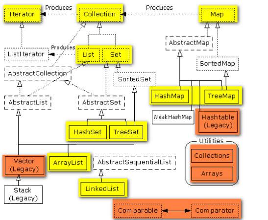

# 1. 【腾讯】说说 B-tree、B+tree 的区别和使用场景？
TODO

# 2. 【阿里巴巴】有10 亿个 url，每个 url 大小小于 56B，要求去重，内存只给你4G
TODO

# 3. Java 集合类框架的基本接口有哪些？
集合类接口指定了一组叫做元素的对象。集合类接口的每一种具体的实现类都可以选择以它自己的方式对元素进行保存和排序。有的集合类允许重复的键，有些不允许。

Java集合类提供了一套设计良好的支持对一组对象进行操作的接口和类。Java集合类里面最基本的接口有：

Collection：代表一组对象，每一个对象都是它的子元素。

Set：不包含重复元素的Collection。

List：有顺序的collection，并且可以包含重复元素。

Map：可以把键（key）映射到值（value）的对象，键不能重复。

# 4. Java 中同步集合与并发集合有什么区别？
同步集合与并发集合都为多线程和并发提供了合适的线程安全的集合，不过并发集合的可扩展性更高。

在Java1.5之前程序员们只有同步集合来用且在多线程并发的时候会导致争用，阻碍了系统的扩展性。Java5介绍了并发集合像ConcurrentHashMap，不仅提供线程安全还用锁分离和内部分区等现代技术提高了可扩展性。

# 5. 说一说 HashSet的使用和原理？
1）哈希表的查询速度特别快，时间复杂度为O（1）。

2）HashMap、Hashtable、HashSet这些集合采用的是哈希表结构，需要用到hashCode哈希码，hashCode是一个整数值。

3）系统类已经覆盖了hashCode方法，自定义类如果要放入hash类集合，必须重写hashcode。如果不重写，调用的是Object的hashcode，而Object的hashCode实际上是地址。

4）向哈希表中添加数据的原理：当向集合Set中增加对象时，首先集合计算要增加对象的hashCode码，根据该值来得到一个位置用来存放当前对象，如在该位置没有一个对象存在的话，那么集合Set认为该对象在集合中不存在，直接增加进去。如果在该位置有一个对象存在的话，接着将准备增加到集合中的对象与该位置上的对象进行equals方法比较，如果该equals方法返回false,那么集合认为集合中不存在该对象，在进行一次散列，将该对象放到散列后计算出的新地址里。如果equals方法返回true，那么集合认为集合中已经存在该对象了，不会再将该对象增加到集合中了。

5）在哈希表中判断两个元素是否重复要使用到hashCode()和equals()。hashCode决定数据在表中的存储位置，而equals判断是否存在相同数据。

6）Y=K(X) ：K是函数，X是哈希码，Y是地址。

# 6. Vector 和 ArrayList 有什么区别和联系？
相同点：

1）实现原理相同，底层都使用数组。

2）功能相同，实现增删改查等操作的方法相似。

3）都是长度可变的数组结构，很多情况下可以互用。

不同点：

1）Vector是早期JDK版本提供，ArrayList是新版本替代Vector的。

2）Vector线程安全，ArrayList重速度轻安全，线程非安全。

长度需增长时，Vector默认增长一倍，ArrayList增长50%。

# 7. List、Set、Collection、Map有什么区别和联系？



1、Collection接口存储一组不唯一，无序的对象；

2、List接口存储一组不唯一，有序（插入顺序）的对象；

3、Set接口存储一组唯一，无序的对象；

4、Map接口存储一组键值对象，提供key到value的映射。Key无序且唯一。value不要求有序，允许重复。（如果只使用key存储，而不使用value，那就是Set）。

# 8. Arraylist 与 Vector 有什么区别？
Arraylist与Vector主要从两个方面来说：

1）同步性：Vetor是线程安全的（同步），而Arraylist是线程序不安全的；

2）数据增长：当需要增长时，Vector默认增长一倍，而是ArrayList却是一半。

# 9. 如何判断使用 HashMap 还是 TreeMap 集合？
对于在Map中插入、删除、定位一个元素这类操作，HashMap是最好的选择，因为相对而言HashMap的插入会更快，但如果要对一个key集合进行有序的遍历，那TreeMap是更好的选择。

# 10. 如何实现数组和 List 之间的转换？
1、数组转List集合：使用Arrays. asList(array)进行转换。

2、List集合转数组：使用List自带的toArray()方法。

代码示例：
```java
// list to array
List list = new ArrayList();
list. add("公众号");
list. add("Java精选");
list. toArray();
// array to list
String[] array = new String[]{"公众号","Java精选"};
Arrays. asList(array);
```
# 11. 【美团】JDK1.8 中对 HashMap 和 ConcurrentHashMap 做了哪些优化？
TODO

# 12. 说出一些常用的类，包，接口，请各举 5 个？
常用的类：String、Arrays、Collections、System、Integer、BufferedReader、BufferedWriter

常用的包：util、io、sql、awt、list、lang

常用的接口：List、Map、Set、Serializable、Comparable、Runnable

# 13. HashMap 和 HashTable 有什么区别？
Hashtable是线程安全，而HashMap则非线程安全。

注：HashMap是jdk1.2推出新的Collection库包含的，HashMap是非线程安全的。
Hashtable所有实现方法添加了synchronized关键字来确保线程同步，因此相对而言HashMap性能会高一些，平时使用时若无特殊需求建议使用HashMap，在多线程环境下若使用HashMap需要使用Collections.synchronizedMap()方法来获取一个线程安全的集合。

HashMap允许使用null作为key，不过建议还是尽量避免使用null作为key。HashMap以null作为key时，总是存储在table数组的第一个节点上。而Hashtable则不允许null作为key。

HashMap继承了AbstractMap，HashTable继承Dictionary抽象类，两者均实现Map接口。

HashMap的初始容量为16，Hashtable初始容量为11，两者的填充因子默认都是0.75。

HashMap扩容时是当前容量翻倍即:capacity*2，Hashtable扩容时是容量翻倍+1即:capacity*2+1。

HashMap和Hashtable的底层实现都是数组+链表结构实现。

链表法处理hash冲突，jdk1.8以下也是链表法，jdk1.8修改链表存储为红黑树，冲突情况下处理效率更高。

# 14. HashMap 中如何实现同步？
HashMap可以使用如下代码实现：
```java
Map map = Collections.synchronizedMap(new HashMap());
```
来达到同步的效果。

具体而言，该方法会返回一个同步的Map集合，这个Map封装了底层HashMap的所有方法，使得底层的HashMap可以在多线程的环境中也能够保证安全性。

# 15. 【得物】Java8 中 hash 运算优化？为什么要这样做？
Java8中hash运算优化：

先获取到key的hashCode（int类型、32位的二进制数据），然后将这个hashCode右移16位，与原来的值进行异或运算（异或算法的结果是相同为 0，不同为 1 ）。

至于为什么这么做？对hash运算的优化，降低了寻址时的碰撞概率。由于hashmap中数组的长度都是2的N次幂。在寻址时是用hash值与长度的（n-1）做与运算。n-1的数值高位都是0，hash算法的优化，这样就使得hashCode的高位与低位都参与了运算，降低了索引值碰撞的概率。

# 16. 【得物】高并发下 HashMap 数组中死循环如何解决？
高并发下hashmap数组中出现死循环原因：

两个线程同时对hashmap扩容，如果两个线程扩容时同时执行到了数组的同一个位置，线程1还没有把该位置的链表全部转义到新的数组中，此时CPU执行时间片切换到了线程2，线程2开始按照自己的进度对链表进行迁移，就会造成链表上的两个元素循环依赖。当有线程调用get方法访问这个位置时，因为存在链表循环依赖，就会造成死循环。

**解决方案：**

多线程时使用CurrentHashMap类。CurrentHashmap在JDK1.7和JDK1.8有些差别：

在JDK1.7中ConcurrentHashMap采用了数组+Segment+分段锁的方式实现；

JDK1.8中是数组+链表，链表在数据过多时转为红黑树。

# 17. 【字节跳动】描述一下 Java 中一致性 hash 算法？
一致性hash算法是因为节点数目发生改变时，尽可能少的数据迁移而出现的。比如扩容时，需要50%的数据迁移；但如果引入一种算法，可以减少数据的迁移量，所以就出现了一致性hash算法。将所有的存储节点排列在收尾相接的hash环上，每个key在计算Hash后会顺时针找到临接的存储节点存放。而当有节点加入或退出时，仅影响该节点在Hash环上顺时针相邻的后续节点。

一致性hash算法的核心是一个hash圆环，范围是[0,2^32-1]。将集群中的实例按照IP或一个唯一值取hash值，对应到hash圆环上一个位置，当需要存入一个数据时，获取这个数据hash值，在hash圆环上顺时针找到最近的一个服务器，那么这个值就会存储到此服务器中。

当添加一个服务器时，只需要移动一部分的数据到新的服务器中，不需要全部移动。

**一致性hash算法优点**

一致性hash算法加入和删除节点只影响哈希环中顺时针方向的相邻的节点，对其他节点无影响。

**一致性hash算法缺点**

一致性hash算法的数据分布和节点位置有关，因为这些节点不是均匀的分布在哈希环上的，所以数据在进行存储时达不到均匀分布的效果。所以，出现了增加虚拟节点的方式来减少不均衡的现象。
