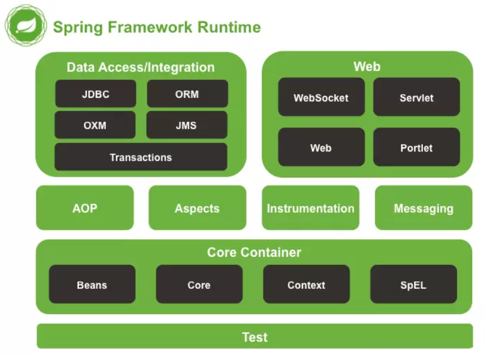

# 1. 什么是 Spring 框架？
Spring中文翻译过来是春天的意思，被称为J2EE的春天，是一个开源的轻量级的Java开发框架， 具有控制反转（IoC）和面向切面（AOP）两大核心。Java Spring框架通过声明式方式灵活地进行事务的管理，提高开发效率和质量。

Spring框架不仅限于服务器端的开发。从简单性、可测试性和松耦合的角度而言，任何 Java 应用都可以从Spring中受益。Spring框架还是一个超级粘合平台，除了自己提供功能外，还提供粘合其他技术和框架的能力。

**1）IOC 控制反转**

对象创建责任的反转，在Spring中BeanFactory是IOC容器的核心接口，负责实例化，定位，配置应用程序中的对象及建立这些对象间的依赖。XmlBeanFactory实现BeanFactory接口，通过获取xml配置文件数据，组成应用对象及对象间的依赖关系。

Spring中有3中注入方式，一种是set注入，另一种是注解注入，另一种是构造方法注入。

**2）AOP面向切面编程**

AOP是指纵向的编程，比如两个业务，业务1和业务2都需要一个共同的操作，与其往每个业务中都添加同样的代码，通过写一遍代码，让两个业务共同使用这段代码。

Spring中面向切面编程的实现有两种方式，一种是动态代理，一种是CGLIB，动态代理必须要提供接口，而CGLIB实现是由=有继承。

# 2. Spring框架的设计目标，设计理念，和核心是什么
Spring设计目标：Spring为开发者提供一个一站式轻量级应用开发平台；

Spring设计理念：在JavaEE开发中，支持POJO和JavaBean开发方式，使应用面向接口开发，充分支持OO（面向对象）设计方法；Spring通过IoC容器实现对象耦合关系的管理，并实现依赖反转，将对象之间的依赖关系交给IoC容器，实现解耦；

Spring框架的核心：IoC容器和AOP模块。通过IoC容器管理POJO对象以及他们之间的耦合关系；通过AOP以动态非侵入的方式增强服务。

IoC让相互协作的组件保持松散的耦合，而AOP编程允许你把遍布于应用各层的功能分离出来形成可重用的功能组件。

# 3. Spring 框架中使用了哪些设计模式？
Spring框架中使用大量的设计模式，下面列举比较有代表性的：

**代理模式**

AOP能够将那些与业务无关（事务处理、日志管理、权限控制等）封装起来，便于减少系统的重复代码，降低模块间的耦合度有利于可拓展性和可维护性。

**单例模式**

Spring中bean的默认作用域是单例模式，在Spring配置文件中定义bean默认为单例模式。

**模板方法模式**

模板方法模式是一种行为设计模式，用来解决代码重复的问题，如RestTemplate、JmsTemplate、JpaTemplate。

**包装器设计模式**

Spring根据不同的业务访问不同的数据库，能够动态切换不同的数据源。

**观察者模式**

定义对象键一种一对多的依赖关系，当一个对象的状态发生改变时，所有依赖于它的对象都会得到通知被制动更新，如Spring中listener的实现–ApplicationListener。

Spring事件驱动模型就是观察者模式很经典的一个应用。

**工厂模式**

Spring使用工厂模式通过BeanFactory、ApplicationContext创建bean对象。

# 4. Spring 依赖注入有几种实现方式？
1）Constructor构造器注入：通过将@Autowired注解放在构造器上来完成构造器注入，默认构造器参数通过类型自动装配。

```java
public class Test {
    @Autowired
    private UserInterface user;  
    
    private Test(UserInterface user) {  
        this.user = user;  
    }  
}
```

2）Field接口注入：通过将@Autowired注解放在构造器上来完成接口注入。

```java
@Autowired //接口注入  
private IUserService userService;  
```
3）Setter方法参数注入：通过将@Autowired注解放在方法上来完成方法参数注入。

```java
public class Test {
    @Autowired
	private User user;

   
    public void setUser(User user) {  
        this.user = user;  
    }  
    public String getuser() {  
        return user;  
    }  
}
```
# 5. Spring 中常用的注解包含哪些？
**1）声明bean的注解**

@Component 组件，没有明确的角色

@Service 在业务逻辑层使用（service层）

@Repository 在数据访问层使用（dao层）

@Controller 在展现层使用，控制器的声明（C*上使用）

**2）注入bean的注解**

@Autowired：由Spring提供

@Inject：由JSR-330提供

@Resource：由JSR-250提供

都可以注解在set方法和属性上，推荐注解在属性上（一目了然，少写代码）。

**3）java配置类相关注解**

@Configuration 声明当前类为配置类，相当于xml形式的Spring配置（类上使用），其中内部组合了@Component注解，表明这个类是一个bean（类上使用）

@Bean 注解在方法上，声明当前方法的返回值为一个bean，替代xml中的方式（方法上使用）

@ComponentScan 用于对Component进行扫描，相当于xml中的（类上使用）

@WishlyConfiguration 为@Configuration与@ComponentScan的组合注解，可以替代这两个注解

**4）切面（AOP）相关注解**

Spring支持AspectJ的注解式切面编程。

@Aspect 声明一个切面（类上使用）

使用@After、@Before、@Around定义建言（advice），可直接将拦截规则（切点）作为参数。

@After 在方法执行之后执行（方法上使用）

@Before 在方法执行之前执行（方法上使用）

@Around 在方法执行之前与之后执行（方法上使用）

@PointCut 声明切点

在java配置类中使用@EnableAspectJAutoProxy注解开启Spring对AspectJ代理的支持（类上使用）

**5）@Bean的属性支持**

@Scope 设置Spring容器如何新建Bean实例（方法上使用，得有@Bean）

其设置类型包括：

Singleton （单例,一个Spring容器中只有一个bean实例，默认模式）,

Protetype （每次调用新建一个bean）,

Request （web项目中，给每个http request新建一个bean）,

Session （web项目中，给每个http session新建一个bean）,

GlobalSession（给每一个 global http session新建一个Bean实例）

@StepScope 在Spring Batch中还有涉及

@PostConstruct 由JSR-250提供，在构造函数执行完之后执行，等价于xml配置文件中bean的initMethod

@PreDestory 由JSR-250提供，在Bean销毁之前执行，等价于xml配置文件中bean的destroyMethod

**6）@Value注解**

@Value 为属性注入值（属性上使用）

**7）环境切换**

@Profile 通过设定Environment的ActiveProfiles来设定当前context需要使用的配置环境。（类或方法上使用）

@Conditional Spring4中可以使用此注解定义条件话的bean，通过实现Condition接口，并重写matches方法，从而决定该bean是否被实例化。（方法上使用）

**8）异步相关**

@EnableAsync 配置类中，通过此注解开启对异步任务的支持，叙事性AsyncConfigurer接口（类上使用）

@Async 在实际执行的bean方法使用该注解来申明其是一个异步任务（方法上或类上所有的方法都将异步，需要@EnableAsync开启异步任务）

**9）定时任务相关**

@EnableScheduling 在配置类上使用，开启计划任务的支持（类上使用）

@Scheduled 来申明这是一个任务，包括cron,fixDelay,fixRate等类型（方法上，需先开启计划任务的支持）

**10）@Enable*注解说明**

注解主要用来开启对xxx的支持。

@EnableAspectJAutoProxy 开启对AspectJ自动代理的支持

@EnableAsync 开启异步方法的支持

@EnableScheduling 开启计划任务的支持

@EnableWebMvc 开启Web MVC的配置支持

@EnableConfigurationProperties 开启对@ConfigurationProperties注解配置Bean的支持

@EnableJpaRepositories 开启对SpringData JPA Repository的支持

@EnableTransactionManagement 开启注解式事务的支持

@EnableTransactionManagement 开启注解式事务的支持

@EnableCaching 开启注解式的缓存支持

**11）测试相关注解**

@RunWith 运行器，Spring中通常用于对JUnit的支持

@ContextConfiguration 用来加载配置ApplicationContext，其中classes属性用来加载配置类

# 6. Spring 支持哪几种 bean 作用域？
1）singleton：默认，每个容器中只有一个bean的实例，单例的模式由BeanFactory自身来维护。

2）prototype：为每一个bean请求提供一个实例。

3）request：为每一个网络请求创建一个实例，在请求完成后，bean会失效并被垃圾回收器回收。

4）session：与request范围类似，确保每个session中有一个bean的实例，在session过期后，bean会随之失效。

5）global-session：全局作用域，global-session和Portlet应用相关。

当应用部署在Portlet容器中工作时，它包含很多portlet。

如果想要声明让所有的portlet共用全局的存储变量的话，那么这全局变量需要存储在global-session中。

全局作用域与Servlet中的session作用域效果相同。

# 7. Spring 中通知有哪些类型？
通知（advice）是在程序中想要应用在其他模块中横切关注点的实现。

**Advice主要有5种类型：**

@Before注解使用Advice

前置通知（BeforeAdvice）：在连接点之前执行的通知（advice），除非它抛出异常，否则没有能力中断执行流。

@AfterReturning注解使用Advice

返回之后通知（AfterRetuningAdvice）：如果一个方法没有抛出异常正常返回，在连接点正常结束之后执行的通知（advice）。

@AfterThrowing注解使用Advice

抛出（异常）后执行通知（AfterThrowingAdvice）：若果一个方法抛出异常来退出的话，这个通知（advice）就会被执行。

@After注解使用Advice

后置通知（AfterAdvice）：无论连接点是通过什么方式退出的正常返回或者抛出异常都会执行在结束后执行这些通知（advice）。

注解使用Advice

围绕通知（AroundAdvice）：围绕连接点执行的通知（advice），只有这一个方法调用。这是最强大的通知（advice）。

另外，@Around注解可以用来在调用一个具体方法前和调用后来完成一些具体的任务。比如在执行controller中方法前打印出请求参数，并在方法执行结束后来打印出响应值，就可以借助于@Around注解来实现。

# 8. Spring AOP 连接点和切入点是什么？
连接点（Joint Point）

连接点是指一个应用执行过程中能够插入一个切面的点，可以理解成一个方法的执行或者一个异常的处理等。

连接点可以是调用方法、抛出异常、修改字段等时，切面代码可以利用这些点插入到应用的正规流程中。使得程序执行过程中能够应用通知的所有点。

在Spring AOP中一个连接点总是代表一个方法执行。如果在这些方法上使用横切的话，所有定义在EmpoyeeManager接口中的方法都可以被认为是一个连接点。

切入点（Point cut）

切入点是一个匹配连接点的断言或者表达式，如果通知定义了“什么”和“何时”，那么切点就定义了“何处”。

通知（Advice）与切入点表达式相关联，切入点用于准确定位，确定在什么地方应用切面通知。

例如表达式

```java
execution(* EmployeeManager.getEmployeeById(...))
```
可以匹配EmployeeManager接口的getEmployeeById()。

Spring默认使用AspectJ切入点表达式，由切入点表达式匹配的连接点概念是AOP的核心。

# 9. Spring AOP 代理模式是什么？
代理模式是使用非常广泛的设计模式之一。

代理模式是指给某一个对象提供一个代理对象，并由代理对象控制对原对象的引用。通俗的来讲代理模式就是生活中常见的房产中介。

Spring AOP是基于代理实现的。

Spring AOP代理是一个由AOP框架创建的用于在运行时实现切面协议的对象。

Spring AOP默认为AOP代理使用标准的JDK动态代理，这使得任何接口（或者接口的集合）可以被代理。

Spring AOP也可以使用CGLIB代理，如果业务对象没有实现任何接口那么默认使用CGLIB。

#  10. Spring 框架有哪些特点？
1）方便解耦，简化开发

通过Spring提供的IoC容器，可以将对象之间的依赖关系交由Spring进行控制，避免编码所造成的过度耦合。使用Spring可以使用户不必再为单实例模式类、属性文件解析等底层的需求编码，可以更专注于上层的业务逻辑应用。

2）支持AOP面向切面编程

通过Spring提供的AOP功能，方便进行面向切面的编程，许多不容易用传统OOP实现的功能可以通过AOP轻松完成。

3）支持声明事物

通过Spring可以从单调繁琐的事务管理代码中解脱出来，通过声明式方式灵活地进行事务的管理，提高开发效率和质量。

4）方便程序测试

使用非容器依赖的编程方式进行几乎所有的测试工作，通过Spring使得测试不再是高成本的操作，而是随手可做的事情。Spring对Junit4支持，可以通过注解方便的测试Spring程序。

5）方便便捷集成各种中间件框架

Spring可以降低集成各种中间件框架的难度，Spring提供对各种框架如Struts,Hibernate、Hessian、Quartz等的支持。

6）降低Java EE API使用难度

Spring对很多Java EE API如JDBC、JavaMail、远程调用等提供了一个简易的封装层，通过Spring的简易封装，轻松实现这些Java EE API的调用。

# 11. Spring 是由哪些模块组成的？
Spring 总共大约有 20 个模块，Spring 框架的基本模块包括Core module、Bean module、Context module、Expression Language module、JDBC module、ORM module、OXM module、Java Messaging Service(JMS) module、Transaction module、Web module、Web-Servlet module、Web-Struts module、Web-Portlet module。由1300多个不同的文件构成，而这些组件被分别整合在核心容器（Core Container）、AOP（Aspect Oriented Programming）和设备支持（Instrmentation）、数据访问与集成（Data Access/Integeration）、Web、消息（Messaging）、Test等6个模块中。

以下是Spring 5的模块结构图：



Spring core：提供了框架的基本组成部分，包括控制反转（Inversion of Control，IOC）和依赖注入（Dependency Injection，DI）功能。

Spring beans：提供了BeanFactory，是工厂模式的一个经典实现，Spring将管理对象称为Bean。

Spring context：构建于 core 封装包基础上的 context 封装包，提供了一种框架式的对象访问方法。

Spring jdbc：提供了一个JDBC的抽象层，消除了烦琐的JDBC编码和数据库厂商特有的错误代码解析， 用于简化JDBC。

Spring aop：提供了面向切面的编程实现，让你可以自定义拦截器、切点等。

Spring Web：提供了针对 Web 开发的集成特性，例如文件上传，利用 servlet listeners 进行 ioc 容器初始化和针对 Web 的 ApplicationContext。

Spring test：主要为测试提供支持的，支持使用JUnit或TestNG对Spring组件进行单元测试和集成测试。

# 12. Spring 提供几种配置方式设置元数据？
Spring配置元数据可以采用三种方式，可以混合使用。

**1）基于XML的配置元数据**

使用XML文件标签化配置Bean的相关属性。

| 属性	             | 描述	                                          | 对应注解                          |
|-----------------|----------------------------------------------|-------------------------------|
| class	          | 此项必填，指定要创建Bean的类(全路径)	                       | 无                             |
| id	             | 全局唯一 指定bean的唯一标示符	                           | 无                             |
| name	           | 全局唯一 指定bean的唯一标示符	                           | @Bean的name属性                  |
| scope	          | 创建bean的作用域	                                  | @Scope                        |
| singleton	      | 是否单例	                                        | @Scope(value=SCOPE_SINGLETON) |
| depends-on	     | 用来表明依赖关系	                                    | @DependsOn                    |
| depends-check	  | 依赖检查	                                        | 无                             |
| autowire	       | 自动装配 默认NO	                                   | @Bean的autowire属性              |
| init-method	    | 对象初始化后调用的方法	                                 | @Bean 的initMethod属性           |
| destroy-method	 | 对象销毁前调用的方法	                                  | @Bean 的destroyMethod          |
| lazy-init	      | 容器启动时不会初始化，只有使用时初始化	                         | @Lazy                         |
| primary	        | 容器中有多个相同类型的bean时，autowired时优先使用primary=true	 | @Primary                      |
| factory-method	 | 工厂创建对象的方法	                                   | 无                             |
| factory-bean	   | 工厂bean	                                      | 无                             |

**2）基于注解的配置元数据**


@Component  标识一个被Spring管理的对象
@Respository  标识持久层对象
@Service         标识业务层对象
@Controller      标识表现层对象
Spring Boot项目中Contrller层、Service层、Dao层均采用注解的方式，在对应类上加相对应的@Controller，@Service，@Repository，@Component等注解。

需要注意的是使用@ComponentScan注解，若是Spring Boot框架项目，扫描组件的默认路径与Application.class同级包。

**3）基于Java的配置元数据**

默认情况下，方法名即为Bean名称。Java使用Configuration类配置bean，</bean>对应Spring注解@Bean。

目前常用的方式是第二种和第三种，也经常结合使用。

# 13. Spring 中单例 bean 是线程安全的吗？
Spring中单例bean默认是线程安全的，前提是这个对象没有非静态成员变量。

Spring中单例bean是存在线程安全是因为多个线程操作同一个对象时，这个对象非静态成员变量的写操作会存在线程安全问题。

两种常见的解决方案：

1）bean对象中尽量避免定义可变的成员变量。

2）推荐在类中定义一个ThreadLocal成员变量，将需要的可变成员变量保存在ThreadLocal中。

3）设置scope="prototype"参数。

# 14. Spring 中 @Component 和 @Bean 注解有什么区别？
1）作用对象不同。@Component注解作用于类，而@Bean注解作用于方法。

2）@Component注解一般是通过类路径扫描来自动侦测及自动装配到Spring容器中，定义要扫描的路径可以使用@ComponentScan注解。@Bean注解一般是在标有该注解的方法中定义产生这个bean，通知Spring这是某个类的实例。

3）@Bean注解相比较@Component注解的自定义性更强，而且很多地方只能通过@Bean注解来完成注册bean。比如引用第三方库的类装配到Spring容器的时候，只能通过@Bean注解来实现。

使用@Bean注解示例：

```java
@Configuration
public class SpringConfig {
    @Bean
    public IUserService iUserService() {
     return new UserServiceImpl();
    }
}
```

上述代码等同于XML配置：

```xml
<beans>
    <bean id="iUserService" class="com.yoodb.UserServiceImpl"/>
</beans>
```
使用@Component注解示例：

```java
@Component("iUserService")
public class IUserService implements UserServiceImpl {

}
```
# 15. Spring 事务管理的方式有几种？
Spring事务管理的方式有两种，编程式事务和声明式事务。

1、编程式事务：在代码中硬编码（不推荐使用）。

2、声明式事务：在配置文件中配置（推荐使用），分为基于XML的声明式事务和基于注解的声明式事务。

声明式事务管理方式是基于AOP技术实现的，实质上就是在方法执行前后进行拦截，然后在目标方法开始之前创建并加入事务，执行完目标方法后根据执行情况提交或回滚事务。

声明式事务管理分为两种方式

1）基于XML配置文件的方式；

2）业务方法上添加@Transactional注解，将事务规则应用到业务逻辑中。

# 16. Spring 中事务有哪几种隔离级别？
Spring在TransactionDefinition接口类中定义了五个表示隔离级别的常量：

ISOLATION_DEFAULT：数据库默认隔离级别，Mysql默认采用REPEATABLE_READ隔离级别；Oracle默认采用的READ_COMMITTED隔离级别。ISOLATION_DEFAULT是一个PlatfromTransactionManager默认的隔离级别，使用数据库默认的事务隔离级别.另外四个与JDBC的隔离级别相对应。

ISOLATION_READ_UNCOMMITTED：最低隔离级别，允许读取尚未提交的变更数据，可能会导致脏读、幻读或不可重复读。

ISOLATION_READ_COMMITTED：允许读取并发事务已经提交的数据，可以阻止脏读，但是幻读或不可重复读仍有可能发生。

ISOLATION_REPEATABLE_READ：对同字段多次读取结果都是一致的，除非数据是被本身事务所修改，可以阻止脏读和不可重复读，但幻读仍有可能发生。

ISOLATION_SERIALIZABLE：最高隔离级别，完全服从ACID的隔离级别。所有的事务依次逐个执行，这样事务之间完全不可能产生干扰，该级别可以防止脏读、不可重复读以及幻读。但是这将严重影响程序的性能。通常情况下不会使用该级别。

# 17. Spring 中事务有哪几种传播行为？
Spring在TransactionDefinition接口中定义了八个表示事务传播行为的常量。

**支持当前事务的情况：**

PROPAGATION_REQUIRED：如果当前存在事务，则加入该事务；如果当前没有事务，则创建一个新的事务。

PROPAGATION_SUPPORTS： 如果当前存在事务，则加入该事务；如果当前没有事务，则以非事务的方式继续运行。

PROPAGATION_MANDATORY： 如果当前存在事务，则加入该事务；如果当前没有事务，则抛出异常。（mandatory：强制性）。

**不支持当前事务的情况：**

PROPAGATION_REQUIRES_NEW： 创建一个新的事务，如果当前存在事务，则把当前事务挂起。

PROPAGATION_NOT_SUPPORTED： 以非事务方式运行，如果当前存在事务，则把当前事务挂起。

PROPAGATION_NEVER： 以非事务方式运行，如果当前存在事务，则抛出异常。

**其他情况：**

PROPAGATION_NESTED： 如果当前存在事务，则创建一个事务作为当前事务的嵌套事务来运行；如果当前没有事务，则该取值等价于PROPAGATION_REQUIRED。

# 18. Spring 事务都有哪些特性？
原子性（Atomicity）：事务是一个原子操作，由一系列动作组成。事务的原子性确保动作要么全部完成，要么完全不起作用。

一致性（Consistency）：一旦事务完成（不管成功还是失败），系统必须确保它所建模的业务处于一致的状态，而不会是部分完成部分失败。在现实中的数据不应该被破坏。

隔离性（Isolation）：可能有许多事务会同时处理相同的数据，因此每个事务都应该与其他事务隔离开来，防止数据损坏。

持久性（Durability）：一旦事务完成，无论发生什么系统错误，它的结果都不应该受到影响，这样就能从任何系统崩溃中恢复过来。通常情况下，事务的结果被写到持久化存储器中。

# 19. Spring 中如何开启定时任务？
1）在启动类上添加@EnableScheduling注解，用于开启对定时任务的支持。

2）在需要定时任务的类上添加@Component注解，用于把普通pojo实例化到Spring容器，等同于添加到配置文件中。

3）在方法上添加@Scheduled(cron = "秒分时日月?")注解，用于声明需要执行的定时任务。

实例代码如下：

```java
import org.springframework.beans.factory.annotation.Configurable;
import org.springframework.scheduling.annotation.EnableScheduling;
import org.springframework.scheduling.annotation.Scheduled;
import org.springframework.stereotype.Component;
import java.text.SimpleDateFormat;
import java.util.Date;

@Component
@Configurable
@EnableScheduling
public class ScheduledTasks {
//每10秒执行一次
@Scheduled(fixedRate = 1000 * 10)
public void reportCurrentTime(){
System.out.println ("Scheduling Tasks Examples: The time is now " + dateFormat ().format (new Date ()));
}

    //在固定时间执行
    @Scheduled(cron = "0 */1 *  * * * ")
    public void reportCurrentByCron(){
        System.out.println ("Scheduling Tasks Examples By Cron: The time is now " + dateFormat ().format (new Date()));
    }
 
    private SimpleDateFormat dateFormat(){
        return new SimpleDateFormat ("HH:mm:ss");
    }
}
```
1、zone表示执行时间的时区

2、fixedDelay 和fixedDelayString 一个固定延迟时间执行,上个任务完成后,延迟多久执行

3、fixedRate 和fixedRateString一个固定频率执行,上个任务开始后多长时间后开始执行

4、initialDelay 和initialDelayString表示一个初始延迟时间,第一次被调用前延迟的时间

5、cron是设置定时执行的表达式，如0 0/1 * * * ?每隔一分钟执行一次。

**cron参数说明:**

0 0 10,14,16 * * ? 每天上午10点，下午2点，4点 0 0/30 9-17 * * ? 朝九晚五工作时间内每半小时 0 0 12 ? * WED 表示每个星期三中午12点 0 0 12 * * ? 每天中午12点触发

按顺序依次为：

秒（0~59） 分钟（0~59） 小时（0~23） 天（月）（0~31，但是需要考虑月的天数） 月（0~11） 天（星期）（1~7 1=SUN 或 SUN，MON，TUE，WED，THU，FRI，SAT） 年份（1970至2099）

# 20. Spring 中自动装配 Bean 有哪些方式？
Spring中支持5中自动装配模式。

**no**

默认方式，缺省情况下，自动配置是通过“ref”属性手动设定。手动装配方式，需要通过ref设定bean的依赖关系，在项目中最常用。

**byName**

根据属性名称自动装配。如果一个bean的名称和其他bean属性的名称是一致，将会自装配它。

**byType**

按数据类型自动装配。如果一个bean的数据类型是用其它bean属性的数据类型，兼容并自动装配它。

**constructor**

根据构造器进行装配，与byType类似，如果bean的构造器有与其他bean类型相同的属性，则进行自动装配。

**autodetect**

如果找到默认的构造函数，使用“自动装配用构造”; 否则，使用“按类型自动装配”。
