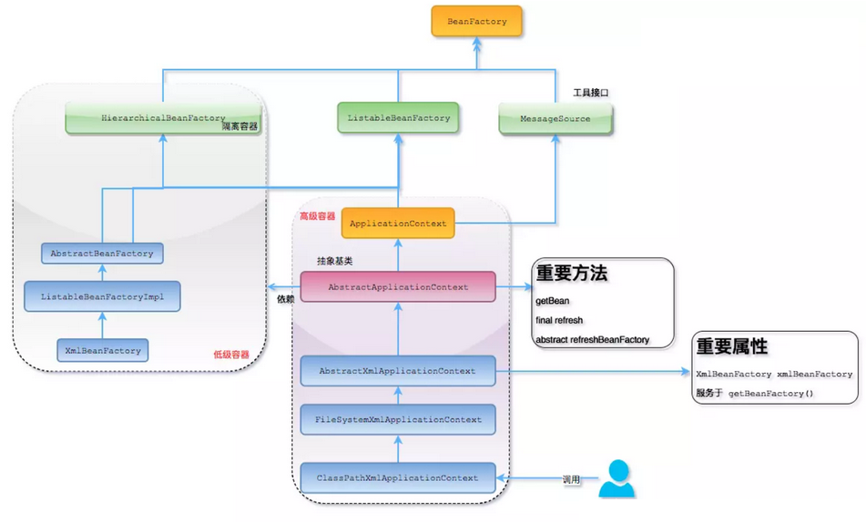

# 1. Spring AOP 中关注点和横切关注点有什么不同？
关注点

关注点是应用中一个模块的行为，一个关注点可能会被定义成一个我们想实现的一个功能。

关注点可以被定义为：想实现以解决特定业务问题的方法。

例如，在所有电子商务应用中不同的关注点（或者模块）可能是库存管理、航运管理、用户管理等。

横切关注点

横切关注点是一个关注点，此关注点是整个应用都会使用的功能，并影响整个应用，比如日志，安全和数据传输，几乎应用的每个模块都需要的功能。因此这些都属于横切关注点。

# 2. Spring AOP 中切入点和连接点什么关系？
连接点是个虚的概念，可简单理解为切入点的集合，它只是对应用程序的所有需要进行插入切面的一个统称。

每个切入点都对应具体的连接点，在运行期Spring就是根据这些切入点的定义，将通知或者拦截器插入到具体的连接点上。

# 3. Spring AOP 代理是什么？
代理是使用非常广泛的设计模式。简单来说，代理是一个看其他像另一个对象的对象，但它添加了一些特殊的功能。

Spring AOP是基于代理实现的。AOP代理是一个由AOP框架创建的用于在运行时实现切面协议的对象。

Spring AOP默认为AOP代理使用标准的JDK 动态代理。这使得任何接口（或者接口的集合）可以被代理。

Spring AOP也可以使用CGLIB代理。这对代理类而不是接口是必须的。

如果业务对象没有实现任何接口那么默认使用CGLIB。

# 4. Java 中什么是 Aspect 切面？
AOP核心就是切面，它将多个类的通用行为封装成可重用的模块，该模块含有一组API提供横切功能。

比如，一个日志模块可以被称作日志的AOP切面。

根据需求的不同，一个应用程序可以有若干切面。

在Spring AOP中，切面通过带有@Aspect注解的类实现。

# 5. BeanFactory 和 ApplicationContext 有什么区别？
BeanFactory和ApplicationContext是Spring的两大核心接口，都可以当做Spring的容器。

1、BeanFactory是Spring里面最底层的接口，是IoC的核心，定义了IoC的基本功能，包含了各种Bean的定义、加载、实例化，依赖注入和生命周期管理。

ApplicationContext接口作为BeanFactory的子类，除了提供BeanFactory所具有的功能外，还提供了更完整的框架功能：

1）继承MessageSource，因此支持国际化。

2）资源文件访问，如URL和文件（ResourceLoader）。

3）载入多个（有继承关系）上下文（即同时加载多个配置文件） ，使得每一个上下文都专注于一个特定的层次，比如应用的web层。

4）提供在监听器中注册bean的事件。

2、BeanFactroy采用的是延迟加载形式来注入Bean的，只有在使用到某个Bean时(调用getBean())，才对该Bean进行加载实例化。这样，我们就不能提前发现一些存在的Spring的配置问题。如果Bean的某一个属性没有注入，BeanFacotry加载后，直至第一次使用调用getBean方法才会抛出异常。

ApplicationContext是在容器启动时，一次性创建了所有的Bean。这样，在容器启动时，我们就可以发现Spring中存在的配置错误，这样有利于检查所依赖属性是否注入。

ApplicationContext启动后预载入所有的单实例Bean，所以在运行的时候速度比较快，因为它们已经创建好了。相对于BeanFactory，ApplicationContext 唯一的不足是占用内存空间，当应用程序配置Bean较多时，程序启动较慢。

3、BeanFactory和ApplicationContext都支持BeanPostProcessor、BeanFactoryPostProcessor的使用，但两者之间的区别是BeanFactory需要手动注册，而ApplicationContext则是自动注册。

4、BeanFactory通常以编程的方式被创建，ApplicationContext还能以声明的方式创建，如使用ContextLoader。

# 6. Spring 中有几种不同类型的自动代理？
BeanNameAutoProxyCreator

DefaultAdvisorAutoProxyCreator

Metadata autoproxying

# 7. Spring 中什么是目标对象?
被一个或者多个切面所通知的对象。它通常是一个代理对象。也指被通知（advised）对象。

# 8. Spring 框架中事务管理有哪些优点？
Spring框架事务管理为不同的事务API，如JTA、JDBC、Hibernate、JPA和JDO，提供一个不变的编程模式。

Spring框架为编程式事务管理提供了一套简单的API而不是一些复杂的事务API。

Spring框架支持声明式事务管理。

Spring框架和Spring各种数据访问抽象层很好得集成。

# 9. JDK 动态代理和 CGLIB 动态代理有什么区别？
Spring AOP中的动态代理主要有两种方式，JDK动态代理和CGLIB动态代理：

1、JDK动态代理只提供接口的代理，不支持类的代理。核心InvocationHandler接口和Proxy类，InvocationHandler 通过invoke()方法反射来调用目标类中的代码，动态地将横切逻辑和业务编织在一起；接着，Proxy利用 InvocationHandler动态创建一个符合某一接口的的实例, 生成目标类的代理对象。

2、如果代理类没有实现InvocationHandler 接口，那么Spring AOP会选择使用CGLIB来动态代理目标类。CGLIB（Code Generation Library），是一个代码生成的类库，可以在运行时动态的生成指定类的一个子类对象，并覆盖其中特定方法并添加增强代码，从而实现AOP。CGLIB是通过继承的方式做的动态代理，因此如果某个类被标记为final，那么它是无法使用CGLIB做动态代理的。

静态代理与动态代理区别在于生成AOP代理对象的时机不同，相对来说AspectJ的静态代理方式具有更好的性能，但是AspectJ需要特定的编译器进行处理，而Spring AOP则无需特定的编译器处理。

InvocationHandler中的

```java
invoke(Object proxy,Method method,Object[] args);
```

proxy是最终生成的代理实例；method是被代理目标实例的某个具体方法；args是被代理目标实例某个方法的具体入参，在方法反射调用时使用。

# 10. Spring AOP 和 AspectJ AOP 有什么区别？
AOP实现的关键在于代理模式，AOP代理主要分为静态代理和动态代理。静态代理的代表为AspectJ；动态代理则以Spring AOP为代表。

1）AspectJ是静态代理的增强，所谓静态代理，就是AOP框架会在编译阶段生成AOP代理类，因此也称为编译时增强，他会在编译阶段将AspectJ(切面)织入到Java字节码中，运行的时候就是增强之后的AOP对象。

2）Spring AOP使用的动态代理，所谓的动态代理就是说AOP框架不会去修改字节码，而是每次运行时在内存中临时为方法生成一个AOP对象，这个AOP对象包含了目标对象的全部方法，并且在特定的切点做了增强处理，并回调原对象的方法。

# 11. Spring 中 ApplicationContext 通常的实现是什么？
FileSystemXmlApplicationContext

此容器从一个XML文件中加载beans的定义，XML Bean 配置文件的全路径名必须提供给它的构造函数。

ClassPathXmlApplicationContext

此容器也从一个XML文件中加载beans的定义，这里，你需要正确设置classpath因为这个容器将在classpath里找bean配置。

WebXmlApplicationContext

此容器加载一个XML文件，此文件定义了一个WEB应用的所有bean。

# 12. Spring Native 框架是什么？
Spring团队发布Spring Native Beta版。

通过Spring Native，Spring应用将有机会以GraalVM原生镜像的方式运行。

为了更好地支持原生运行，Spring Native提供了Maven和Gradle插件，并且提供了优化原生配置的注解。

# 13. Spring Native 有什么优缺点？
Spring Native优点

1）立即启动，一般启动时间小于100ms；

2）更低的内存消耗；

3）独立部署，不再需要JVM；

4）同样的峰值性能要比JVM消耗的内存小。

Spring Native缺点

1）构建时间长；

2）只支持新的Springboot版本（Spring Native 0.9.0 supports Spring Boot 2.4.3, Spring Native 0.9.1 will support Spring Boot 2.4.4, etc.）

# 14. Spring Native 和 JVM 有什么区别？
欢迎大家关注微信公众号： Java精选 ，专注分享前沿资讯，BATJ 大厂面试题解读，架构技术干货，微服务、高可用等架构设计，10年开发老兵帮你少走弯路，欢迎各领域程序员交流学习！

此类面试题只能在微信小程序： Java精选面试题 ，查阅全部内容，感谢支持！

# 15. 什么是 Spring 配置文件？
Spring配置文件是一个XML文件。此文件包含类信息，并描述了这些类是如何配置和相互引入的。

# 16. Spring 中如何定义 Bean 的范围？
在Spring中定义一个时，我们也可以为bean声明一个范围。它可以通过bean定义中的scope属性定义。

例如，当Spring每次需要生成一个新的bean实例时，bean的scope属性就是原型。另一方面，当每次需要Spring都必须返回相同的bean实例时，bean的scope属性必须设置为singleton。

注：bean的scope属性有prototype，singleton，request, session几个属性

# 17. Spring 框架中有哪些不同类型的事件？
Spring提供了以下5种标准的事件：

上下文更新事件（ContextRefreshedEvent）：在调用ConfigurableApplicationContext 接口中的refresh()方法时被触发。

上下文开始事件（ContextStartedEvent）：当容器调用ConfigurableApplicationContext的Start()方法开始/重新开始容器时触发该事件。

上下文停止事件（ContextStoppedEvent）：当容器调用ConfigurableApplicationContext的Stop()方法停止容器时触发该事件。

上下文关闭事件（ContextClosedEvent）：当ApplicationContext被关闭时触发该事件。容器被关闭时，其管理的所有单例Bean都被销毁。

请求处理事件（RequestHandledEvent）：在Web应用中，当一个http请求（request）结束触发该事件。如果一个bean实现了ApplicationListener接口，当一个ApplicationEvent 被发布以后，bean会自动被通知。

# 18. Spring 应用程序有哪些不同组件？
Spring 应用一般有以下组件：

接口 - 定义功能。

Bean类 - 它包含属性，setter和getter方法，函数等。

Bean配置文件 - 包含类的信息以及如何配置它们。

Spring面向切面编程（AOP） - 提供面向切面编程的功能。

用户程序 - 它使用接口。

# 19. Spring 如何设计容器的？BeanFactory 和 ApplicationContext 两者关系？
Spring 作者 Rod Johnson 设计了两个接口用以表示容器。

BeanFactory

ApplicationContext

BeanFactory可以理解为就是个HashMap，Key是BeanName，Value是Bean实例。通常只提供注册（put），获取（get）这两个功能。我们可以称之为 “低级容器”。

ApplicationContext可以称之为 “高级容器”。因为它比BeanFactory多了更多的功能。它继承了多个接口。因此具备了更多的功能。例如资源的获取，支持多种消息（例如JSP tag的支持），对BeanFactory多了工具级别的支持等待。所以他的名称已经不是BeanFactory之类的工厂，而是 “应用上下文”， 代表着整个大容器的所有功能。该接口定义了一个refresh方法，此方法是所有阅读Spring源码的人的最熟悉的方法，用于刷新整个容器，即重新加载/刷新所有的bean。

当然，除了这两个大接口，还有其他的辅助接口，这里就不过多介绍。

BeanFactory和ApplicationContext的关系为了更直观的展示 “低级容器” 和 “高级容器” 的关系，这里通过常用的ClassPathXmlApplicationContext类来展示整个容器的层级UML关系。



**有点复杂，解释一下：**

最上面的是BeanFactory，下面的3个绿色的，都是功能扩展接口，这里就不展开来讲，简单跳过。

看下面的隶属ApplicationContext粉红色的 “高级容器”，依赖着 “低级容器”，这里说的是依赖，不是继承，它依赖着 “低级容器” 的getBean功能。而高级容器有更多的功能：支持不同的信息源头，可以访问文件资源，支持应用事件（Observer 模式）。

通常用户看到的就是 “高级容器”。 但BeanFactory也非常够用！

左边灰色区域的是 “低级容器”， 只负载加载Bean，获取Bean。容器其他的高级功能是没有的。例如上图画的refresh刷新Bean工厂所有配置，生命周期事件回调等。

**小结**

说了这么多，不知道有没有理解Spring IoC？这里总结一下：IoC在Spring中，只需要低级容器就可以实现，2 个步骤：

加载配置文件，解析成BeanDefinition放在Map里。

调用getBean的时候，从BeanDefinition所属的Map里，拿出Class对象进行实例化，同时，如果有依赖关系，将递归调用getBean方法 —— 完成依赖注入。 上面就是Spring低级容器（BeanFactory）的IoC。

至于高级容器ApplicationContext，它包含了低级容器的功能，当他执行refresh模板方法的时候，将刷新整个容器的Bean。同时其作为高级容器，包含了太多的功能。一句话，它不仅仅是IoC。它支持不同信息源头，支持BeanFactory工具类，支持层级容器，支持访问文件资源，支持事件发布通知，支持接口回调等等。

# 20. Spring 如何处理线程并发问题？
在一般情况下，只有无状态的Bean才可以在多线程环境下共享，在Spring中，绝大部分Bean都可以声明为singleton作用域，因为Spring对一些Bean中非线程安全状态采用ThreadLocal进行处理，解决线程安全问题。

ThreadLocal和线程同步机制都是为了解决多线程中相同变量的访问冲突问题。同步机制采用了“时间换空间”的方式，仅提供一份变量，不同的线程在访问前需要获取锁，没获得锁的线程则需要排队。而ThreadLocal采用了“空间换时间”的方式。

ThreadLocal会为每一个线程提供一个独立的变量副本，从而隔离了多个线程对数据的访问冲突。因为每一个线程都拥有自己的变量副本，从而也就没有必要对该变量进行同步了。ThreadLocal提供了线程安全的共享对象，在编写多线程代码时，可以把不安全的变量封装进ThreadLocal。
