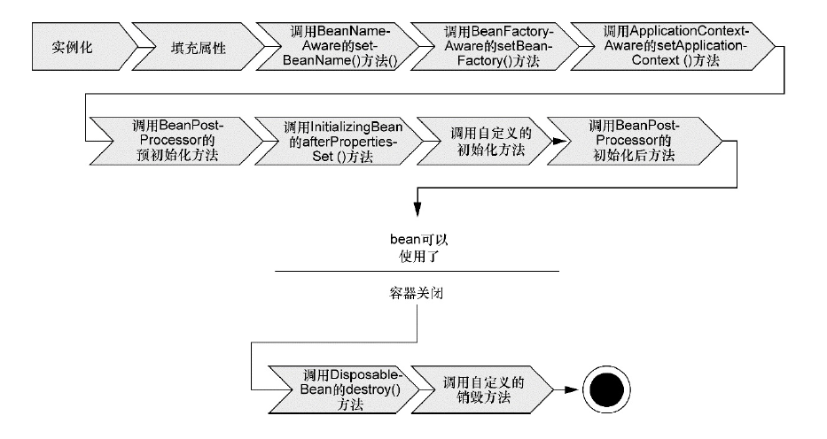

# 1. 解释 Spring 框架中 bean 的生命周期？
在传统的Java应用中，bean的生命周期很简单。使用Java关键字new进行bean实例化，然后该bean就可以使用了。一旦该bean不再被使用，则由Java自动进行垃圾回收。相比之下，Spring容器中的bean的生命周期就显得相对复杂多了。正确理解Spring bean的生命周期非常重要，因为或许要利用Spring提供的扩展点来自定义bean的创建过程。

下图展示了bean装载到Spring应用上下文中的一个典型的生命周期过程。



bean在Spring容器中从创建到销毁经历了若干阶段，每一阶段都可以针对Spring如何管理bean进行个性化定制。

正如所见，在bean准备就绪之前，bean工厂执行了若干启动步骤。

根据上图进行详细描述：

Spring对bean进行实例化；

Spring将值和bean的引用注入到bean对应的属性中；

如果bean实现了BeanNameAware接口，Spring将bean的ID传递给setBean-Name()方法；

如果bean实现了BeanFactoryAware接口，Spring将调用setBeanFactory()方法，将BeanFactory容器实例传入；

如果bean实现了ApplicationContextAware接口，Spring将调用setApplicationContext()方法，将bean所在的应用上下文的引用传入进来；

如果bean实现了BeanPostProcessor接口，Spring将调用它们的post-ProcessBeforeInitialization()方法；

如果bean实现了InitializingBean接口，Spring将调用它们的after-PropertiesSet()方法。类似地，如果bean使用initmethod声明了初始化方法，该方法也会被调用；

如果bean实现了BeanPostProcessor接口，Spring将调用它们的post-ProcessAfterInitialization()方法；

此时，bean已经准备就绪，可以被应用程序使用了，它们将一直驻留在应用上下文中，直到该应用上下文被销毁；

如果bean实现了DisposableBean接口，Spring将调用它的destroy()接口方法。同样，如果bean使用destroy-method声明了销毁方法，该方法也会被调用。

现在应该了解了如何创建和加载一个Spring容器。举例就是一个空的容器并没有太大的价值，在把东西放进去之前，它里面什么都没有。为了从Spring的DI(依赖注入)中受益，必须将应用对象装配进Spring容器中。

# 2. 哪些是重要的 bean 生命周期方法？能否重载它们？
有两个重要的bean生命周期方法，第一个是setup，它是在容器加载bean的时候被调用。

第二个方法是teardown它是在容器卸载类的时候被调用。bean标签有两个重要的属性（init-method和destroy-method）。用它们可以自己定制初始化和注销方法。它们也有相应的注解（@PostConstruct和@PreDestroy）。

# 3. 为什么 Spring 只支持方法级别的连接点？
因为Spring基于动态代理，所以Spring只支持方法连接点。

Spring缺少对字段连接点的支持，而且它不支持构造器连接点。方法之外的连接点拦截功能，可以利用Aspect来补充。

# 4. 解释一下 Spring AOP 中的几个名词？
1）切面（Aspect）：切面是通知和切点的结合。通知和切点共同定义了切面的全部内容。在Spring AOP中，切面可以使用通用类（基于模式的风格）或者在普通类中以@AspectJ注解来实现。

2）连接点（Join point）：指方法，在Spring AOP中，一个连接点总是代表一个方法的执行。应用可能有数以千计的时机应用通知。这些时机被称为连接点。连接点是在应用执行过程中能够插入切面的一个点。这个点可以是调用方法时、抛出异常时、甚至修改一个字段时。切面代码可以利用这些点插入到应用的正常流程之中，并添加新的行为。

3）通知（Advice）：在AOP术语中，切面的工作被称为通知。

4）切入点（Pointcut）：切点的定义会匹配通知所要织入的一个或多个连接点。我们通常使用明确的类和方法名称，或是利用正则表达式定义所匹配的类和方法名称来指定这些切点。

5）引入（Introduction）：引入允许我们向现有类添加新方法或属性。

6）目标对象（Target Object）：被一个或者多个切面（aspect）所通知（advise）的对象。它通常是一个代理对象。也有人把它叫做 被通知（adviced） 对象。 既然Spring AOP是通过运行时代理实现的，这个对象永远是一个被代理（proxied）对象。

7）织入（Weaving）：织入是把切面应用到目标对象并创建新的代理对象的过程。在目标对象的生命周期里有多少个点可以进行织入：

编译期：切面在目标类编译时被织入。AspectJ的织入编译器是以这种方式织入切面的。

类加载期：切面在目标类加载到JVM时被织入。需要特殊的类加载器，它可以在目标类被引入应用之前增强该目标类的字节码。AspectJ5的加载时织入就支持以这种方式织入切面。

运行期：切面在应用运行的某个时刻被织入。一般情况下，在织入切面时，AOP容器会为目标对象动态地创建一个代理对象。Spring AOP就是以这种方式织入切面。

# 5. 说一下 Spring 的事务隔离？
Spring有五大隔离级别，默认值为ISOLATION_DEFAULT（使用数据库的设置），其他四个隔离级别和数据库的隔离级别一致：

ISOLATION_DEFAULT：用底层数据库的设置隔离级别，数据库设置的是什么我就用什么；

ISOLATION_READ_UNCOMMITTED：未提交读，最低隔离级别、事务未提交前，就可被其他事务读取（会出现幻读、脏读、不可重复读）；

ISOLATION_READ_COMMITTED：提交读，一个事务提交后才能被其他事务读取到（会造成幻读、不可重复读），SQL server的默认级别；

ISOLATION_REPEATABLE_READ：可重复读，保证多次读取同一个数据时，其值都和事务开始时候的内容是一致，禁止读取到别的事务未提交的数据（会造成幻读），MySQL的默认级别；

ISOLATION_SERIALIZABLE：序列化，代价最高最可靠的隔离级别，该隔离级别能防止脏读、不可重复读、幻读。

脏读 ：表示一个事务能够读取另一个事务中还未提交的数据。比如，某个事务尝试插入记录A，此时该事务还未提交，然后另一个事务尝试读取到了记录A。

不可重复读 ：是指在一个事务内，多次读同一数据。

幻读 ：指同一个事务内多次查询返回的结果集不一样。比如同一个事务A第一次查询时候有n条记录，但是第二次同等条件下查询却有n+1条记录，这就好像产生了幻觉。发生幻读的原因也是另外一个事务新增或者删除或者修改了第一个事务结果集里面的数据，同一个记录的数据内容被修改了，所有数据行的记录就变多或者变少了。

# 6. Spring 中 @Autowire 和 @Resource 有什么区别？
1、@Autowire和@Resource都可以用来装配bean，都可以用于字段或setter方法。

2、@Autowire默认按类型装配，默认情况下必须要求依赖对象必须存在，如果要允许null值，可以设置它的required属性为false。

3、@Resource默认按名称装配，当找不到与名称匹配的bean时才按照类型进行装配。名称可以通过name属性指定，如果没有指定name属性，当注解写在字段上时，默认取字段名，当注解写在setter方法上时，默认取属性名进行装配。

# 7. 将一个类声明为 Spring 的 bean 的注解有哪些？
@Component：通用的注解，可标注任意类为 Spring的组件。如果一个Bean不知道属于哪个层，可以使用@Component注解标注。

@Repository：对应持久层即Dao层，主要用于数据库相关操作。

@Service：对应服务层，主要设计一些复杂的逻辑，需要用到Dao层。

@Controller：对应Spring MVC控制层，主要用来接受用户请求并调用Service层返回数据给前端页面。

@Configuration：声明该类为一个配置类，可以在此类中声明一个或多个@Bean方法。

# 8. @Component、@Repository、@Service 三者有什么区别？
@Component是一个通用的Spring容器管理的单例bean组件。而@Repository、@Service、@Controller就是针对不同的使用场景所采取的特定功能化的注解组件。

因此，当一个类被@Component所注解，那么就意味着同样可以用@Repository、@Service、@Controller来替代它，同时这些注解会具备有更多的功能，而且功能各异。

最后，如果不知道要在项目的业务层采用@Service还是@Component注解。那么，@Service是一个更好的选择。

# 9. Spring 中 restful 风格的几种注解区别与应用？
Spring4.3中引进了｛@GetMapping、@PostMapping、@PutMapping、@DeleteMapping、@PatchMapping｝，来帮助简化常用的HTTP方法的映射，并更好地表达被注解方法的语义。

@RequestMapping如果没有指定请求方式，将接收Get、Post、Head、Options等所有的请求方式。

@GetMapping是一个组合注解，是@RequestMapping(method = RequestMethod.GET)的缩写。

@PostMapping是一个组合注解，是@RequestMapping(method = RequestMethod.POST)的缩写。

@DeleteMapping是一个组合注解，是@RequestMapping(method = RequestMethod.DELETE)的缩写。

@PutMapping是一个组合注解，是@RequestMapping(method = RequestMethod.PUT)的缩写。

# 10. Spring 中允许注入一个null 或一个空字符串吗？
Spring中允许注入一个null或一个空字符串。

```xml
<bean id="jingXuan" class="jingXuanServiceImpl">
   <!-- 注入空字符串值 -->
   <property name="emptyValue">
       <value></value>
   </property>
   <!-- 注入null值 -->
   <property name="nullValue">  
       <null/>
   </property>
</bean>
```

# 11. 构造器依赖注入和 Setter方法注入有什么区别？
| 构造函数注入	        | setter 注入                     |
|---------------------|-------------------------------|
| 没有部分注入	        | 有部分注入                         |
| 不会覆盖setter属性	  | 会覆盖setter属性                   |
| 任意修改都会创建一个新实例	 | 任意修改不会创建一个新实例                 |
| 适用于设置很多属性	     | 适用于设置少量属性                     |

两种依赖方式都可以使用，构造器注入和Setter方法注入。最好的解决方案是用构造器参数实现强制依赖，setter方法实现可选依赖。

# 12. Spring 中如何解决 @Cacheable 注解不生效？
如果在一个类中存在A、B两个方法，A方法使用@Cacheable注解，B方法调用A方法的时候该注解不会生效，原因是Spring使用@Cacheable创建缓存是基于AOP实现的，即Java的动态代理机制。

解决方案：

1、使用Ehcache的CacheManger创建缓存；

2、将A、B两个方法分别放到不同的类中。

如果一个类实现了一个接口，在类中的某个方法上使用@Cacheable注解，那么该方法应该是重写的接口中的抽象方法；

如果一个类并没有实现接口，那么想在某个方法上使用@Cacheable注解，只需要该方法为public即可。

@Cacheable注解式缓存使用注意事项：正确的注解式缓存配置，注解对象为spring管理的hean，调用者为另一个对象。

有些情形下注解式缓存是不起作用的：如同一个bean内部方法调用，子类调用父类中有缓存注解的方法、使用static关键字修饰等。后者不起作用是因为缓存切面必须走代理才有效，这时可以手动使用CacheManager来获得缓存效果。
