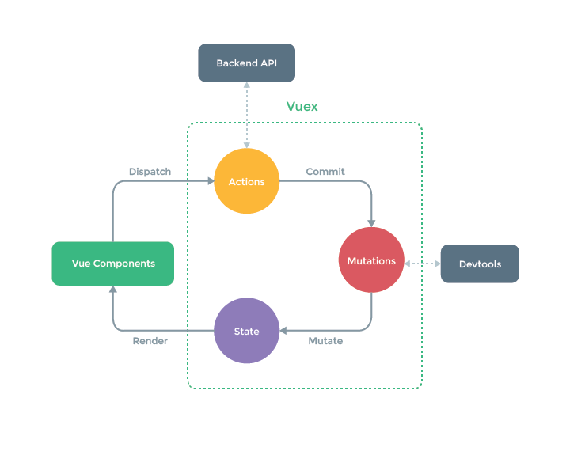

# 1. Vuex 在什么情况下使用？
如果应用比较简单，不建议使用Vuex，一个简单的store模式即可；而需要构建一个中大型单页应用时，使用Vuex能更好地在组件外部管理状态。

# 2. Vuex 和单纯的全局对象有什么区别？
Vuex的状态存储是响应式的。当Vue组件从store中读取状态的时候，若store中的状态发生变化，那么相应的组件也会相应地得到高效更新。

不能直接改变store中的状态。改变store中的状态的唯一途径就是显式地提交（commit）mutation。这样使得开发人员可以方便地跟踪每一个状态的变化，从而让我们能够实现一些工具帮助我们更好地了解我们的应用。

# 3. 为什么 Vuex 的 mutation 中不能做异步操作？
每个mutation执行完成后都会对应到一个新的状态变更，这样devtools就可以打个快照存下来，然后就可以实现time-travel了。

如果mutation支持异步操作，就没有办法知道状态是何时更新的，无法很好的进行状态的追踪，给调试带来困难。

# 4. axios 是什么，其特点和常用语法？
**axios介绍：**

1、Axios是一个基于promise的HTTP库，可以用在浏览器和node.js中。前端最流行的ajax请求库，

2、react/vue官方都推荐使用axios发ajax请求。

**axios特点：**

1、基于promise的异步ajax请求库，支持promise所有的API

2、浏览器端/node端都可以使用，浏览器中创建XMLHttpRequests

3、支持请求／响应拦截器

4、支持请求取消

5、可以转换请求数据和响应数据，并对响应回来的内容自动转换成JSON类型的数据

6、批量发送多个请求

7、安全性更高，客户端支持防御XSRF，就是让你的每个请求都带一个从cookie中拿到的key,根据浏览器同源策略，假冒的网站是拿不到你cookie中得key的，这样，后台就可以轻松辨别出这个请求是否是用户在假冒网站上的误导输入，从而采取正确的策略。

**常用语法：**

axios(config)：通用/最本质的发任意类型请求的方式

axios(url[,config])：可以只指定url发get请求

axios.request(config)：等同于axios(config)

axios.get(url[,config])：发get请求

axios.delete(url[,config])：发delete请求

axios.post(url[,data,config])：发post请求

axios.put(url[,data,config])：发put请求

axios.defaults.xxx：请求的默认全局配置

axios.interceptors.request.use()：添加请求拦截器

axios.interceptors.response.use()：添加响应拦截器

axios.create([config])：创建一个新的axios(它没有下面的功能)

axios.Cancel()：用于创建取消请求的错误对象

axios.CancelToken()：用于创建取消请求的token对象

axios.isCancel()：是否是一个取消请求的错误

axios.all(promises)：用于批量执行多个异步请求

axios.spread()：用来指定接收所有成功数据的回调函数的方法

# 5. Vue3.0 中为什么要用 Proxy API 替代 defineProperty API？
1、defineProperty API的局限性最大原因是它只能针对单例属性做监听。

Vue2.x中的响应式实现正是基于defineProperty中的descriptor，对data中的属性做了遍历 + 递归，为每个属性设置了getter、setter。这也就是为什么Vue只能对data中预定义过的属性做出响应的原因。

2、Proxy API的监听是针对一个对象的，那么对这个对象的所有操作会进入监听操作， 这就完全可以代理所有属性，将会带来很大的性能提升和更优的代码。

Proxy可以理解成，在目标对象之前架设一层“拦截”，外界对该对象的访问，都必须先通过这层拦截，因此提供了一种机制，可以对外界的访问进行过滤和改写。

3、响应式是惰性的。

在 Vue.js 2.x 中，对于一个深层属性嵌套的对象，要劫持它内部深层次的变化，就需要递归遍历这个对象，执行Object.defineProperty把每一层对象数据都变成响应式的，这无疑会有很大的性能消耗。

在Vue.js 3.0中，使用Proxy API并不能监听到对象内部深层次的属性变化，因此它的处理方式是在getter中去递归响应式，这样的好处是真正访问到的内部属性才会变成响应式，简单的可以说是按需实现响应式，减少性能消耗。

# 6. Vue 中 Proxy 和 Object.defineProperty 优劣对比？
1、Proxy可以直接监听对象而非属性；

2、Proxy可以直接监听数组的变化；

3、Proxy有多达13种拦截方法,不限于apply、ownKeys、deleteProperty、has等等是Object.defineProperty不具备的；

4、Proxy返回的是一个新对象,我们可以只操作新的对象达到目的,而Object.defineProperty只能遍历对象属性直接修改；

5、Proxy作为新标准将受到浏览器厂商重点持续的性能优化，也就是传说中的新标准的性能红利；

6、Object.defineProperty的优势如下: 兼容性好，支持IE9，而Proxy的存在浏览器兼容性问题,而且无法用polyfill磨平，因此Vue的作者才声明需要等到下个大版本（3.0）才能用Proxy重写。

# 7. Vue 为什么在 HTML 中监听事件？
开发者可能注意到这种事件监听的方式违背了关注点分离（separationofconcern）这个长期以来的优良传统。但不必担心，因为所有的Vue.js事件处理方法和表达式都严格绑定在当前视图的ViewModel上，它不会导致任何维护上的困难。实际上，使用v-on或@有几个好处：

扫一眼HTML模板便能轻松定位在JavaScript代码里对应的方法。

因为开发者无须在JavaScript里手动绑定事件，你的ViewModel代码可以是非常纯粹的逻辑，和DOM完全解耦，更易于测试。

当一个ViewModel被销毁时，所有的事件处理器都会自动被删除。你无须担心如何清理它们。

# 8. Vue 3.0 使用的 Composition Api 和 Vue 2.x 使用的 Options Api 有什么区别？
**Options Api**

包含一个描述组件选项（data、methods、props等）的对象options；

API开发复杂组件，同一个功能逻辑的代码被拆分到不同选项 ；

使用mixin重用公用代码，也有问题：命名冲突，数据来源不清晰；

**Composition Api**

vue3新增的一组api，它是基于函数的api，可以更灵活的组织组件的逻辑。

解决options api在大型项目中，options api不好拆分和重用的问题。

# 9. 项目中针对 Vue 做过哪些性能优化？
**编码阶段**

- 尽量减少data中的数据，data中的数据都会增加getter和setter，会收集对应的watcher

- v-if和v-for不能连用

- 如果需要使用v-for给每项元素绑定事件时使用事件代理

- SPA 页面采用keep-alive缓存组件

- 在更多的情况下，使用v-if替代v-show

- key保证唯一

- 使用路由懒加载、异步组件

- 防抖、节流

- 第三方模块按需导入

- 长列表滚动到可视区域动态加载

- 图片懒加载

**SEO优化**

- 服务端渲染SSR

- 预渲染

- 打包优化

**压缩代码**

- Tree Shaking/Scope Hoisting

- 使用cdn加载第三方模块

- 多线程打包happypack

- splitChunks抽离公共文件

- sourceMap优化

# 10. 对 SSR 有了解吗，它主要解决什么问题？
Server-Side Rendering 我们称其为SSR，意为服务端渲染指由服务侧完成页面的 HTML 结构拼接的页面处理技术，发送到浏览器，然后为其绑定状态与事件，成为完全可交互页面的过程；

解决了以下两个问题：

- seo：搜索引擎优先爬取页面HTML结构，使用ssr时，服务端已经生成了和业务想关联的HTML，有利于seo。

- 首屏呈现渲染：用户无需等待页面所有js加载完成就可以看到页面视图（压力来到了服务器，所以需要权衡哪些用服务端渲染，哪些交给客户端）。

SSR缺点

- 复杂度：整个项目的复杂度；

- 性能会受到影响；

- 服务器负载变大，相对于前后端分离务器只需要提供静态资源来说，服务器负载更大，所以要慎重使用。

# 11. Vue 中为什么 data 是一个函数？
组件的data写成一个函数，数据以函数返回值形式定义，这样每复用一次组件，就会返回一分新的data，类似于给每个组件实例创建一个私有的数据空间，让各个组件实例维护各自的数据。而单纯的写成对象形式，就使得所有组件实例共用了一份data，就会造成一个变了全都会变的结果。

# 12. 如何理解 Vue 的单项数据流？
数据总是从父组件传到子组件，子组件没有权利修改父组件传过来的数据，只能请求父组件对原始数据进行修改。这样会防止从子组件意外改变父组件的状态，从而导致你的应用的数据流向难以理解。

>注意：在子组件直接用 v-model 绑定父组件传过来的 props 这样是不规范的写法，开发环境会报警告。

如果实在要改变父组件的 props 值可以再data里面定义一个变量，并用 prop 的值初始化它，之后用$emit 通知父组件去修改。

# 13. v-if 和 v-for 为什么不建议一起使用？
v-for和v-if不要在同一标签中使用，因为解析时先解析v-for在解析v-if。如果遇到需要同时使用时可以考虑写成计算属性的方式。

# 14. Vue 如何检测数组变化？
数组考虑性能原因没有用 defineProperty 对数组的每一项进行拦截，而是选择对7种数组（push,shift,pop,splice,unshift,sort,reverse）方法进行重写（AOP 切片思想）。

所以在 Vue 中修改数组的索引和长度无法监控到。需要通过以上7种变异方法修改数组才会触发数组对应的watcher进行更新。

# 15. 虚拟 DOM 是什么？有什么优缺点？
由于在浏览器中操作DOM是很昂贵的。频繁操作DOM，会产生一定性能问题。这就是虚拟Dom的产生原因。Vue2的Virtual DOM 借鉴了开源库 snabbdom 的实现。Virtual DOM本质就是用一个原生的JS对象去描述一个DOM节点，是对真实DOM的一层抽象。

**优点：**

1、保证性能下限：框架的虚拟DOM需要适配任何上层API可能产生的操作，他的一些DOM操作的实现必须是普适的，所以它的性能并不是最优的；但是比起粗暴的DOM操作性能要好很多，因此框架的虚拟DOM至少可以保证在你不需要手动优化的情况下，依然可以提供还不错的性能，既保证性能的下限。

2、无需手动操作DOM：我们不需手动去操作DOM，只需要写好 View-Model的 代码逻辑，框架会根据虚拟DOM和数据双向绑定，帮我们以可预期的方式更新视图，极大提高我们的开发效率。

3、跨平台：虚拟DOM本质上是JavaScript对象，而DOM与平台强相关，相比之下虚拟DOM可以进行更方便地跨平台操作，例如服务器端渲染、weex开发等等。

**缺点：**

1、无法进行极致优化：虽然虚拟DOM + 合理的优化，足以应对大部分应用的性能需要，但在一些性能要求极高的应用中虚拟DOM无法进行针对性的极致优化。

2、首次渲染大量DOM时，由于多了一层DOM计算，会比innerHTML插入慢。

# 16. vue-router 路由钩子函数是什么？执行顺序是什么？
路由钩子的执行流程，钩子函数种类有：全局守卫、路由守卫、组件守卫。

完整的导航解析流程：

1、导航被触发。

2、在失活的组件里调用beforeRouterLeave守卫。

3、调用全局的beforeEach守卫。

4、在重用的组件调用beforeRouterUpdate守卫（2.2+）。

5、在路由配置里面beforeEnter。

6、解析异步路由组件。

7、在被激活的组件里调用beforeRouterEnter。

8、调用全局的beforeResolve守卫（2.5+）。

9、导航被确认。

10、调用全局的afterEach钩子。

11、触发DOM更新。

12、调用beforeRouterEnter守卫中传给next的回调函数，创建好的组件实例会作为回调函数的参数传入。

# 17. vue-router 动态路由是什么？参数失效如何处理？
假设需要把某种模式匹配到的所有路由，全都映射到同个组件。例如，有一个User组件，对于所有ID各不相同的用户，都要使用这个组件来渲染。那么，可以在vue-router的路由路径中使用“动态路径参数”（dynamic segment）来达到这个效果：
```js
const User = { template: "User" };
const router = new VueRouter({
routes: [
    // 动态路径参数 以冒号开头
    { path: "/user/:id", component: User },
],
});
```
vue-router组件复用导致路由参数失效怎么办？

解决方案：

方式一：通过watch监听路由参数再发请求
```js
watch：{
    "router":function(){
        this.getData(this.$router.params.xxx)
    }
}
```
方式二：用“:key”来阻止复用
```js
router-view :key="$route.fullPath"
```
# 18. 谈一下对 Vuex 的个人理解？


主要包括以下几个模块：

- State：定义了应用状态的数据结构，可以在这里设置默认的初始化状态。

- Getter：允许组件从Store中获取数据，mapGetters辅助函数仅仅是将store中的getter映射到局部计算属性。

- Mutation：是唯一更改store中状态的方法，且必须是同步函数。

- Action：用于提交mutation，而不是直接变更状态，可以包含任意异步请求。

- Module：允许将单一的Store拆分更多个store且同时保存在单一的状态树中。

# 19. Vuex 页面刷新数据丢失怎么解决？
需要做vuex数据持久化，一般使用本地储存的方案来保存数据，可以自己设计存储方案，也可以使用第三方插件。

推荐使用vuex-persist(脯肉赛斯特)插件，它是为Vuex持久化储存而生的一个插件。不需要你手动存取storage，而是直接将状态保存至cookie或者localStorage中。

# 20. Vuex 为什么要分模块并且加命名空间？
**模块**： 由于使用单一状态树，应用的所有状态会集中到一个比较大的对象。当应用变得非常复杂时，store对象就有可能会变得相当臃肿。为了解决以上问题，Vuex允许我们将store分割成模块（module）。每个模块拥有自己的state、mutation、action、getter、甚至是嵌套子模块。

**命名空间**： 默认情况下，模块内部的action、mutation、getter是注册在全局命名空间的---这样使得多个模块能够对同一mutation或action做出响应。如果希望你的模块具有更高的封装度和复用性，你可以通过添加namespaced:true的方式使其成为带命名的模块。当模块被注册后，他所有getter、action、及mutation都会自动根据模块注册的路径调整命名。