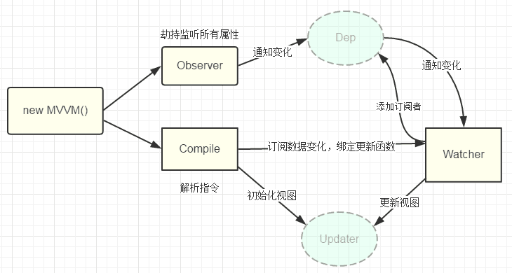

# 1. Vue 中使用了哪些设计模式？
1、工厂模式 - 传入参数即可创建实例 虚拟 DOM 根据参数的不同返回基础标签的 Vnode 和组件 Vnode。

2、单例模式 - 整个程序有且仅有一个实例 vuex 和 vue-router 的插件注册方法 install 判断如果系统存在实例就直接返回掉。

3、发布-订阅模式。（vue 事件机制）

4、观察者模式。（响应式数据原理）

5、装饰器模式（@装饰器的用法）

6、策略模式，策略模式指对象有某个行为，但是在不同的场景中，该行为有不同的实现方案 - 比如选项的合并策略。

# 2. vue-router 中常用的路由模式和实现原理？
**hash模式**

1、location.has的值实际就是URL中#后面的东西。它的特点在于：hash虽然出现URL中，但不会被包含在HTTP请求中，对后端完全没有影响，因此改变hash不会重新加载页面。

2、可以为hash的改变添加监听事件

window.addEventListener("hashchange",funcRef,false)
每一次改变hash (window.location.hash)，都会在浏览器的访问历史中增加一个记录，利用hash的以上特点，就可以实现前端路由“更新视图但不重新请求页面”的功能了 特点：兼容性好但是不美观。

**history模式**

利用HTML5 History Interface中新增的pushState()和replaceState()方法。

这两个方法应用于浏览器的历史记录站，在当前已有的back、forward、go 的基础上，他们提供了对历史记录进行修改的功能。这两个方法有个共同点：当调用他们修改浏览器历史记录栈后，虽然当前 URL 改变了，但浏览器不会刷新页面，这就为单页面应用前端路由“更新视图但不重新请求页面”提供了基础

特点：虽然美观，但是刷新会出现404需要后端进行配置。

# 3. Vue 中修饰符都有哪些？
**事件修饰符**

- .stop阻止事件继续传播

- .prevent阻止标签默认行为

- .capture使用事件捕获模式，即元素自身触发的事件先在此处处理，然后才交由内部元素进行处理

- .self只当在event.target是当前元素自身时触发处理函数

- .once事件只会触发一次

- .passive告诉浏览器你不想阻止事件的默认行为

**v-model的修饰符**

- .lazy通过这个修饰符，转变为在change事件再同步

- .number自动将用户输入值转化为数值类型

- .trim自动过滤用户输入的收尾空格

**键盘事件修饰符**

- .enter

- .tab

- .delete(捕获“删除”和“退格”键)

- .esc

- .space

- .up

- .down

- .left

- .right

**系统修饰符**

- .ctrl

- .alt

- .shift

- .meta

**鼠标按钮修饰符**

- .left

- .right

- .middle

# 4. 函数式组件使用场景和原理？
函数式组件与普通组件的区别

1、函数式组件需要在声明组件时指定 functional:true；

2、不需要实例化，所以没有this，this通过render函数的第二个参数context代替；

3、没有生命周期钩子函数，不能使用计算属性，watch；

4、不能通过$emit对外暴露事件，调用事件只能通过context.listeners.click的方式调用外部传入的事件；

5、因为函数组件时没有实例化的，所以在外部通过ref去引用组件时，实际引用的是HTMLElement；

6、函数式组件的props可以不用显示声明，所以没有在props里面声明的属性都会被自动隐式解析为prop，而普通的组件所有未声明的属性都解析到$attrs里面，并自动挂载到组件根元素上（可以通过inheritAttrs属性禁止）。

优点：

1、由于函数组件不需要实例化，无状态，没有生命周期，所以渲染性要好于普通组件；

2、函数组件结构比较简单，代码结构更清晰。

使用场景：

一个简单的展示组件，作为容器组件使用 比如router-view就是一个函数式组件。 高阶组件用于接受一个组件为参数，返回一个被包装过的组件。

相关代码如下：
```js
if (isTrue(Ctor.options.functional)) { // 带有functional的属性的就是函数式组件
    return createFunctionalComponent(Ctor, propsData, data, context, children);
}
const listeners = data.on;
data.on = data.nativeOn;
installComponentHooks(data); // 安装组件相关钩子 （函数式组件没有调用此方法，从而性能高于普通组件）
```
# 5. 什么是双向绑定？
先从单向绑定切入，单向绑定非常简单，就是把Model绑定到View，当用JavaScript代码更新Model时，View就会自动更新。

而双向绑定就很容易联想到了，在单向绑定的基础上，用户更新View，Model的数据也自动被更新，这种情况就是双向绑定。


当用户填写表单时，View的状态就被更新了，如果此时可以自动更新Model的状态，那就相当于把Model和View做了双向绑定。

关系图如下：


# 6. 双向绑定的原理是什么？
Vue是数据双向绑定的框架，双向绑定由三个重要部分构成。

- 数据层（Model）：应用的数据及业务逻辑；

- 视图层（View）：应用的展示效果，各类UI组件；

- 业务逻辑层（ViewModel）：框架封装的核心，它负责将数据与视图关联起来。

而上面的这个分层的架构方案，可以用一个专业术语进行称呼：MVVM。这里的控制层核心功能便是“数据双向绑定”。

ViewModel的主要职责：

- 数据变化后更新视图；

- 视图变化后更新数据。

ViewModel是由两个主要部分组成：

- 听器（Observer）：对所有数据的属性进行监听；

- 解析器（Compiler）：对每个元素节点的指令进行扫描跟解析，根据指令模板替换数据，以及绑定相应的更新函数。

# 7. Vue 中是如何实现的双向绑定？
Vue中双向绑定流程：

1、newVue()首先执行初始化，对data执行响应化处理，这个过程发生Observe中；defineReactive时为每一个key创建一个Dep实例。

2、同时对模板执行编译，找到其中动态绑定的数据，从data中获取并初始化视图，这个过程发生在Compile中；初始化视图时读取某个key，例如name1，创建一个watcher1。

3、同时定义一个更新函数和Watcher，将来对应数据变化时Watcher会调用更新函数。

4、由于data的某个key在一个视图中可能出现多次，所以每个key都需要一个管家Dep来管理多个Watcher；由于触发name1的getter方法，便将watcher1添加到name1对应的Dep中。

5、将来data中数据一旦发生变化,会首先找到对应的Dep，通知所有Watcher执行更新函数；当name1更新，setter触发时，便可通过对应Dep通知其管理所有Watcher更新。

流程图：



实现思路

1、defineReactive时为每一个key创建一个Dep实例。

2、初始化视图时读取某个key，例如name1，创建一个watcher1。

3、由于触发name1的getter方法，便将watcher1添加到name1对应的Dep中。

4、当name1更新，setter触发时，便可通过对应Dep通知其管理所有Watcher更新。

# 8. Vue 中 Vue.set 方法实现原理？
Vue.set或者说$set原理如下：

因为响应式数据，给对象和数组本身新增了__ob__属性，代表的是Observer实例。当给对象新增不存在的属性，首先会把新的属性进行响应式跟踪然后会触发对象__ob__的dep收集到的watcher去更新，当修改数组索引时我们调用数组本身的splice方法去更新数组。

# 9. Vue 中什么是自定义指令？其原理是什么？
指令本质上是装饰器，是vue对HTML元素的扩展，给HTML元素添加自定义功能。vue编译DOM时，会找到指令对象，执行指令的相关方法。

自定义指令有五个生命周期（也叫钩子函数），分别是bind、inserted、update、componentUpdated、unbind

1、bind：只调用一次，指令第一次绑定到元素时调用。在这里可以进行一次性的初始化设置。

2、inserted：被绑定元素插入父节点时调用。

3、update：被绑定元素所在的模板更新时调用，而不论绑定值是否变化。通过比较前后的绑定值。

4、componentUpdated：被绑定元素所在模板完成一次更新周期时调用。

5、unbind：只调用一次，指令与元素解绑时调用。

原理：

1、在生成ast语法树时，遇到指令会给当前元素添加directives属性。

2、通过genDirectives生成指令代码。

3、在patch前将指令的钩子提取到cbs中，在patch过程中调用对应的钩子。

4、当执行指令对应钩子函数时，调用对应指令定义方法。

# 10. Vue 中 nextTick 使用场景和原理？
nextTick中的回调是在下次DOM更新循环结束之后执行的延迟回调。在修改数据之后立即使用这个方法，获取更新后的DOM。主要思路就是采用微任务优先的方式调用异步方法去执行nextTick包装的方法。