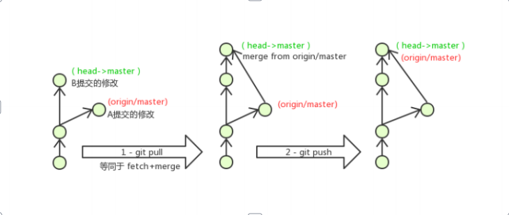

## 操作远程仓库

### 添加远程仓库
```shell
# 此操作是先初始化本地库，然后与已创建的远程库进行对接。
git remote add <远端名称> <仓库路径>
# 远端名称，默认是origin，取决于远端服务器设置
# 仓库路径，从远端服务器获取此URL
# 例如: git remote add origin git@gitee.com:meng-hao/jieni.git
```
### 查看远程仓库
```shell
git remote
```
### 推送到远程仓库
```shell
git push [-f] [--set-upstream] [远端名称 [本地分支名][:远端分支名] ]
# 如果远程分支名和本地分支名称相同，则可以只写本地分支
git push origin master
# -f 表示强制覆盖
# --set-upstream 推送到远端的同时并且建立起和远端分支的关联关系。
git push --set-upstream origin master
# 如果当前分支已经和远端分支关联，则可以省略分支名和远端名。
git push 将master分支推送到已关联的远端分支。
```

### 从远程仓库克隆
```shell
git clone <仓库路径> [本地目录]
# 本地目录可以省略，会自动生成一个目录
```

### 从远程仓库中抓取和拉取
```shell
# 远程分支和本地的分支一样，我们可以进行merge操作，只是需要先把远端仓库里的更新都下载到本地，再进行操作
git fetch [remote name] [branch name] # 抓取
# 抓取指令就是将仓库里的更新都抓取到本地，不会进行合并
# 如果不指定远端名称和分支名，则抓取所有分支。
git pull [remote name] [branch name] # 拉取
# 拉取指令就是将远端仓库的修改拉到本地并自动进行合并，等同于fetch+merge
# 如果不指定远端名称和分支名，则抓取所有并更新当前分支。
```

### 解决合并冲突
在一段时间，A、B用户修改了同一个文件，且修改了同一行位置的代码，此时会发生合并冲突。 A用户在本地修改代码后优先推送到远程仓库，此时B用户在本地修订代码，提交到本地仓库后，也需要推送到远程仓库，此时B用户晚于A用户，`故需要先拉取远程仓库的提交，经过合并后才能推送到远端分
支`


