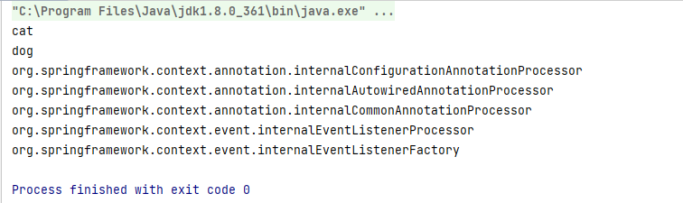

## xml:context + 注解（@Component+@Controller+@Service+@Repository）

新建项目，导入spring包

```xml
    <dependency>
      <groupId>org.springframework</groupId>
      <artifactId>spring-context</artifactId>
      <version>5.3.9</version>
    </dependency>
```

创建Dog类，Cat类
```java
    @service
    public class Dog {
    }

    @Component
    public class Cat {
    }
```

添加spring配置文件，application.xml

```xml
    <?xml version="1.0" encoding="UTF-8"?>
    <beans xmlns="http://www.springframework.org/schema/beans"
        xmlns:context="http://www.springframework.org/schema/context"
        xmlns:xsi="http://www.w3.org/2001/XMLSchema-instance"
        xsi:schemaLocation="
        http://www.springframework.org/schema/beans
        http://www.springframework.org/schema/beans/spring-beans.xsd
        http://www.springframework.org/schema/context
        http://www.springframework.org/schema/context/spring-context.xsd"
    >
        <!--  开启组件扫描  -->
        <context:component-scan base-package="com.cj"></context:component-scan>
    </beans>

```

在main方法中运行，初始化上下文，获取bean
```java
    public static void main(String[] args) {
        //获取上下文对象
        ApplicationContext applicationContext = new ClassPathXmlApplicationContext("application.xml");
        //获取所有定义的bean名称
        String[] beanDefinitionNames = applicationContext.getBeanDefinitionNames();
        for (String beanDefinitionName : beanDefinitionNames) {
            System.out.println(beanDefinitionName);
        }
    }
```

控制台打印

